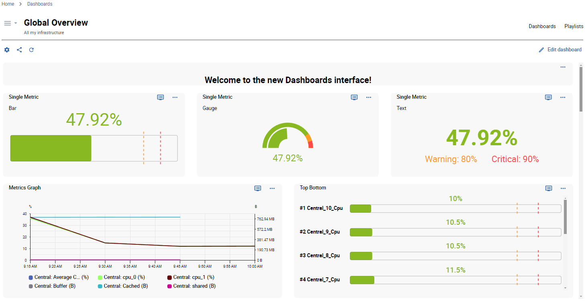
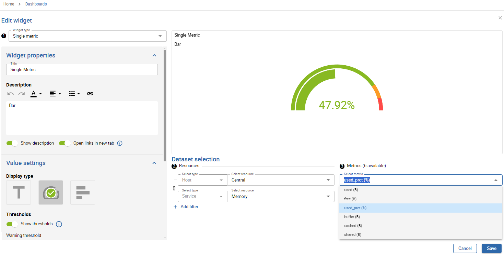

Get started with creating dashboards and adding widgets specially designed to optimize your user experience. Then benefit from data visualization options to display and monitor your resources in real time.

## Creating your first dashboard

> You must be logged into Centreon with administrator or creator rights.

1. Go to **Home > Dashboards Beta**.
2. In the **Dashboard library** page, click the **Create a dashboard** button. This opens the **Create dashboard** modal.
3. Name the dashboard and enter a description if needed.
4. Click **Create** to confirm the creation.

Your dashboard is now added! You can directly start adding widgets.

### Add widgets

> Your dashboard must be open in edition mode. 

- If this is your very first widget, click the **Add a widget** area.
- If not, click the **+ Add a widget** on the right of the interface.

Most of the widgets usually follow these steps: 

- **Step 1:** Select the type of widget. The widget parameters then depend on the widget you select.
- **Step 2:** Select resources.
- **Step 3:** Select metrics.

 > Make sure to save your changes. If you leave without saving your dashboard, changes will be permanently lost.

### More actions

Click the **three vertical dots** menu at the top right of the widget to edit it or to access more actions:
- Refresh
- Duplicate
- Delete widget

> In edition mode, you can easily organize your widgets by moving or resizing them. Make sure to save your changes.

### Link to Resources Status page

From the dashboard, you can click a screen pictogram at the top right of a widget: this button allows you to **See more on the Resources Status page**. It opens a new tab on the Resources Status page, with detailed information regarding the specific widget.

## Managing dashboards

> You must be in the **Dashboard library** page to get an overview of your dashboards.

### Edit a dashboard

#### Update properties

Click the **gear** button at the bottom right of the dashboard to update its name and description.

#### Edit dashboard widgets 

1. Click the dashboard to open it in view mode.
2. Click **Edit dashboard** to access and manage widgets in edition mode.

### Delete a dashboard

Click the **trash** button at the bottom left of the dashboard to delete it. Then confirm the deletion.

### Share a dashboard

> You can share dashboards using the **Manage access rights** interface.

#### About access rights

You are using the Dashboards feature with a **viewer** or an **editor** profile:

- **Viewers:** can only view dashboards you share with them.
- **Editors:** can view and edit dashboards you share with them.

#### Manage access rights

1. Click the **share** button at the bottom right of the dashboard.
2. In the **Add contact** dropdown list, select the user to add.
3. Select either **Viewer** or **Editor** profile.
4. Click the **+** button to add it.
5. Repeat the action for each user you want to add.
6. Click the **Update** button to save your changes.

The users you have just added now have access to your dashboard sharing, according to the profile you have set for them.

> Use the **Copy link** feature to share the dashboard URL directly with users who have access to your platform.

## List of widgets

| Widget                   | Description                                                                                                                                                                                                                                                                                                    |
|--------------------------|----------------------------------------------------------------------------------------------------------------------------------------------------------------------------------------------------------------------------------------------------------------------------------------------------------------|
| Generic text           | Allows you to add free text to your dashboards (section titles, information, etc.).   |
| MAP - Display a view            |  Allows you to select and visualize a map created from the MAP module.  |
| Metrics graph         | Displays metrics for a given time period.                                                                                |
| Resource table                 | Displays data on resource status and events, centralized in a table.
| Single metric          | Displays the value of a single metric as a text, a gauge or a bar chart.   |
| Status grid     | Displays the current status of selected resources, as a grid.      |
| Top/bottom              | Displays the top or bottom x hosts, for a selected metric.   |
