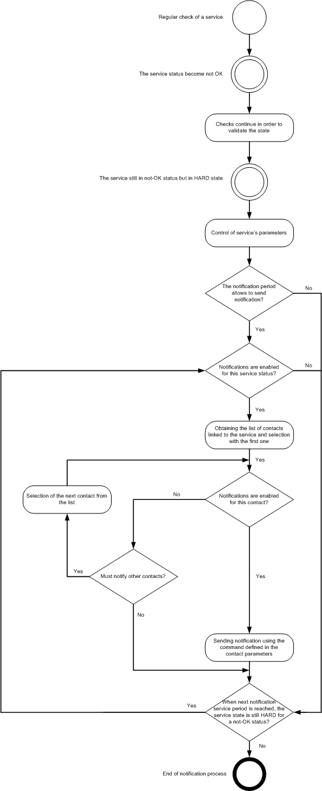

Before a contact can be notified in Centreon, it is necessary to go
through several steps.

1. A service (or a host) is checked at regular intervals according to
    the check period defined for it (In the case of a passive service,
    we wait for the status of the service to change)
2. If an anomaly occurs (Not-OK status), the service (or the host) goes
    into a SOFT state
3. After the Max Check Attempts has taken place and if the service (or
    the host) persists in retaining its Not-OK status its state changes
    from SOFT to HARD. The monitoring engine caches the notification
    number for the service (or the host): i.e. 0.

At each notification interval of the service (or the host) and until the
end of the Not-OK status, the monitoring engine performs the following
operations:

4. The monitoring engine checks that the notification period defined
    for the service (or the host) allows the notification for the
    service (or the host) when is switched into the HARD state. If the
    answer is yes, we go to the next step otherwise we wait for period
    defined for the service (or the host) to allow notification.
5. The monitoring engine checks that the notification is enabled to the
    current status of the service (or of the host)

6. For every contact associated with the service (or the host), the monitoring engine checks whether notifications are enabled or not.

7. If notifications are enabled, the monitoring engine
    alerts the contact using the notifications script defined for the
    service or the host.
8. The monitoring engine increments the notification number by 1.

The diagram below summarizes the notifications management in Centreon Cloud:

