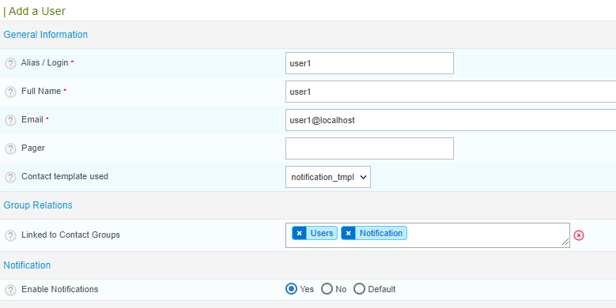

By default, notifications are active for all hosts and services. In Centreon Cloud, notifications are sent by the central server.

## In which cases are notifications sent?

Notifications are sent in the following cases:

* when a resource is in a non-ok state (**Warning** or **Critical** for a service, **Down** ou **Unreachable** for a host)
* when a resource goes back to an OK state
* when a downtime starts.

## Who are notifications sent to?

Notifications are sent to all users for which the notifications have been configured.
To enable a user to receive notifications:

1. Go to **Configuration > Users > Contacts/Users** and then click on the contact you want to be notified.
2. In the **General Information** section, in the **Contact template used** field, select **notification_tmpl**.
3. In the **Linked to contact groups** section, check that the user has the **Notifications** [role](../users/users.md#user-roles).
4. In the **Notification** section, check that **Enable notifications** is set to **Yes**.
5. Click **Save**.
6. [Deploy](../monitoring/monitoring-servers/deploying-a-configuration.md) the configuration.

## How are resources checked?

Resources are checked according to the following parameters:

* Checks are made 24x7, every 5 minutes for as long as the host or service is in an OK state.
* When a host or service enters a non-ok status (SOFT status type, e.g. DOWN SOFT for a host), Centreon checks 3 times that the host or service is still in a non-ok state (1 minute elapses between each of these checks).
* If, after these 3 checks, the resource is still in a non-ok status, its status type becomes HARD and notifications start being sent.
* Checks are then made every 5 minutes to see if the resource is still in a HARD state. Notifications are sent every 5 minutes.

> To ensure compatibility with future versions, do not change these values.

## Troubleshooting

### Contacts are not receiving notification emails

Check that notifications are enabled for the contact, that the user has the **Notifications** role, and that the **notification_tmpl** contact template is selected for them (see [above](#who-are-notifications-sent-to)).

### Notifications have been sent outside the user's time period

Check the user's timezone:

1. Go to **Configuration > Users > Contacts/Users** and then click on the contact you want to be notified.
2. Check the **Timezone/Location** field. The time period during which notifications will be sent to a user is the time period in their timezone.
