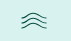
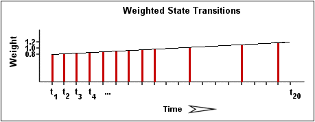

## Introduction

Centreon Engine detects when hosts and services are "flapping". Flapping occurs when a service or host changes its status too
frequently. Flapping detection stops Centreon from sending many alert and recovery notifications: only one flapping notification is sent (one when flapping starts and one when it stops).
Flapping can indicate troublesome services, or real network problems.

## How flapping detection works

Whenever Centreon Engine checks the status of a host or service, it will
check to see if it has started or stopped flapping. It does this by:

* Storing the results of the last 21 checks of the host or service
* Determining the percentage of state changes that occurred for the host or service over these 21 checks
* Comparing the percentage of state change against low and high flapping thresholds.

A host or service is determined to have started flapping when its
percent state change first **exceeds a high flapping threshold**. When a host or service is flapping:

* it has a green background in the **Resources status** page.
* it has the following icon in its **Details** panel and in the **State** column:
    
* one notification is sent when the resource starts flapping, and another one is sent when it stops flapping. Alert and recovery notifications are temporarily disabled.

In the **Resource status** page, you can filter the view to display only flapping resources.

A host or service is determined to have stopped flapping when its
percent state goes below a low flapping threshold (assuming that it was
previously flapping).

## Flapping thresholds

In Centreon Cloud, the flapping thresholds are as follows:

| Threshold | Hosts | Services |
| --- | --- | --- |
| Low Flap Threshold | 25 | 25 |
| High Flap Threshold | 50 | 50 |

## Example

Let’s describe in more detail how flapping detection works with services.

The image below shows a chronological history of service states from the
most recent 21 service checks. OK states are shown in green, WARNING
states in yellow, CRITICAL states in red, and UNKNOWN states in orange.

The historical service check results are examined to determine where
state changes/transitions occur. State changes occur when an archived
state is different from the archived state that immediately precedes it
chronologically. Since we keep the results of the last 21 service checks
in the array, there is a possibility of having at most 20 state changes.
In this example there are 712 state changes, indicated by blue arrows in
the image above.

The flap detection logic uses the state changes to determine an overall
percent state change for the service. This is a measure of
volatility/change for the service. Services that never change state will
have a 0% state change value, while services that change state every time
they're checked will have 100% state change. Most services will have a
percent state change somewhere in between.

When calculating the percent state change for the service, the flap
detection algorithm will give more weight to new state changes compared
to older ones. Specifically, the flap detection routines are currently
designed to make the newest possible state change carry 50% more weight
than the oldest possible state change. The image below shows how recent
state changes are given more weight than older state changes when
calculating the overall or total percent state change for a particular
service.

Using the images above, let’s do a calculation of percent state change
for the service. You will notice that there is a total of 12 state
changes. Without any
weighting of the state changes over time, this would give us a total
state change of 60%:

(12 observed state changes / possible 20 state changes) \* 100 = 60%

Since the flap detection logic will give newer state changes a higher
rate than older state changes, the actual calculated percent state
change will be slightly less than 60% in this example. Let's say that
the weighted percent of state change turned out to be 53%.

The calculated percent state change for the service (53%) will then be
compared against flapping thresholds to see what should happen:

-   If the service was not previously flapping, Centreon Engine considers the
    service to have just started flapping, as its percent state change is above the high flapping threshold.
-   If the service was previously flapping, Centreon Engine considers the service is still flapping (as its percent state change is not lower than the low flap threshold).
