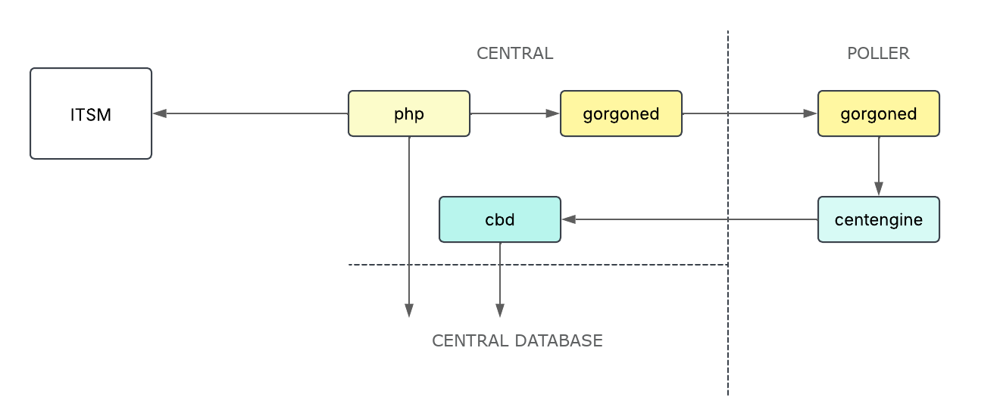

import Tabs from '@theme/Tabs';
import TabItem from '@theme/TabItem';

## Diagram

## Debugging

| Steps | Process | Useful logs |
| -- | -- | -- |
| A user opens a ticket from the interface | php-fpm | /var/log/php-fpm.log (/var/log/php**X.Y**-fpm.log for Debian), /var/log/centreon/sql-error.log, browser console |
| The ticket is opened in the ITSM tool | php-fpm | /var/log/php-fpm.log (/var/log/php**X.Y**-fpm.log for Debian), /var/log/centreon/sql-error.log, ITSM tool's logs |
| The information concerning the ticket is recorded in the database and the ticket number is sent to the gorgoned daemon of the central server, using external commands (according to your configuration: ACKNOWLEDGE_[HOST\|SERVICE]_PROBLEM, SCHEDULE_FORCED_[HOST\|SERVICE]_CHECK et CHANGE_CUSTOM_[HOST\|SVC]_VAR) | php-fpm | /var/log/php-fpm.log (/var/log/php**X.Y**-fpm.log for Debian), /var/log/centreon/sql-error.log, /var/log/centreon-gorgone/gorgoned.log |
| The Gorgone of the central server sends the external commands to the relevant poller | gorgoned (central server and poller) | /var/log/centreon-gorgone/gorgoned.log (central server and poller) |
| The Gorgone of the poller sends the external commands to the centengine daemon | gorgoned, centengine | /var/log/centreon-gorgone/gorgoned.log, /var/log/centreon-engine/centengine.log |
| The centengine daemon of the poller sends the results of the external commands to the cbd daemon of the central server | centengine (poller), cbd (central server) | /var/log/centreon-engine/centengine.log (poller), /var/log/centreon-broker/central-broker.log (central server) |
| The cbd daemon saves the resultst of the externa commands to the database | cbd | /var/log/centreon-broker/central-broker.log |
