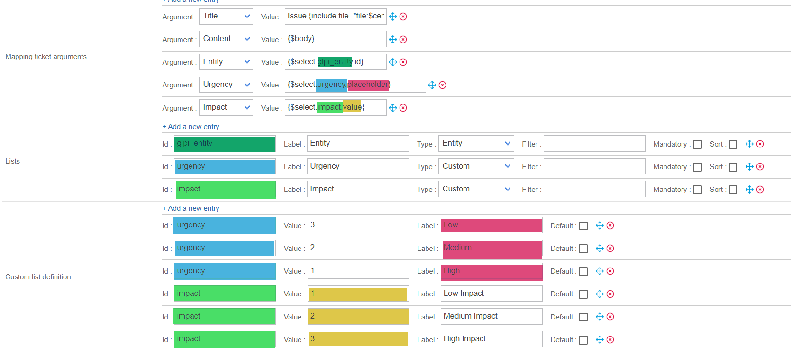

import Tabs from '@theme/Tabs';
import TabItem from '@theme/TabItem';

When you create an [Open Tickets rule (on the **Configuration > Notifications > Rules** page)](../ticketing.md), you can define fields to be displayed in the ticket creation popup. The information entered by the user will be inserted into the ticket body when the ticket is created.

In the [default ticket body example](ticketing-body.md), this information will be imported into the ticket via the following line: `{include file="file:$centreon_open_tickets_path/providers/Abstract/templates/display_selected_lists.ihtml" separator=""}`.

Use the following sections of the form to customize the ticket creaton popup:

- [**Mapping ticket arguments**](#mapping-ticket-arguments)
- [**Lists**](#lists)
- [**Custom list definition**](#custom-list-definition).

## Mapping ticket arguments

The **Mapping ticket arguments** section defines the data that will be sent by Centreon to the ITSM tool when the ticket is opened. Details for the corresponding data are defined in the **Lists** and **Custom list definition** sections. Please note that if data appears in other lists but not in **Mapping ticket arguments**, it will simply not be sent to the ITSM tool.

Each line has two elements:

- **Argument**: information supported by the provider. The argument list is a predefined list for each provider. Please refer to the corresponding documentation to learn which information is supported by each provider.
- **Value**: once the code has been interpreted, the exact value that will be sent to the ITSM tool. The value generally consists of Smarty code, the meaning of which is very important. Take the example below:

```smarty
{$select.urgency.value}
```

The above expression can be broken down into three elements:

- **$select**: the variable which indicates that we're going to take a value from a list of arguments.
- **urgency**: this is an identifier. It must correspond to the **Id** field in the **Lists** and **Custom list definition** sections. It can only consist of alphanumeric values and a _. In short, it must correspond to the regular expression **[A-Za-Z0-9\_]**.
- **value**: in this example, the exact value of the data will be sent to the ITSM tool, not its ID. See [type formats](#types).

The following arguments have a different syntax: do not modify them.

   * **Title** By default, the ticket title has the following format: for hosts, **Host name/Host status**, for services: **Host name/Service name/Service status**.
   * **Content** : the value must be **\{$body\}** to call the **Default** entry in the **Body list definition** section.

## Lists

The **Lists** section defines which fields will be displayed in the ticket creation popup, and in which order (below the title and the **Custom message** field).
It consists of the following fields:

- **Id**: This ID must absolutely be the same as the ID defined in the [**Mapping ticket arguments**](#mapping-ticket-arguments) section. In the example [above](#mapping-ticket-arguments), since the **Value** field has been defined as `{$select.urgency.value}`, the ID in the **Lists** section must be **urgency**.
- **Label**: This label will be the name displayed in the ticket opening popup.
- **Type**: [Corresponds to the data source](#types).
- **Filter**: A filter to limit the results obtained.
   * Filters apply only to the **Label** field and not to the **ID** field.
   * You can use PHP regular expressions, or apply filters directly in the ITSM tool API call.
- **Mandatory**: If the box is checked, the ticket can only be opened if the field is filled in the popup.
- **Sort**: In the ticket opening popup, the possible values for this list will be sorted alphabetically.

You can change the order of the list items using the blue cross at the end of each line. The order of the list will be the order in which the fields are displayed in the ticket opening popup.

### Types

There are three types of lists:

- Some lists retrieve data from the ITSM tool.
- Some retrieve data from Centreon (Host Group, Host Category, Host Severity, Service Group, Service Category, Service Severity, Contact Group). These are generally not used.
- **Custom**: these retrieve data from the [**Custom list definition**](#custom-list-definition) section.

In the [Mapping ticket arguments](#mapping-ticket-arguments) section, the Smarty code `{$select.urgency.value}` was mentioned. Now that the **urgency** ID has been explained, it's time to focus on the `.value`.

For **all** **Types** (except **Custom**), the data retrieved is often of the following form:

- The data ID in the ITSM tool (or, in rare cases, in Centreon).
- A value that is usually a label users can understand.

In our example with **urgency**, we could have **High** as the label and **911** as the ID when the data is retrieved from the ITSM tool. There are then two possibilities for displaying the corresponding value in the ticket creation/sending the data to the ITSM tool.

- If you wish to send the ID to the ITSM tool when the ticket is opened, use the syntax `{$select.urgency.id}`.
- If you wish to send the label to the ITSM tool when the ticket is opened, use the syntax `{$select.urgency.value}`.

## Custom list definition

**Custom lists** are used to define the possible values that a field in the ITSM tool can have, that will appear in the ticket opening popup. This allows us to manage two main situations:

- There is no API in the ITSM tool to retrieve this type of object, either because the endpoint doesn't exist, or because it's a custom field you've created yourself in your ITSM tool (only certain providers support this). You therefore need to manually define the possible values.
- The rule will always use the same value for an item of information. It is therefore not appropriate to make a call to an API that will return the same result hundreds of times (e.g. to retrieve the user account that will be indicated as the ticket creator).

Custom lists contain the following fields:

- **Id**: This ID must be the same as the ID defined in the [**Mapping ticket arguments**](#mapping-ticket-arguments) section. In the example [above](#mapping-ticket-arguments), since the **Value** field has been defined as `{$select.urgency.value}`, the ID in the **Custom lists** section must be **urgency**.
- A value: This is generally the value that will be accepted by the ITSM tool's APIs (this is the ID of the data in the ITSM tool).
- A label (also called **placeholder**): This is the value that will be displayed to users in the ticket opening popup.
- Default: Check this box to define the value that will be selected by default in the ticket opening popup.

You can change the order of the list items using the blue cross at the end of each line. The order of the list will be the order in which the data is displayed in the corresponding field in the ticket opening popup.

Let's take the example of the **urgency** parameter again. This time, let's imagine that the value comes from a custom list definition and not from the ITSM tool APIs. We'd like to have an **urgency** named **Low** with ID **118218**.

The custom list must then be filled in as follows:

| Id      | Value  | Label |
| ------- | ------ | ----- |
| urgency | 118218 | Low   |

You can then choose the exact data to send to the ITSM tool:

- To send **118218**, enter `{$select.urgency.value}` in the **Mapping ticket arguments** section. In most cases, you will want to send the `value`.
- To send **Low**, enter `{$select.urgency.placeholder}` in the **Mapping ticket arguments** section.
- The expression `{$select.urgency.id}` would return the **urgency** label itself, but that wouldn't make sense.

## Schematic

Here's a colored representation of the correspondence between the 3 sections described above:


