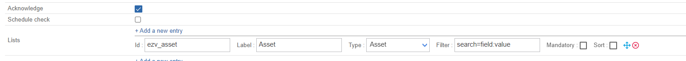
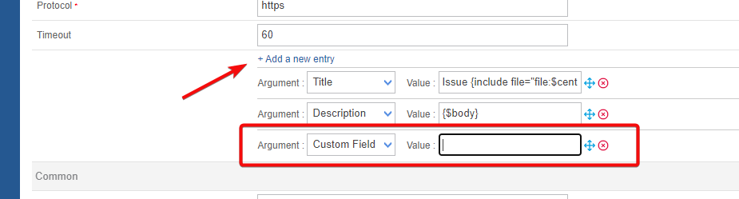
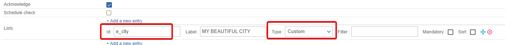
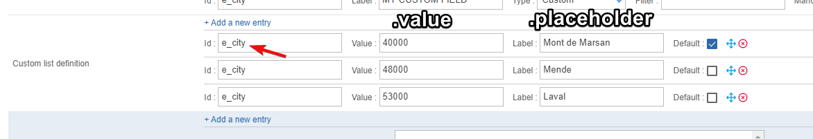
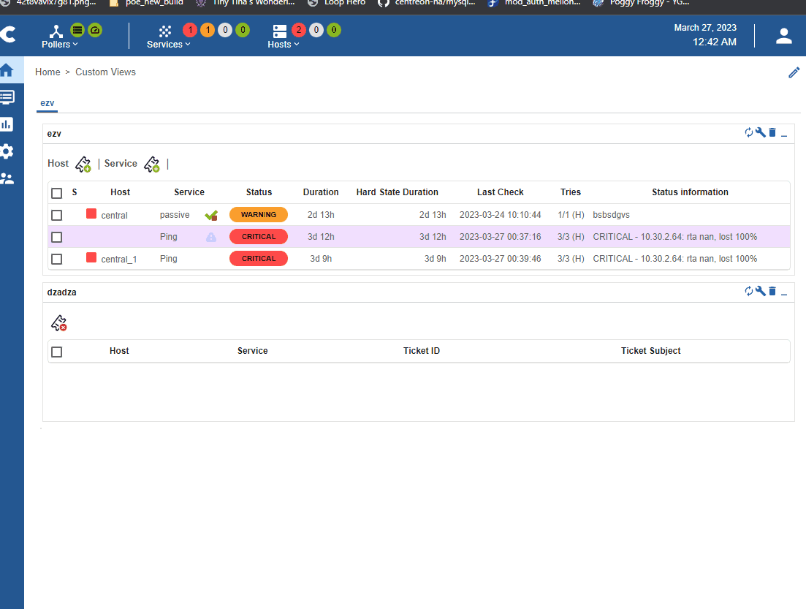

## Features information

| open ticket | close ticket (from Centreon to Service Now) | Handle custom fields |
| -- | -- | -- |
| ✓ | ✓ | ✓ |

## Prerequisites

### Network Flow

| Source | Destination | Protocol/Port |
| -- | -- | -- |
| Centreon central server | Easyvista | TCP/443 (https) or TCP/80 (http) |

### Account

You need the following information

- Account
- Password or token

The aforementioned account must at least be able to open a ticket through the **/requests API endpoint**.

The connector will also try to access the following API endpoints depending on the configuration of your open ticket rule.

- /assets

Some test commands that you can run from your Centreon central server are available in the [Test commands chapter](#test-commands)

### Account password or token

You can either use an api token or the user password method by setting the **Use token** to 1 (token will be needed) or 0 (user and password will be used)

## Retrieved data

This open ticket connector can retrieve the following information from your Easy vista server

- Assets

If you need more information regarding retrieved data from an open ticket connector, please read the [retrieved data chapter](../mapping.md) from the Open Ticket module global documentation.

## Assets

Every information sent to Easy vista comes from Centreon apart from assets. To be able to retrieve them, you will need to use the following syntax in the **Filter field** of the **Lists definition**. It must be set as follows: **search=field1:value1,field2:value2**. For more information please refer to the [Easy vista documentation](https://wiki.easyvista.com/xwiki/bin/view/Documentation/Integration/WebService%20REST/REST%20API%20-%20See%20a%20list%20of%20assets/)



## Easy vista Custom fields

Easy vista allow their users to create custom fields for their tickets form. Since they are not standard, Open Ticket will only allow you to manually configure them. This requires a specific syntax and actions. This chapter is going to guide you through this configuration.

### Add a custom field in the provider configuration

- Add a new **Mapping ticket arguments** with the **+ Add a new entry** button.
  - In the **Argument** field, select **Custom Field**
  - In the **Value** field, write `{$select.e_<your_field_name>.value}` where `<your_field_name>` must be replaced with the name of your custom field in Easy vista. For example, a **city** custom field could become **\{$select.e_city.value\}**



- Add a new **List** for your custom field with the **+Add a new entry** button.
  - In the **Id** field you **must** keep the same syntax than before. So for a *e_city* custom field, the Id will be **e_city**.
  - In the **Label** field, feel free to be creative. It is up to you to find a meaningful label.
  - In the **Type** field, select **Custom**
  - The **Filters**, **Mandatory** and **Sort** parameters are optional.



- Add new **Custom list definitions** for your custom field with the **+Add a new entry** button. This is where you set up the possible values for your fields.
  - In the **Id** field you **must** keep the same syntax than before. So for a *e_city* custom field, the Id will be **e_city**
  - In the **Value** field, you usually put the value that will be sent to Easy vista. In the below example, we have set the zip code of each city.
  - In the **Label** field, put a value that is meaningful for your users (or more human-readable if the value is some kind of internal id not meant for end users). Therefore, in our example, it is going to be name of the city
  - The **Default** parameter is optional

As explained in the example down below, in the **Mapping ticket arguments** you could also use `{$select.e_<your_field_name>.placeholder}` instead of `{$select.e_<your_field_name>.value}` if you wish to send the name of the city instead of the zip code.



## CI parameter

It is possible to send the CI field to Easy Vista. When configured (see [custom lists](../mapping.md#custom-list-definition) for more information) it will send either the name of the host or a selected hostgroup when you tick the "Use hostgroup name as CI". When you open a ticket on multiple hosts in one go, only groups in which both hosts belong can be selected. Still in the multiple hosts selection, you will be forced to select one of the host names as CI if you are not using the host group feature.



## Test commands

The Curl commands listed below must be run from your central server. You need to replace everything between `<>` for example `<easy_vista_address>` may be replaced with **my_ezv.local**

If you are using the user/password authentication, replace the `--header 'Authorization: Bearer <token>'` part with `-u '<user>:<password>'`

### Open a ticket

```bash
curl 'https://<easy_vista_address>/api/v1/requests' \
--header 'Content-Type: application/json' \
--header 'Authorization: Bearer <token>' \
--data '{"requests":[{"catalog_guid:"1234","catalog_code":"1234"}]}'
```

### Close a ticket

```bash
curl -X PUT 'https://<easy_vista_address>/api/v1/requests/<ticket_id>' -H
--header 'Content-Type: application/json' \
--header 'Authorization: Bearer <token>' \
--data '{"closed":{}}'
```

### Get Easy vista assets

without filter:

```bash
curl -X GET 'https://<easy_vista_address>/api/v1/assets/?fields=asset_tag,HREF' -H
--header 'Content-Type: application/json' \
--header 'Authorization: Bearer <token>'
```

with filters:

```bash
curl -X GET 'https://<easy_vista_address>/api/v1/assets/?fields=asset_tag,HREF&search=<field>:<value>' -H
--header 'Content-Type: application/json' \
--header 'Authorization: Bearer <token>'
```
