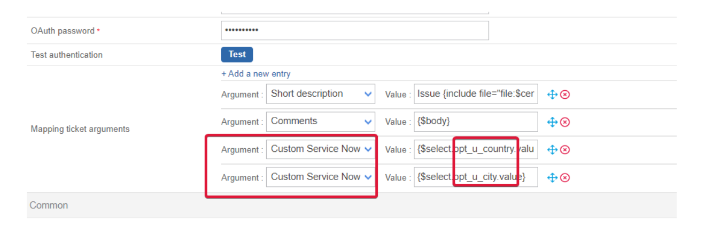
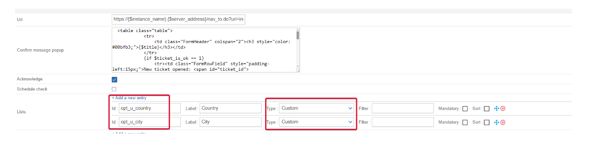

# Service Now

- [Service Now](#service-now)
  - [Features information](#features-information)
  - [Prerequisites](#prerequisites)
    - [Network Flow](#network-flow)
    - [Account](#account)
  - [Retrieved data](#retrieved-data)
  - [Service Now Custom fields](#service-now-custom-fields)
    - [Add a custom field in the provider configuration](#add-a-custom-field-in-the-provider-configuration)
  - [Test commands](#test-commands)
    - [Get oauth tokens](#get-oauth-tokens)
    - [Get Service Now severities](#get-service-now-severities)
    - [Get Service Now urgencies](#get-service-now-urgencies)
    - [Get Service Now impact](#get-service-now-impact)
    - [Get Service Now categories](#get-service-now-categories)
    - [Get Service Now subcategories](#get-service-now-subcategories)
    - [Get Service Now users](#get-service-now-users)
    - [Get Service Now user groups](#get-service-now-user-groups)
    - [Open a ticket](#open-a-ticket)

## Features information

| open ticket | close ticket (from Centreon to Service Now) | Handle custom fields |
| -- | -- | -- |
| ✓ | ✘ | ✓ |

## Prerequisites

### Network Flow

| Source | Destination | Protocol/Port |
| -- | -- | -- |
| Centreon central server | Service Now instance | TCP/443 (https) or TCP/80 (http) |

### Account

You need the following information

- Client ID
- Client secret
- Username
- Password
- Instance name

The aforementioned account must be able to at least be able to open a ticket through the **Service Now Table REST API**. This is a POST action into the **incident table**.

The connector will also try to access the following tables from the API depending on the configuration of your open ticket rule.

- sys_user table
- sys_user_group table
- sys_choice

Some tests commands that you can run from your Centreon central server are available in the [Test commands chapter](#test-commands)

## Retrieved data

This open ticket connector will be able to retrieve the following informations from your Service Now instance

- Categories
- Subcategories
- Impact
- Urgency
- Severity
- Assignment Group
- Assignment

If you need more information regarding retrieved data from an open ticket connector, please read the [mapping chapter](../mapping.md) from the Open Ticket module global documentation.

## Service Now Custom fields

Service Now allow their users to create custom fields for their tickets form. Since they are not standard, Open Ticket will only allow you to manually configure them. This require a specific syntax and actions. This chapter is going to guide you through this configuration.

### Add a custom field in the provider configuration

1. Add a new **Mapping ticket arguments** with the **+ Add a new entry** button.
   - In the **Argument** field, select **Custom Service Now**
   - In the **Value** field, write `{$select.opt_<your_field_name>.value}` where `<your_field_name>` must be replaced by the name of your custom field in Service Now. In the below picture, two custom fields from Service Now have been added, one that is called *u_city* and another called *u_country*. As stated in the mapping chapter, the field name must only contain alphanumerical characters and underscores

2. Add a new **List** for your custom field with the **+Add a new entry** button.
   - In the **Id** field you **must** keep the same syntax than before. So for a *u_city* custom field, the Id will be **opt_u_city**.
   - In the **Label** field, feel free to be creative. It is up to you to find a meaningful label.
   - In the **Type** field, select **Custom**
   - The **Filters**, **Mandatory** and **Sort** parameters are optionals.

3. Add new **Custom list definitions** for your custom field with the **+Add a new entry** button. This is where you set up the possible values for your fields.
   - In the **Id** field you **must** keep the same syntax than before. So for a *u_city* custom field, the Id will be **opt_u_city**
   - In the **Value** field, you **must** put the value that will be sent to Service Now.
   - In the **Label** field, put a value that is meaningful for your users (or more human readbale if the value is some kind of internal id not meant for end users)
   - The **Default** parameter is optional


## Test commands

The below Curl commands must be run from your central server. You need to replace everything between **\<\>** for example **\<server_address\>** may become **service-now.com**

### Get oauth tokens

```bash
curl --location 'https://<instance_name>.<server_address>/oauth_token.do' \
--header 'Content-Type: application/x-www-form-urlencoded' \
--data-urlencode 'grant_type=password' \
--data-urlencode 'client_id=<client_id>' \
--data-urlencode 'client_secret=<client_secret>' \
--data-urlencode 'username=<username>' \
--data-urlencode 'password=<password>'
```

### Get Service Now severities

```bash
curl --location 'https://<instance_name>.<server_address>/api/now/table/sys_choice?sysparm_fields=value%2Clabel%2Cinactive&sysparm_query=nameSTARTSWITHincident%5EelementSTARTSWITHseverity' \
--header 'Authorization: Bearer <authentication_token>' \
--header 'Content-Type: application/json'
```

### Get Service Now urgencies

```bash
curl --location 'https://<instance_name>.<server_address>/api/now/table/sys_choice?sysparm_fields=value,label,inactive&sysparm_query=nameSTARTSWITHincident%5EelementSTARTSWITHurgency' \
--header 'Authorization: Bearer <authentication_token>' \
--header 'Content-Type: application/json'
```

### Get Service Now impact

```bash
curl --location 'https://<instance_name>.<server_address>/api/now/table/sys_choice?sysparm_fields=value,label,inactive&sysparm_query=nameSTARTSWITHtask%5EelementSTARTSWITHimpact' \
--header 'Authorization: Bearer <authentication_token>' \
--header 'Content-Type: application/json'
```

### Get Service Now categories

```bash
curl --location 'https://<instance_name>.<server_address>/api/now/table/sys_choice?sysparm_fields=value,label,inactive&sysparm_query=nameSTARTSWITHincident%5EelementSTARTSWITHcategory' \
--header 'Authorization: Bearer <authentication_token>' \
--header 'Content-Type: application/json'
```

### Get Service Now subcategories

```bash
curl --location 'https://<instance_name>.<server_address>/api/now/table/sys_choice?sysparm_fields=value,label,inactive&sysparm_query=nameSTARTSWITHincident%5EelementSTARTSWITHsubcategory' \
--header 'Authorization: Bearer <authentication_token>' \
--header 'Content-Type: application/json'
```

### Get Service Now users

```bash
curl --location 'https://<instance_name>.<server_address>/api/now/table/sys_user?sysparm_fields=sys_id,active,name' \
--header 'Authorization: Bearer <authentication_token>' \
--header 'Content-Type: application/json'
```

### Get Service Now user groups

```bash
curl --location 'https://<instance_name>.<server_address>/api/now/table/sys_user_group?sysparm_fields=sys_id,active,name' \
--header 'Authorization: Bearer <authentication_token>' \
--header 'Content-Type: application/json'
```

### Open a ticket

The below curl command is using a limited json. By default, this connector is able to send the following field in the json:

- impact
- urgency
- short_description
- priority
- category
- subcategory
- assigned_to
- assignment_group
- comments

```bash
curl --location 'https://<instance_name>.<server_address>/api/now/v1/table/incident' \
--header 'Authorization: Bearer <authentication_token>' \
--header 'Content-Type: application/json' \
-d '{"impact":1,"urgency":1,"short_description":"test ticket Centreon"}
```