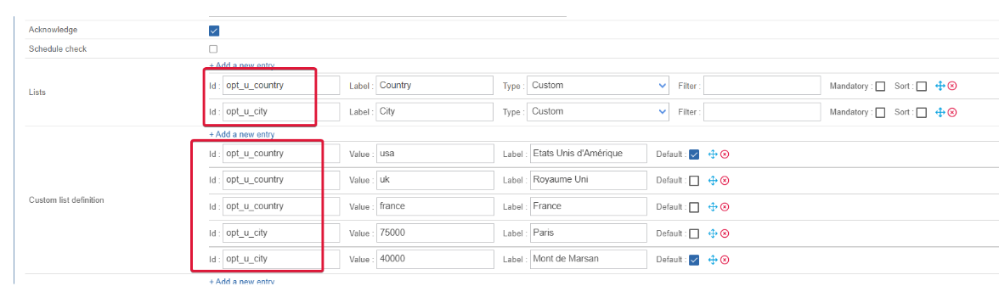

## Features information

| open ticket | close ticket (from Centreon to Service Now) | Handle custom fields |
| -- | -- | -- |
| ✓ | ✘ | ✓ |

## Prerequisites

### Network Flow

| Source | Destination | Protocol/Port |
| -- | -- | -- |
| Centreon central server | Service Now instance | TCP/443 (https) or TCP/80 (http) |

### Account

You need the following information

- Client ID
- Client secret
- Username
- Password
- Instance name

The aforementioned account must at least be able to open a ticket through the **Service Now Table REST API**. This is a POST action into the **incident table**.

The connector will also try to access the following tables from the API depending on the configuration of your open ticket rule.

- sys_user table
- sys_user_group table
- sys_choice

Some test commands that you can run from your Centreon central server are available in the [Test commands chapter](#test-commands)

## Retrieved data

This open ticket connector can retrieve the following information from your Service Now instance

- Categories
- Subcategories
- Impact
- Urgency
- Severity
- Assignment Group
- Assignment

If you need more information regarding retrieved data from an open ticket connector, please read the [retrieved data chapter](../mapping.md) from the Open Ticket module global documentation.

## Service Now Custom fields

Service Now allow their users to create custom fields for their tickets form. Since they are not standard, Open Ticket will only allow you to manually configure them. This requires a specific syntax and actions. This chapter is going to guide you through this configuration.

### Add a custom field in the provider configuration

- Add a new **Mapping ticket arguments** with the **+ Add a new entry** button.
  - In the **Argument** field, select **Custom Service Now**
  - In the **Value** field, write `{$select.opt_<your_field_name>.value}` where `<your_field_name>` must be replaced with the name of your custom field in Service Now. In the below picture, two custom fields from Service Now have been added, one that is called *u_city* and another called *u_country*.


- Add a new **List** for your custom field with the **+Add a new entry** button.
  - In the **Id** field you **must** keep the same syntax than before. So for a *u_city* custom field, the Id will be **opt_u_city**.
  - In the **Label** field, feel free to be creative. It is up to you to find a meaningful label.
  - In the **Type** field, select **Custom**
  - The **Filters**, **Mandatory** and **Sort** parameters are optional.


- Add new **Custom list definitions** for your custom field with the **+Add a new entry** button. This is where you set up the possible values for your fields.

  - In the **Id** field you **must** keep the same syntax than before. So for a *u_city* custom field, the Id will be **opt_u_city**
  - In the **Value** field, you **must** put the value that will be sent to Service Now.
  - In the **Label** field, put a value that is meaningful for your users (or more human-readable if the value is some kind of internal id not meant for end users)
  - The **Default** parameter is optional



## Test commands

The Curl commands listed below must be run from your central server. You need to replace everything between `<>` for example `<server_address>` may be replaced with **service-now.com**

### Get oauth tokens

```bash
curl --location 'https://<instance_name>.<server_address>/oauth_token.do' \
--header 'Content-Type: application/x-www-form-urlencoded' \
--data-urlencode 'grant_type=password' \
--data-urlencode 'client_id=<client_id>' \
--data-urlencode 'client_secret=<client_secret>' \
--data-urlencode 'username=<username>' \
--data-urlencode 'password=<password>'
```

### Get Service Now severities

```bash
curl --location 'https://<instance_name>.<server_address>/api/now/table/sys_choice?sysparm_fields=value%2Clabel%2Cinactive&sysparm_query=nameSTARTSWITHincident%5EelementSTARTSWITHseverity' \
--header 'Authorization: Bearer <authentication_token>' \
--header 'Content-Type: application/json'
```

### Get Service Now urgencies

```bash
curl --location 'https://<instance_name>.<server_address>/api/now/table/sys_choice?sysparm_fields=value,label,inactive&sysparm_query=nameSTARTSWITHincident%5EelementSTARTSWITHurgency' \
--header 'Authorization: Bearer <authentication_token>' \
--header 'Content-Type: application/json'
```

### Get Service Now impact

```bash
curl --location 'https://<instance_name>.<server_address>/api/now/table/sys_choice?sysparm_fields=value,label,inactive&sysparm_query=nameSTARTSWITHtask%5EelementSTARTSWITHimpact' \
--header 'Authorization: Bearer <authentication_token>' \
--header 'Content-Type: application/json'
```

### Get Service Now categories

```bash
curl --location 'https://<instance_name>.<server_address>/api/now/table/sys_choice?sysparm_fields=value,label,inactive&sysparm_query=nameSTARTSWITHincident%5EelementSTARTSWITHcategory' \
--header 'Authorization: Bearer <authentication_token>' \
--header 'Content-Type: application/json'
```

### Get Service Now subcategories

```bash
curl --location 'https://<instance_name>.<server_address>/api/now/table/sys_choice?sysparm_fields=value,label,inactive&sysparm_query=nameSTARTSWITHincident%5EelementSTARTSWITHsubcategory' \
--header 'Authorization: Bearer <authentication_token>' \
--header 'Content-Type: application/json'
```

### Get Service Now users

```bash
curl --location 'https://<instance_name>.<server_address>/api/now/table/sys_user?sysparm_fields=sys_id,active,name' \
--header 'Authorization: Bearer <authentication_token>' \
--header 'Content-Type: application/json'
```

### Get Service Now user groups

```bash
curl --location 'https://<instance_name>.<server_address>/api/now/table/sys_user_group?sysparm_fields=sys_id,active,name' \
--header 'Authorization: Bearer <authentication_token>' \
--header 'Content-Type: application/json'
```

### Open a ticket

Keep in mind that the data in the command down below is just an example and your Service Now instance may ask you to add mandatory data

```bash
curl --location 'https://<instance_name>.<server_address>/api/now/table/incident' \
--header 'Content-Type: application/json' \
--header 'Accept: application/json' \
--header 'Authorization: Basic <authentication_token>' \
--data '{
    "short_description": "This a test ticket",
    "description": "Believe it or not, but it is just a test."
}'
```
