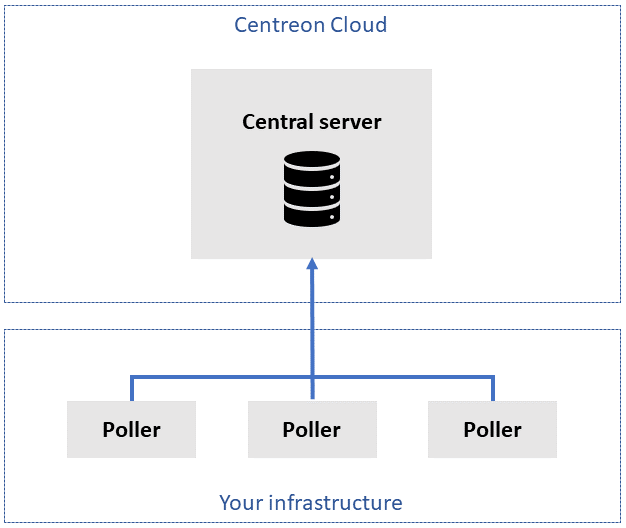

Centreon Cloud consists of the following elements:

* **A central server**:
  * The central server does not monitor resources in your infrastucture (the pollers do).
  * The central server has a [user interface](interface), in which you can see resources monitored by all pollers.
  * You can reach the user interface from anywhere with a web browser at `<organisation>.centreon.cloud`.
  * The central server is hosted in the cloud.
  * Centreon installs and upgrades central servers.

* **One or more pollers**:
  * Pollers monitor resources in your infrastructure.
  * Pollers do not have a user interface (you see the pollers' activity on the central server's interface).
  * Pollers are part of your infrastructure, which means better security, latency and bandwidth.
  * A VPN connects your pollers with the central server.

