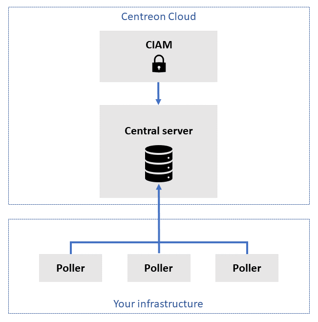

Centreon Cloud consists mainly of a user interface provided by Centreon, and pollers that you install in your infrastructure. In addition, the Centreon [CIAM](../ciam/ciam.md) module allows you to manage organizations and users, and to log in to Centreon Cloud.

## SaaS platform

* The SaaS platform is provided to you by Centreon, ready to use.
* The SaaS platform does not monitor resources in your infrastructure (the pollers do).
* The SaaS platform has a [user interface](interface.md), in which you can see the resources monitored by all pollers.
* You can reach the user interface from anywhere, using a web browser, at `<organization>.<region>.centreon.cloud`.
* The SaaS platform is hosted in the cloud.
* Centreon installs and upgrades SaaS platform.

## One or more pollers

* Pollers monitor resources in your infrastructure. They should be in the same network as the resources they will monitor.
* Pollers do not have a user interface (you see the pollers' activity on the user interface).
* Pollers are part of your infrastructure, which means better security, latency and bandwidth.
* You [install your pollers](../installation/deploy-poller.md) using a simple script.
* The communication between the central and the pollers uses HTTPS.

## Centreon CIAM

* The [CIAM](../ciam/ciam.md) has a user interface that is separate from the SaaS platform.
* Before you can use Centreon Cloud, you need to configure your organization in the CIAM, and invite your users to your platform.
