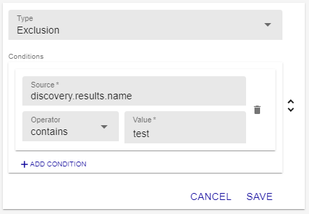
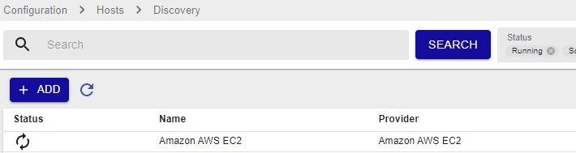

In this tutorial, we will use the Auto Discovery module to detect AWS EC2 instances and monitor them.

## Prerequisites

You must have:

* the credentials to the AWS group of instances you want to monitor (Name, AWS Access Key and AWS Secret Key)
* the region your AWS instances are in.

## Step 1: Installing the Amazon EC2 plugin dependencies

Using SSH, log in to the poller that will monitor your EC2 resources, then install the **awscli** binary:

```shell
yum install awscli
```

## Step 2: Configure the discovery job

1. Go to **Configuration > Hosts > Discovery**, and then click **Add**.

2. Enter a name for your discovery job, and then select the **Amazon AWS EC2** provider. Click **Next**.

    

3. Select the poller you want to monitor the EC2 instances with.

4. If your infrastructure requires it, fill in the details for the proxy you want to use.

5. Click on the `+` sign to the right of the **Choose credentials** list. Fill in the Name, AWS Access Key and AWS Secret Key fields, then click on **Confirm**. Click **Next**.

6. Enter the region your EC2 instances are in (for example, **eu-north-1**). Click **Next**.

7. Edit or add mappers:
    * Map `host.name` to the `discovery.results.name` attribute. The names of your hosts in Centreon will be the ones defined in this attribute (i.e. the hostname of the instance).
    * In our example, we will exclude the instances whose hostname contains "test".

    

    Click **Next**.

8. Select **Manual analysis**: we will have to add the hosts to the list of monitored hosts manually. Click **Next**.

9. Select **Execute immediately** and then click **Finish**. The discovery job appears in the list of jobs.

  

## Step 3: Saving the hosts and monitoring them

1. After a few seconds, refresh the page. There should be a green tick mark in the **Status** column.

    

2. Hover over the job that has just ended and then click **Display the job result** (the arrow icon). A list of hosts appears.

    

3. Select the hosts you want to add to the list of monitored hosts, and then click **Save**. 

4. Go to **Configuration > Hosts > Hosts** and check that the hosts you selected at the previous step appear in the list. The hosts are added to the lists of hosts but they are not monitored yet.

5. [Deploy the configuration](../monitoring/monitoring-servers/deploying-a-configuration.md). The hosts appear in the **Resources Status** page: they are monitored.
