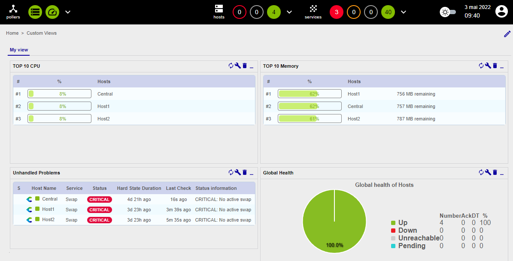

Go to the **Home > Custom Views** menu and click the pencil icon located on the far right of the interface to enable
editing mode.

Click **+ Add view** to create your first custom view, then enter **My view** for the name and select 2 columns.
Finally, click **Submit**:

Add your first widget by clicking **+ Add widget**, then enter **TOP 10 CPU** for the title and select
**Live Top 10 CPU Usage**. Click **Submit**:

Click **+ Add widget**, then enter **TOP 10 Memory** and select **Live Top 10 Memory Usage**. Click **Submit**:

The second widget is automatically placed on the second column:

Click **+ Add widget**, then enter **Unhandled alerts** and select **Services Monitoring**. Click **Submit**:

Edit this widget by clicking the wrench icon:

In the popin, uncheck the following items:

* **Display Pending**
* **Display Duration**
* **Display Tries**

Then click **Apply**.

Click **+ Add widget**, then enter **Global Health** and select **Global Health**. Click **Submit**:

Edit this widget by clicking the wrench icon and then selecting **Show services** for the **Services/Hosts** field. Then click **Apply**:

Your first custom view is created:

