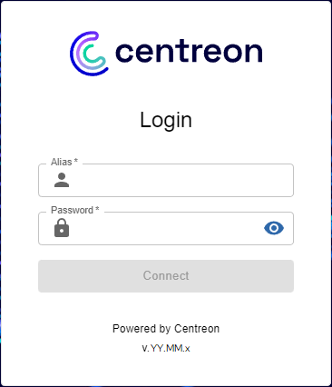
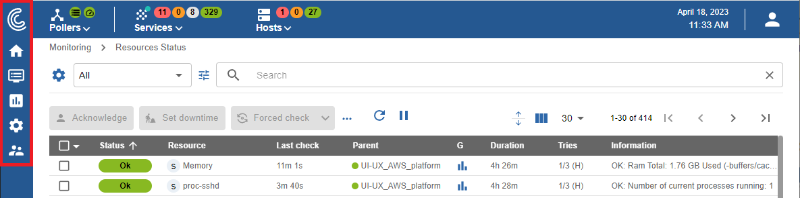
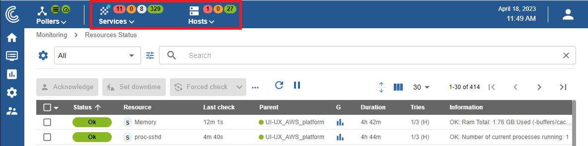

## Accessing the central server's interface

When you first connect to Centreon Cloud, use the URL and credentials that the Centreon support team has provided to you. The connection URL looks like this: `https://<organization>.<region>.centreon.cloud`.

Fill in your user name and associated password and click on the **Connect** button:

You are now connected to the Centreon web interface.

## Menus

The Centreon web interface contains several menus, each with a specific function (click the Centreon logo at the top left of the screen to expand the menus):

* **Home** shows [custom views](create-custom-view).
  Your workspace may be blank for now. Once you configure customizable widgets, you will see data and charts according
  to your customization.
* **Monitoring** provides a combined view of the statuses of all monitored items in real and delayed time using logs and
  performance graphics.
* **Reporting** provides an intuitive view (using diagrams) of the evolution of monitoring over a given time period.
* **Configuration** allows you to configure all monitored items and the monitoring infrastructure.
* **Administration** allows you to configure the Centreon platform (with settings such as authentication, proxy, extensions...) and view the overall status of the monitoring servers.

## Top banner

### Pollers section

The left part of the top banner shows the health of your platform in real time: 
* whether all pollers are running or not: the icon becomes red when a poller has not sent data to the central server for at least 15 minutes
* whether checks are running late or not. If the icon is orange or red, this may mean that your pollers are monitoring too many resources.

Click the **pollers** icon to expand the menu. On the menu, click **Configure pollers** to access page **Configuration > Pollers > Pollers**.

### Hosts and services section (top counters)

To the right of the top banner, statistics show the number of resources that are being monitored, with a specific status: 
* For hosts: number of hosts with a **Down**, **Unreachable** and **Up** status. 
* For services: number of services with a **Critical**, **Warning**, **Unknown** and **OK** status.

These numbers include unconfirmed (SOFT) alerts, but do not include resources that are acknowledged or in downtime. Pending resources are shown by a blue dot on the **hosts** or **services** icons.
 
Click on a circle representing a status:
* Page **Monitoring > Resources status** opens.
* The page is filtered according to the type of resource and the corresponding status.
 
Click the **hosts** or **services** icon to expand the menu and display the details of the hosts and services.

## Change the user interface language

On the banner, click on the profile icon, then click on **Edit profile**:

In the language select box, choose your language:

Then click on **Save**. Your interface is now translated.
