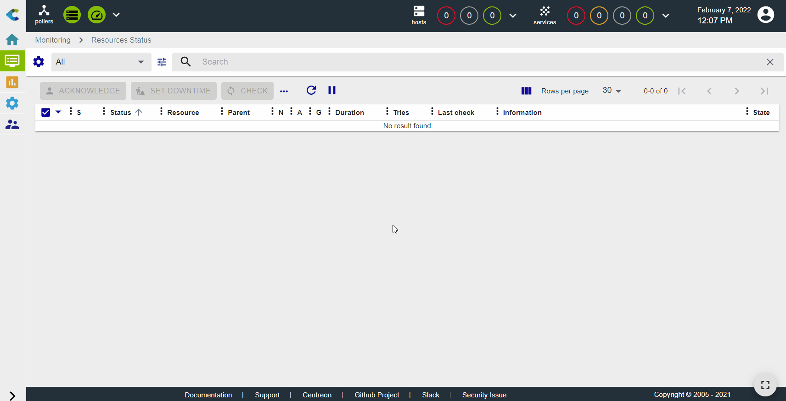
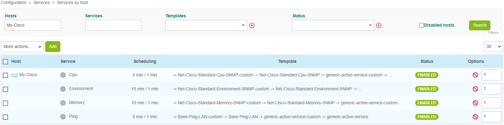
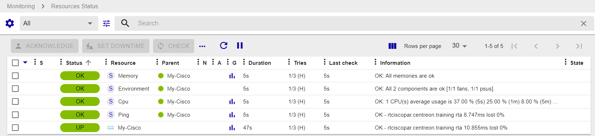

## Monitoring a Cisco Router with SNMP

In this tutorial, we're assuming that your Centreon platform is installed and running well.

Your Cisco router will be monitored using the Cisco standard plugin pack. (More about Plugin Packs [here](../monitoring/pluginpacks.md)).

## Prerequisites

### On the Cisco router you want to monitor

The first step is to activate and configure an SNMP service on your Cisco device.
Please refer to the documentation of your Cisco device to know how to configure the SNMP service.

### Network flow

The target device must be reachable from the Centreon Poller on the UDP/161 SNMP port.

## Configure the host and deploy the configuration

1. In the web interface, go to **Configuration > Plugin Packs**, search for the **Cisco standard** Plugin Pack and install it:

   

Go to the **Configuration > Hosts > Hosts** menu and click on **Add**:

Fill in the following information:

* The name of the router (1)
* A description of the router (2)
* The IP address of the router (3)
* The SNMP version and community (4)
* Select the poller that will monitor the device (keep "Central" if you have no other poller) (5)

3. Click on **+ Add a new entry** in the **Templates** field (6), then select the **Net-Cisco-Standard-SNMP-custom** template (7) from the list:

  

4. Click on **Save** (8). Your equipment has been added to the list of hosts:

  

5. Go to **Configuration > Services > Services by host**. A set of indicators has been created automatically.

  

  You can also use the shortcut beside the host's name to go directly to **Configuration > Services > Services by host**. The list will be filtered by the name of the host:

  

  

6. [Deploy the configuration](../monitoring/monitoring-servers/deploying-a-configuration.md).

7. Go to **Monitoring > Resources Status** and select **All** from the **Resource status** filter. At first, the resources appear with the status **Pending**, which means that no checks have been executed yet:

   

   After a few minutes, the first results of the monitoring appear:

   

   If not all services are in an OK state, check what causes the error and fix the problem.