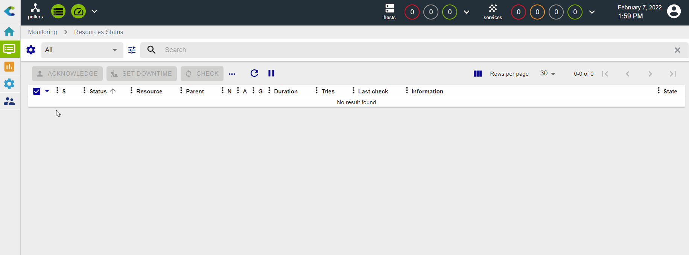
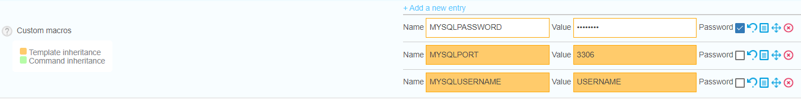
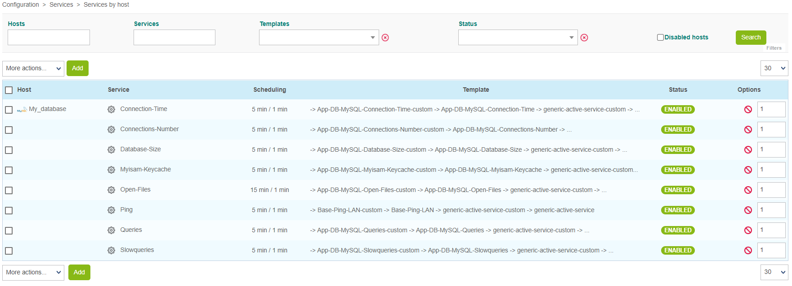

## Prerequisites

The objective of this tutorial is to monitor a Mysql/MariaDB database.

In order to be able to collect the necessary information from the database, a database user with specific privileges is required. If the database you want to monitor is a Centreon database, a dedicated user already exists and is called **centreon**. Otherwise, start by creating a new user: log in to your database, then run the following command:

```shell
CREATE USER 'username'@'IP_POLLER' IDENTIFIED BY 'password';
```

Then, whether your database is a Centreon database or not, run the following command:

```shell
GRANT SELECT ON *.* TO 'centreon'@'IP_POLLER';
```

> Replace the username, the IP address of the poller and the password by the values you want.

### Installing the Plugin Pack

The database will be monitored using the **MySQL/MariaDB** Plugin Pack.
Go to the menu **Configuration > Plugin Packs** and install the **MySQL/MariaDB** Plugin Pack:


## Set up the host and deploy the configuration

1. Go to **Configuration > Hosts > Hosts** and click on **Add**:

  

2. Fill in the following information:

  * The name of your server
  * A description of your server
  * Its IP address
  * Select the poller that will monitor the database (leave "Central" if you have no other poller)

3. Click on the **+ Add New Entry** button for the **Templates** field and select the **App-DB-MySQL-custom** template:

  

4. A list of macros matching the template will appear:

  

  Fill in the value of following macros:

  * **MYSQLUSERNAME**: the name of the user that will connect to the database.
  * **MySQLPASSWORD**: the password associated with this user.
  * **MySQLPORT**: the listening port of the database, by default 3306.

5. Click on **Save**. Your equipment has been added to the list of hosts:

  

6. Go to **Configuration > Services > Services by host**. A set of indicators has been deployed automatically:

  

7. [Deploy the supervision](../monitoring/monitoring-servers/deploying-a-configuration.md).

8. Go to **Monitoring > Status Details > Services** and select **All**
for the **Service Status** filter. At first, the resources appear with the status **Pending**,
 which means that no checks have been executed yet. After a few minutes, the first results of the monitoring appear:

  