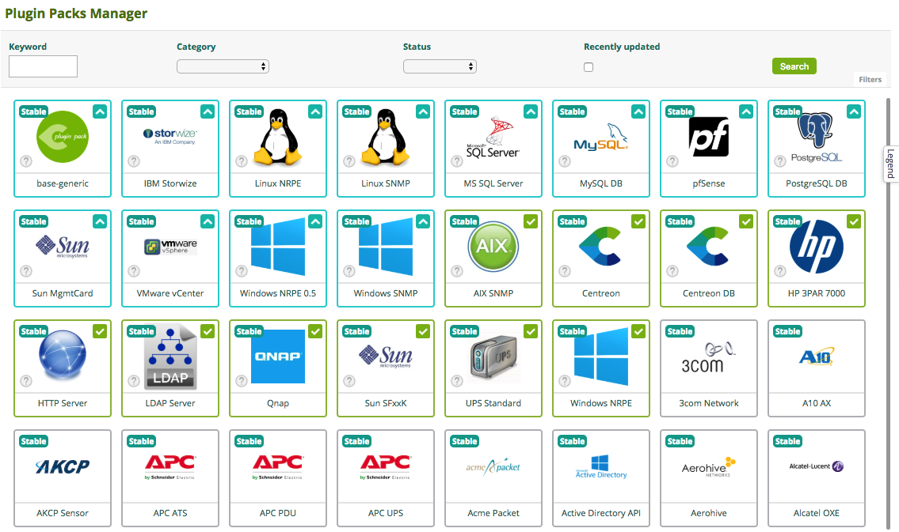
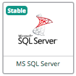
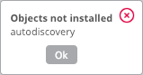

## What is a Plugin Pack?

A Plugin Pack is a downloadable package containing a set of configuration
templates that make it fast and easy to monitor your IT infrastructure.
Applying a Plugin Pack is the easiest way to monitor a host. There is one plugin pack per type of monitored equipment (e.g. a Plugin Pack to monitor Linux servers, a Plugin Pack to monitor Windows servers, etc.).

Plugin Packs consist of 2 elements, which are installed separately:

- A plugin that executes the monitoring commands from a poller. All plugins are 
already installed on your pollers.

- A pack that contains commands, host templates and service templates. 
For each type of equipment,
 the templates determine which indicators will be
monitored and set default warning and critical thresholds (these may be
fine-tuned later on). If you want to use a pack, you must install it on the central server.

  Some packs also contain [discovery rules](discovery/introduction).

To get an up-to-date list of all Plugin Packs with their respective monitoring
procedure, please refer to the section on [Plugin Packs](../integrations/plugin-packs/introduction).

## What do I need to do to be able to use a Plugin Pack?

### Checking the monitoring procedure

Some Plugin Packs require extra configuration steps. Read the monitoring procedure for each installed pack
to understand the contents of the pack and to find out about any prerequisites. Go to page **Configuration > Plugin Packs** and click on the ``i`` icon of each pack to access its documentation:

### Installing the pack

You now have access to the Plugin Packs catalog, on page **Configuration > Plugin Packs**:

To install a pack, hover over the icon with the mouse and click on the ``+``

You can also click on the Plugin Pack to display more details and click on the ``+``

Once the pack is installed, it has a green outline and a green check mark.

| **Before installation**                                          | **After installation**                                          |
| ---------------------------------------------------------------- | --------------------------------------------------------------- |
|  |  |

### Managing dependencies

During installation, some objects in the pack may not be installed. These objects are often additional configuration
objects and are not required to deploy the configuration templates provided by the pack.

Most of the time, it is necessary to update your Centreon platform and then reinstall your pack.

In the following example, the "autodiscover" object is a discovery rule for the "Centreon Auto Discovery" module, but
this one is only available for Centreon in 18.10.x version:

## How do I use a Plugin Pack?

Apply a plugin pack to a host or service to start monitoring them:

1. Create the host/the service, and in the **Template(s)** field, choose the template for the Plugin Pack you want.

2. [Deploy](monitoring-servers/deploying-a-configuration) the configuration. Your host or service is now monitored using the Plugin Pack.