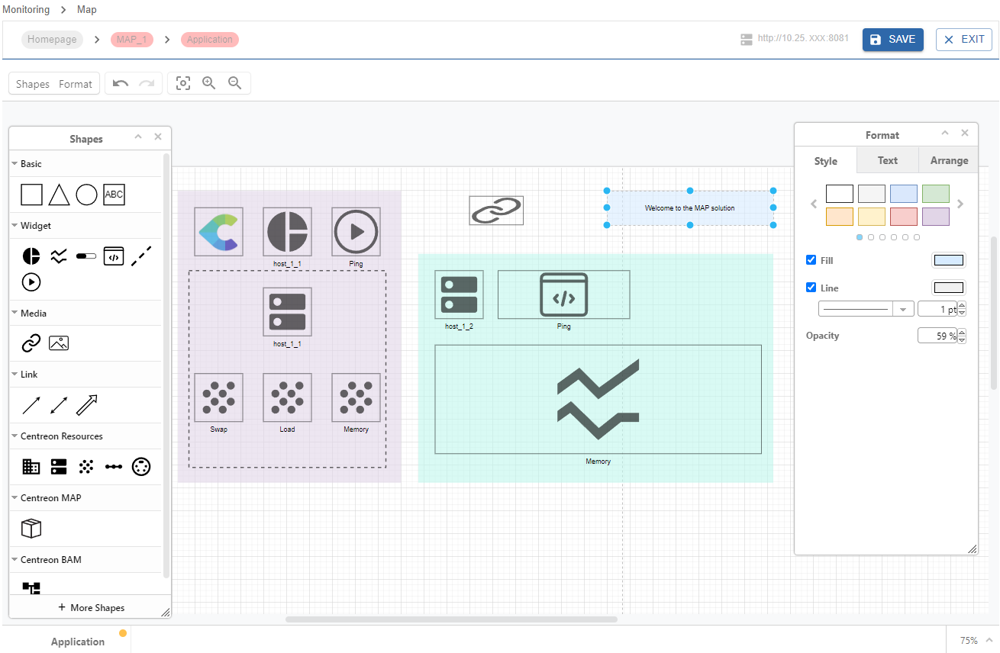

Centreon MAP is a solution fully available in the Centreon web interface offering you the best possible experience in creating, displaying and sharing graphical representations of your monitored infrastructure.

## Overview

Create, customize, and display your maps within a single web interface.

You need first to create your logical views using the MAP editor:

Then you can display your map directly in view mode:

Your maps can be displayed in two ways in the interface:
- In the **Monitoring > Map** page, in view mode.
- In the **Home > Custom Views** page, using a dedicated MAP [widget](../alerts-notifications/custom-views.md).

## Procedures

Use the following procedures to use and administrate Centreon MAP.

- [Manage access rights on MAP](map-web-manage.md) describes the various rights and permissions on maps.
- [Manage maps in MAP](map-web-manage.md) gives you information about how to manage maps from the Centreon MAP interface.
- [Create a standard map](map-web-create-standard-map.md) describes how to create standard maps and how to customize them using the MAP editor.
- [Create a geographic view](map-web-create-geoview.md) explains how to display your resources across a defined geographical area.
- [MAP known issues](map-web-known-issues.md) is a list of issues you may encounter using MAP.
