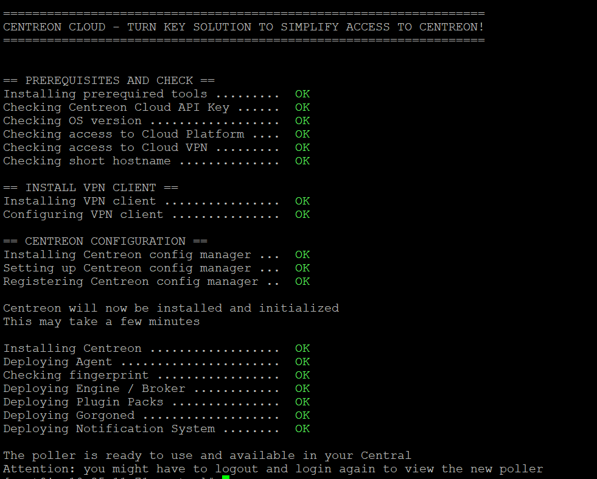

import Tabs from '@theme/Tabs';
import TabItem from '@theme/TabItem';

With Centreon Cloud, your central server is already ready to use. All you have to do is to install pollers in your infrastructure, and that is very easy: just execute a script and then export the configuration, and there you are!

Before deploying a poller, make sure the [prerequisites](prerequisites.md) for your host machine are met.

## Step 1: Running the script

1. Use SSH to connect to the server that will become a poller.

2. Run the command that will deploy the poller automatically. This command has been provided to you by our support team. It looks like this (according to your region):

<Tabs groupId="sync">
<TabItem value="US East Region" label="US East Region">

> This applies to customers located in the USA, Canada and South America.

```shell
bash -c "$(curl -H "content-type: application/json"  -H "x-api-key: your_token"  https://api.useast1.prod1.centreon.cloud/v1/organization/your_organization_code/site/centreon/poller -s)"
```

> Make sure you replace **your_token** and **your_organization_code** with the correct values.

</TabItem>
<TabItem value="Europe West Region" label="Europe West Region">

> This applies to customers located in Europe, Africa, Asia and Oceania.

```shell
bash -c "$(curl -H "content-type: application/json"  -H "x-api-key: your_token"  https://api.euwest1.prod1.centreon.cloud/v1/organization/your_organization_code/site/centreon/poller -s)"
```

> Make sure you replace **your_token** and **your_organization_code** with the correct values.

</TabItem>
</Tabs>
  
3. The script is executed (this should take about 10 minutes):

   

4. When this is finished, [log in to your central server](../getting-started/interface.md#accessing-the-central-servers-interface) and go to **Configuration > Pollers > Pollers**. The new poller appears in the list of pollers.
   * By default, the name of the poller is its hostname (this may be shortened). Click the name to rename it.
   * The address in the **IP Address** column is that of the poller as seen by the central server.
   * The poller is not running yet (**No** in the **Is running?** column).

## Step 2: Exporting the configuration and restarting the poller

Export the configuration for this poller:

1. On the central server, go to **Configuration > Pollers > Pollers**, then select the poller you have just created.
2. Click **Export configuration**. A new page opens:
   * Check the first four boxes
   * Under **Restart Monitoring Engine**, select the **Restart** method.
3. Click **Export**. A log of the export is displayed. This should have no errors.
4. Go back to **Configuration > Pollers > Pollers**: the poller now has **Yes** under **Is running?**. Your poller is now ready to monitor resources.
