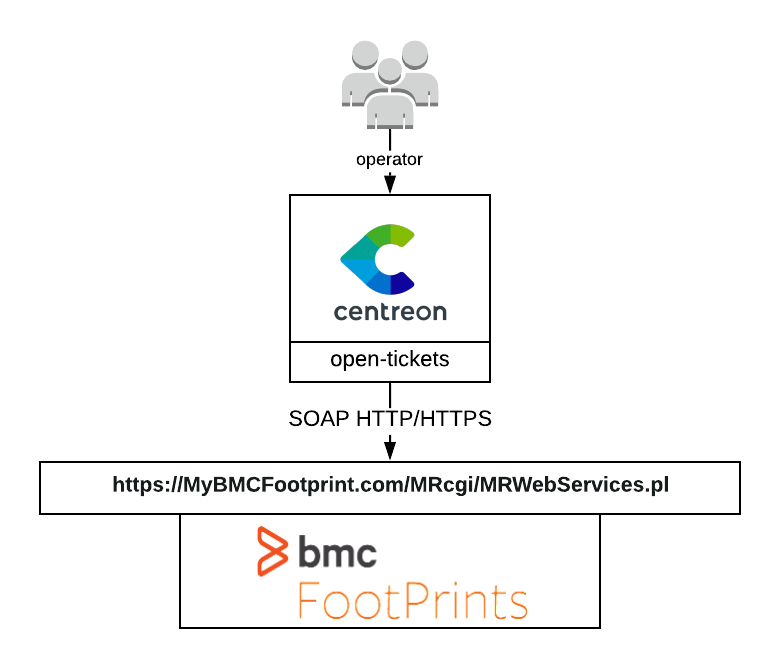

## How it works

BMC Footprints open-tickets provider uses the BMC Footprints SOAP API to open
incidents about your monitoring alerts.

## Compatibility

This integration is (at least) compatible with the following BMC Footprints
versions:

  - 11.x

## Requirements

You need to [configure Open Tickets](../../alerts-notifications/ticketing.md) in order for resources (hosts and services) to receive a ticket number.

Our provider requires the following parameters:

| Parameter       | Example of value        |
| --------------- | ----------------------- |
| Address         | 10.11.12.13             |
| Webservice Path | /MRcgi/MRWebServices.pl |
| Action          | /MRWebServices          |
| Username        | centreon                |
| Password        | MyPassword              |
| Timeout         | 60                      |

## Possibilities

As of now, the provider is able to open a ticket
