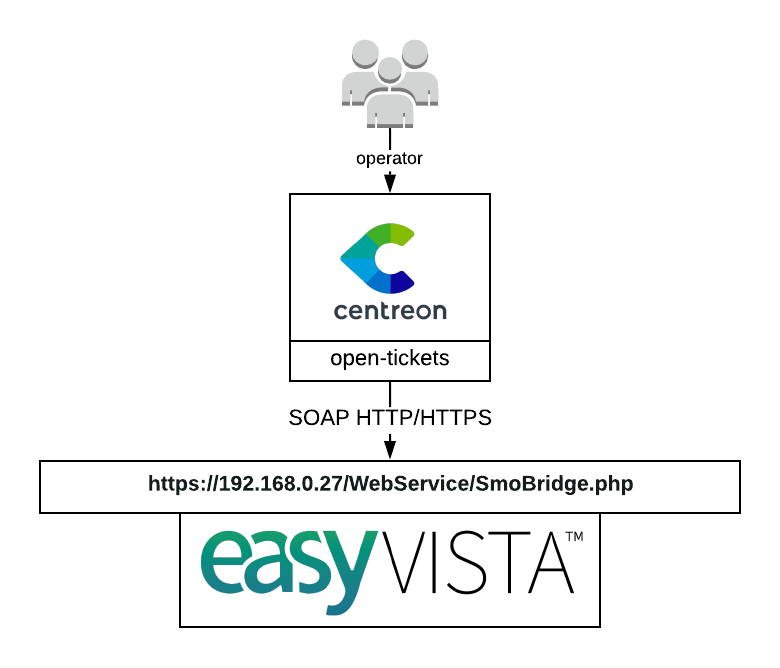

## How it works

EasyVista open-tickets provider uses the EasyVista SOAP API to open incidents
about your monitoring alerts.

## Requirements

Our provider requires the following parameters:

| Parameter       | Example of value          |
| --------------- | ------------------------- |
| Address         | 192.168.0.27              |
| Webservice Path | /WebService/SmoBridge.php |
| Username        | centreon                  |
| Password        | MyPassword                |
| Timeout         | 60                        |

## Possibilities

As of now, the provider is able to open a ticket with the following parameters

  - Requestor
  - Urgency
  - Severity
  - Asset
  - External reference
  - Phone
  - Recipient
  - Origin
  - CI
