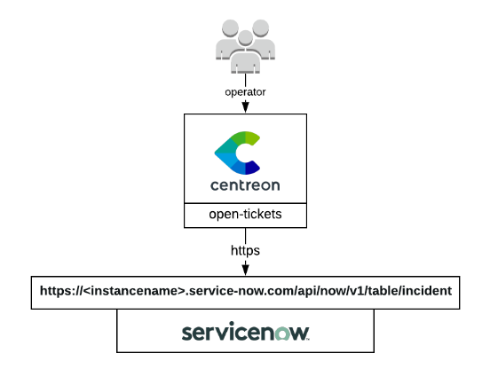

## How it works

ServiceNow open-tickets provider uses the ServiceNow REST API to get
configuration data and open incidents about your monitoring alerts. Since it
gathers a lot of configurations objects from ServiceNow, it puts them in cache. Loging
out or waiting 10 hours will flush the cache.



## Compatibility

This integration is (at least) compatible with the following ServiceNow
versions and latest version of ServiceNow:

  - Madrid
  - London
  - New York

## Feature information

| Open ticket | Close ticket (from Centreon to ServiceNow) | Handle custom fields |
| -- | -- | -- |
| ✓ | ✘ | ✘ |

## Requirements

You need to [configure Open Tickets](../../alerts-notifications/ticketing.md) in order for resources (hosts and services) to receive a ticket number.

Our provider requires the following parameters:

| Parameter           | Example of value |
| ------------------- | ---------------- |
| Instance Name       | MyCompany        |
| OAuth Client ID     | xxxxxxxxx        |
| OAuth Client Secret | yyyyyyyy         |
| Username            | centreon         |
| Password            | MyPassword       |
| Protocol            | https            |
| Timeout             | 60               |

### Network flow

| Source | Destination | Protocol/Port |
| -- | -- | -- |
| Centreon central server | ServiceNow instance | TCP/443 (https) or TCP/80 (http) |

### Account

You need the following information:

- Client ID
- Client secret
- Username
- Password
- Instance name

The aforementioned account must at least be able to open a ticket through the **ServiceNow Table REST API**. This is a POST action into the **incident table**.

The connector will also try to access the following tables from the API depending on the configuration of your open ticket rule:

- sys_user table
- sys_user_group table
- sys_choice

Some test commands that you can run from your Centreon central server are available in the [Test commands](#test-commands) section.

## Retrieved data

This open ticket connector can retrieve the following information from your ServiceNow instance:

- Categories
- Subcategories
- Impact
- Urgency
- Severity
- Assignment Group
- Assignment

> If you need more information regarding retrieved data from an open ticket connector, please read the [retrieved data chapter](../../alerts-notifications/ticketing/mapping.md) from the Open Ticket global documentation.

## Test commands

The curl commands listed below must be run from your central server. You need to replace everything between `<>`. For example `<server_address>` may be replaced with `service-now.com`.

### Get oauth tokens

```bash
curl --location 'https://<instance_name>.<server_address>/oauth_token.do' \
--header 'Content-Type: application/x-www-form-urlencoded' \
--data-urlencode 'grant_type=password' \
--data-urlencode 'client_id=<client_id>' \
--data-urlencode 'client_secret=<client_secret>' \
--data-urlencode 'username=<username>' \
--data-urlencode 'password=<password>'
```

### Get ServiceNow severities

```bash
curl --location 'https://<instance_name>.<server_address>/api/now/table/sys_choice?sysparm_fields=value%2Clabel%2Cinactive&sysparm_query=nameSTARTSWITHincident%5EelementSTARTSWITHseverity' \
--header 'Authorization: Bearer <authentication_token>' \
--header 'Content-Type: application/json'
```

### Get ServiceNow urgencies

```bash
curl --location 'https://<instance_name>.<server_address>/api/now/table/sys_choice?sysparm_fields=value,label,inactive&sysparm_query=nameSTARTSWITHincident%5EelementSTARTSWITHurgency' \
--header 'Authorization: Bearer <authentication_token>' \
--header 'Content-Type: application/json'
```

### Get ServiceNow impact

```bash
curl --location 'https://<instance_name>.<server_address>/api/now/table/sys_choice?sysparm_fields=value,label,inactive&sysparm_query=nameSTARTSWITHtask%5EelementSTARTSWITHimpact' \
--header 'Authorization: Bearer <authentication_token>' \
--header 'Content-Type: application/json'
```

### Get ServiceNow categories

```bash
curl --location 'https://<instance_name>.<server_address>/api/now/table/sys_choice?sysparm_fields=value,label,inactive&sysparm_query=nameSTARTSWITHincident%5EelementSTARTSWITHcategory' \
--header 'Authorization: Bearer <authentication_token>' \
--header 'Content-Type: application/json'
```

### Get Service Now subcategories

```bash
curl --location 'https://<instance_name>.<server_address>/api/now/table/sys_choice?sysparm_fields=value,label,inactive&sysparm_query=nameSTARTSWITHincident%5EelementSTARTSWITHsubcategory' \
--header 'Authorization: Bearer <authentication_token>' \
--header 'Content-Type: application/json'
```

### Get ServiceNow users

```bash
curl --location 'https://<instance_name>.<server_address>/api/now/table/sys_user?sysparm_fields=sys_id,active,name' \
--header 'Authorization: Bearer <authentication_token>' \
--header 'Content-Type: application/json'
```

### Get ServiceNow user groups

```bash
curl --location 'https://<instance_name>.<server_address>/api/now/table/sys_user_group?sysparm_fields=sys_id,active,name' \
--header 'Authorization: Bearer <authentication_token>' \
--header 'Content-Type: application/json'
```

### Open a ticket

Keep in mind that the data in the command down below is just an example and your ServiceNow instance may ask you to add mandatory data

```bash
curl --location 'https://<instance_name>.<server_address>/api/now/table/incident' \
--header 'Content-Type: application/json' \
--header 'Accept: application/json' \
--header 'Authorization: Basic <authentication_token>' \
--data '{
    "short_description": "This a test ticket",
    "description": "Believe it or not, but it is just a test."
}'
```
