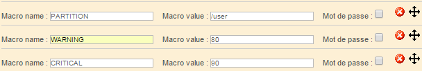

A macro is a variable that defines a value to be used in a [command](commands.md) when checking hosts or services. Macros allow you to customize checks by defining a particular value for each host or service being checked by the same template: the value of the macro for a specific host of service is defined by the user in the configuration form for the host or the service.

Example: In the following command (used to check the uptime on a Linux server) **$HOSTADDRESS$**, **$_SERVICEWARNING$** and **$_HOSTSNMPEXTRAOPTIONS$** are macros.

```shell
$CENTREONPLUGINS$/centreon_linux_snmp.pl --plugin=os::linux::snmp::plugin --mode=uptime --hostname=$HOSTADDRESS$ --snmp-version='$_HOSTSNMPVERSION$' --snmp-community='$_HOSTSNMPCOMMUNITY$' $_HOSTSNMPEXTRAOPTIONS$ --warning-uptime='$_SERVICEWARNING$' --critical-uptime='$_SERVICECRITICAL$' $_SERVICEEXTRAOPTIONS$
```

When the command is used to check the host that has 10.10.10.10 as an IP address (defined in the host's configuration form), the macro is replaced by the value 10.10.10.10 so that the command is specific to this host.

* A host macro is used to define a variable that is specific to the host and that will not change regardless of the
service questioned: host connection identifiers, a connection port to a particular service, an SNMP community, etc.
* A service macro is used to define settings specific to a service: a WARNING / CRITICAL threshold, a partition
to be questioned, etc.

A macro always starts and finishes with the **$** sign.

## Standard macros

Standard macros are macros predefined in the source code of the monitoring engines. They can be used in any [check command](commands.md). In the check command creation form, you can insert them using the dropdown list and the arrows on the bottom right of the **Command line** field. The values for all of these macros are provided by Engine. If a standard macro already exists for the value you want, use the standard macro rather than a custom macro.

Example:

* The macro called **$HOSTADDRESS$** enables us to retrieve the IP address of a host
* The macro called **$CONTACTEMAIL$** enables us to retrieve the e-mail address of a contact.

> A complete list of standard macros is available [at the following address](https://assets.nagios.com/downloads/nagioscore/docs/nagioscore/3/en/macrolist.html).

## Custom macros

### Definition

A custom macro is a macro defined by the user, and used in a [check command](commands.md).

Custom macros start with $_HOST for custom host macros and $_SERVICE for custom service macros.

> If you were using Centreon OnPrem or Nagios in the past, you may have used arguments ($ARG1, $ARG2...). These are deprecated in Centreon Cloud: use custom macros. Fields relating to arguments appear in the form only for compatibility reasons for OnPrem customers migrating to Centreon Cloud.

### Example

In a host check command, the following macros are used: **$_HOSTUSERLOGIN$**, **$_HOSTUSERPASSWORD$**. When a host is configured, the values for these macros are defined:


In a service check command, the following macros are used: **$_SERVICEPARTITION$**, **$_SERVICEWARNING$**, **$_SERVICECRITICAL$**. When a service is configured, the values for these macros are defined:



### A special case

The **Community SNMP & Version** fields in a host form automatically generate the following custom macros:
**$_HOSTSNMPCOMMUNITY$** and **$_HOSTSNMPVERSION$**.
