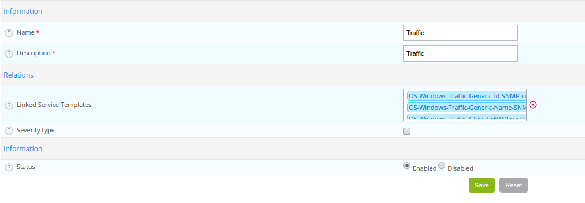

Categories allow you to:

- organize hosts or services
- [filter the view](../alerts-notifications/resources-status.md#filtering-events) in the **Resources status** page
- define types of objects in the Centreon MAP module.

A special type of category is called severity. Severities can be used to achieve all of the above, but also to:

- sort the view on the **Resources Status** page by severity level, e.g., to show the most important alerts first. (Severities are shown in the **S** column in the **Resources Status** page.)

- filter data in the **Host monitoring** and **Service monitoring** widgets in [custom views](../alerts-notifications/custom-views.md).

## Hosts category

Go to the **Configuration > Hosts > Categories** menu and click **Add**.

* The **Name** and **Alias** fields contain the name and the alias of the category of host, respectively.
* The **Linked hosts** list allows us to add hosts to the category.
* If a host template is added to the **Linked host template** list, all the hosts that inherit from this Model belong to
  this category.
* The **Severity type** box signifies that the category of hosts has a criticality level.
  * The **Level** and **Icon** fields define a criticality level and an associated icon, respectively.
* The **Status** and **Comments** fields allow us to enable or disable the category of host and to comment on it.

## Services category

Go to the **Configuration > Services > Categories** menu and click **Add**.

* The **Name** and **Description** fields define the name and the description of the category of service.
* If a service template is added to the **Linked Templates** list, all the services that inherit from this
  template belong to this category.
* The **Severity type** box signifies that the category of service has a criticality level.
  * The **Level** and **Icon** fields define a criticality level and an associated icon, respectively.
* The **Status** field allows us to enable or disable the category of services.

## Severities

### Creating a severity

To create a severity:

1. Go to **Configuration > Hosts > Categories** or **Configuration > Services > Categories**, and then click **Add**.
2. Fill in the **Name** and **Alias** fields, and then check **Severity type**.
3. Define a level for the severity (a number that will be used to sort hosts or services in the **Resources Status** page) and an icon that will appear in the **S** column in the **Resources Status** page.
4. Click **Save**. The severity appears in the list of severities.

### Applying the severity to a host or service

1. Edit the host or service (go to **Configuration > Hosts > Hosts** or **Configuration > Services > Services by host**, and then click the host or service).
2. On the **Extended Info** tab, in the **Monitoring Engine** section, select the severity you want from the **Severity level** list.
3. Click **Save**.
4. [Deploy the configuration](../monitoring/monitoring-servers/deploying-a-configuration.md). On the **Resources Status** page, the icon for the severity appears in the **S** column. A tooltip shows the level and name of the severity. If you click the column header, the view is sorted by severity level.
