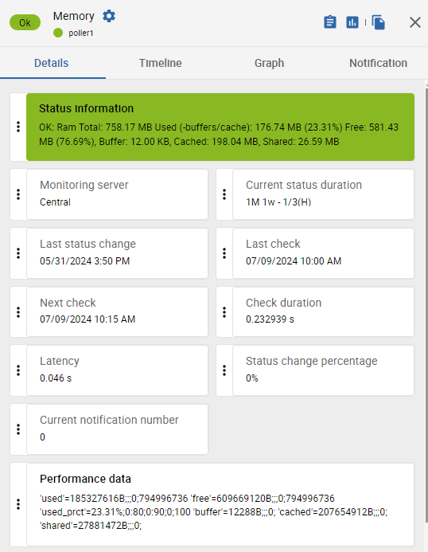

## What is a metric?

A metric, or "performance data", is part of a service. A service can have several metrics, or none.

Metrics allow you to display graphs and to define thresholds according to which you will receive notifications.

### Status of a metric and status of a service

When a service has several metrics, the status of the service is the worst among all metric status. The order of priority is as follows: OK, UNKNOWN, WARNING, CRITICAL.

If a metric cannot be retrieved, its status is considered as UNKNOWN and will impact the associated service.

### Services without metrics

Some services have no associated metrics: they check statuses rather than metrics with numerical values. Typically, checks on hardware. The status the service takes is directly defined in the plugin's code, according to the device's response.

## Where can I see the metrics for a service in Centreon?

On the **Resource status** page, in the **Details** panel for a service, the **Performance data** section gives you the detailed values for all metrics for this service. The values are that of the last check.

Example: We are monitoring a Centreon poller (for this service, via the [Linux SNMP](https://docs.centreon.com/pp/integrations/plugin-packs/procedures/operatingsystems-linux-snmp/#collected-metrics--status) connector). In the following picture, we can see that the **Memory** service returns 6 metrics: **used**, **free**, **used_prct**, **buffer**, **cached** and **shared**.



You can also:

* See the evolution of all the metrics for a service in the **Graph** tab of the details panel for the service.
* Display the last value for a metric in a [dashboard](../alerts-notifications/dashboards.md), using the **Single metric** widget.

## What is the format of a metric?

In all cases, the format of the metrics as returned by the plugins is as follows:

```text
'name_of_the_metric'= value[unit];warning;critical;min;max
```

* **value**: the value that is displayed in the details panel of the service is the value returned by the last performed check.

* **warning/critical**: [thresholds](#syntax-of-metric-thresholds) for which the status of the metric will be WARNING or CRITICAL. If no threshold is defined, the status of the metrics will always be OK. The value of these thresholds is defined [in a macro specific to the service, or in its EXTRAOPTIONS macro](#how-do-i-define-a-threshold-for-a-specific-metric).

   > You can choose to define only a CRITICAL threshold and no WARNING threshold, and vice versa.

* **min/max**: This is not the minimum/maximum value seen in the data, but the minimum/maximum possible value that the metric can have. For instance, the maximum CPU usage will always be 100%. For some plugins or modes, these values can be redefined [EXTRAOPTIONS macro](#how-do-i-define-a-threshold-for-a-specific-metric).

   * The min and max values will be the minimum/maximum values on the Y axis of the graph. If no min or max are defined, the graph will adapt its height to the smallest and biggest seen value. Redefining the min/max values help make graphs as relevant as possible: if several graphs that represent the same service for several hosts are displayed together, defining the same min and max for all metrics allows you to display them with the same scale.
   * The min/max values also make it possible to assess the usage of a resource compared to its capacity: redefining them may be relevant in certain cases. For instance, if you are checking the network traffic on an interface, this interface provides its theoretical minimum speed to the plugin, but you can change it manually if the actual speed is limited by another device.
   * Min/max values can also be used to display data as a gauge in [MAP](../graph-views/introduction.md).

### Syntax of metric thresholds

* **x** : we are alerted if the value of the metric is strictly higher than **x** (**80** means higher than 80).
* **x:** : we are alerted if the value of the metric is strictly lower than **x** (**50:** means lower than 50).
* **x:y**: we are alerted if the value of the metric is outside this range (**0:10** means below 0 and above 10). For example, we can determine that the temperature of a datacenter will be CRITICAL if it is below 18 or higher than 24: we will input **18:24**.
* **@x:y**: we are alerted if the value of the metric is inside the range (**@0:10** means that we are alerted if the value of the metric is between 0 and 10).
* **x:x**: the value of the metric must be equal to **x** for its status to be OK.

## How do I define a threshold for a specific metric?

To define a threshold for a specific metric, you must add an option in the EXTRAOPTIONS macro of the service (if a macro specific to the metric doesn't already exist). For each connector, the documentation includes le table of options, in the **Available options > Mode options** section.

**Example**: An [**HWg-STE Sensor**](/pp/integrations/plugin-packs/procedures/hardware-sensors-hwgste-snmp) connector brings a **Sensors-Global** service, that includes 2 metrics: **hardware.sensor.temperature** and **hardware.sensor.humidity.percentage**. We want to define WARNING and CRITICAL thresholds for the temperature and the humidity. The documentation explains:

| Option | Description |
| ------ | ----------- |
| --warning	| Set warning threshold for 'temperature', 'humidity' (syntax: type,regexp,threshold) Example: --warning='temperature,.*,30' |
| --critical | Set critical threshold for 'temperature', 'humidity' (syntax: type,regexp,threshold) Example: --warning='temperature,.*,50' |

(Here, **regexp** allows you to filter on a specific sensor if there are several. To include all sensors, use `.*`)

In the EXTRAOPTIONS macro of the service, we will input:

```text
--warning='temperature,.*,30' --warning='humidity,.*,60' --critical='temperature,.*,50' --critical='humidity,.*,80'
```

## Examples of commands and their returned metrics

### HTTP-Response-Time service

**Command**

```text
/usr/lib/centreon/plugins//centreon_protocol_http.pl
--plugin=apps::protocols::http::plugin
--mode=response
--hostname=xxx.xxx.xxx.xxx
--proto='http'
--port='80'
--urlpath='/'
--warning=''
--critical=''
```

**Returned metrics**

```text
'time'=0.224s;;;0; 'size'=579B;;;0;
```

### CPU service

**Command**

```text
/usr/lib/centreon/plugins//centreon_linux_snmp.pl
--plugin=os::linux::snmp::plugin
--mode=cpu
--hostname=xxx.xxx.xxx.xxx
--snmp-version='2c'
--snmp-community='public'
--warning-average='80'
--critical-average='90'
--critical-core='85'
```

**Returned metrics**

```text
'total_cpu_avg'=17.00%;0:80;0:90;0;100 'cpu_0'=16.00%;;0:85;0;100 'cpu_1'=18.00%;;0:85;0;100
```

### Ping service

**Command**

```text
/usr/lib64/nagios/plugins/check_icmp
-H xxx.xxx.xxx.xxx
-w 200.000,20%
-c 400.000,50% -p 1
```

**Returned metrics**

```text
rta=0,984ms;200,000;400,000;0; pl=0%;20;50;0;100 rtmax=4,721ms;;;; rtmin=0,032ms;;;;
```

### Swap service

**Command**

```text
/usr/lib/centreon/plugins//centreon_linux_snmp.pl
--plugin=os::linux::snmp::plugin
--mode=swap
--hostname=xxx.xxx.xxx.xxx
--snmp-version='2c'
--snmp-community='public'
--warning-usage-prct='10'
--critical-usage-prct='30'
```

**Returned metrics**

```text
'used'=270487552B;;;0;1719660544 'free'=1449172992B;;;0;1719660544 'used_prct'=15.73%;0:10;0:30;0;100
```

### Load service

**Command**

```text
/usr/lib/centreon/plugins//centreon_linux_snmp.pl
--plugin=os::linux::snmp::plugin
--mode=load
--hostname=xxx.xxx.xxx.xxx
--snmp-version='2c'
--snmp-community='public'
--warning='4,3,2'  // 1 minute, 5 minutes, 15 minutes glissantes
--critical='6,5,4'
```

**Returned metrics**

```text
'load1'=0.30;0:4;0:6;0; 'load5'=0.16;0:3;0:5;0; 'load15'=0.29;0:2;0:4;0;
```

### Chronyd service

**Command**

```text
/usr/lib/centreon/plugins/centreon_linux_snmp.pl
--plugin os::linux::snmp::plugin
--hostname 127.0.0.1
--snmp-community public
--mode processcount
--process-name chronyd
--critical 2:2
```

**Command output**

```text
CRITICAL: Number of current processes running: 1 | 'nbproc'=1;;2:2;0;
```
