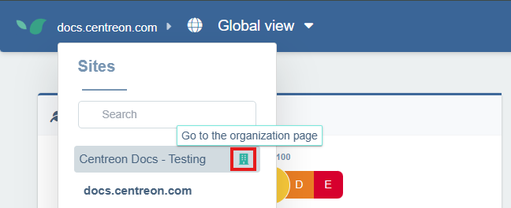

A private Synthetic Monitoring Zone (STM Zone) allows you to monitor your user journeys on internal domains or networks specific to your organization using a probe deployed inside your infrastructure.

## Prerequisites

- A machine inside your infrastructure to host the probe. The machine must be able to access the application you will monitor.
- The Docker credentials provided by Centreon. The credentials are sent by Centreon using a secure Keeper link. Save these credentials in your own safe.
- A user journey configured on the internal application to monitor.

## Step 1: Create a new STM zone

1. From the **Global View**, open the site selector in the top-left corner and select your organization’s page.



2. On your organization’s configuration page, click the **Synthetic Monitoring Zones** tab.

3. Click **+ New Synthetic Monitoring Zone**. Give the zone a meaningful name (e.g., Paris Office) then click **+ Create**.

Your new zone now appears in the list.

## Step 2: Associate a probe to the STM zone

1. Click **Associate a probe** to the right of your zone. A window opens with 2 Docker commands:

2. Use the first command to log into the Centreon Docker registry with [the credentials provided by Centreon](#prerequisites)

```shell
docker login docker.centreon.com/centreon-dem-beta
```

## Step 3: Create and launch the probe

1. To create and launch the probe, execute the second command you obtained at [step 2](#step-2-associate-a-probe-to-an-stm).

2. Refresh the page: once launched, the probe is automatically saved and appears to the right of the associated zone in the **Synthetic Monitoring Zones** list.

## Step 4: Associate the zone with a user journey

1. Go to **Configuration** and select the **User Journeys** tab. 

2. On the journey you want to run from your private zone, click on the three dots on the right, then click on **Advanced**.

3. In the **Advanced configuration** window, scroll down to the **Synthetic Monitoring Zones** section. Your private zone appears under **Private Zones**. Select it and click **Save**.

After a short while, the probe will have executed its first check and your internal journey monitoring will be operational. You can analyze it just like a regular [user journey](../../how-to-articles/user-journey-screen.md).
