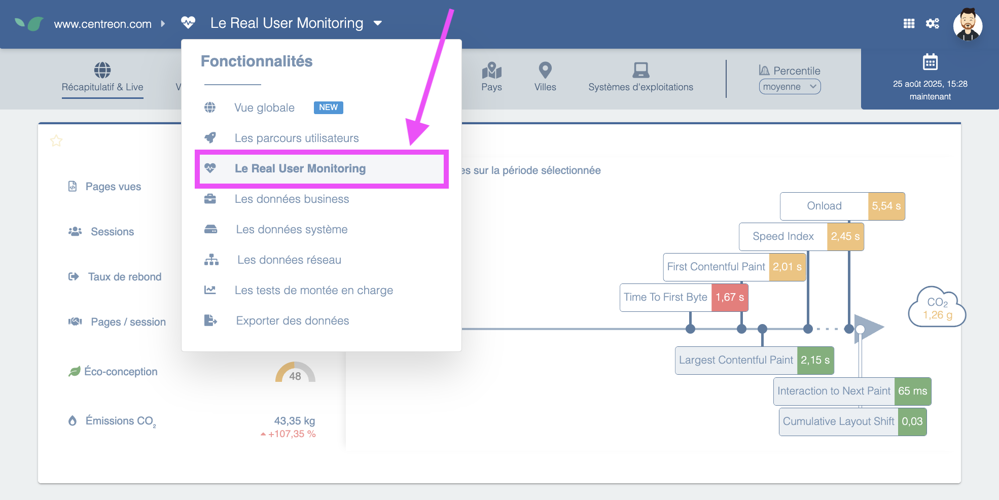

Real User Monitoring (RUM) is a performance monitoring technique that captures and analyzes how actual users experience your website or application in real time.

## RUM vs STM

Unlike synthetic monitoring (which uses bots to simulate visits on a schedule), RUM captures real conditions - actual devices, browsers, network speeds, and usage patterns. This means you see the performance your users actually experience, not lab results.

## How it works

RUM works by injecting a small JavaScript snippet into your web pages. This snippet runs in the user's browser and collects data about their actual session — then sends that data back to Centreon Experience Monitoring for analysis. The snippet is unintrusive and has no impact on Google Analytics for instance.
