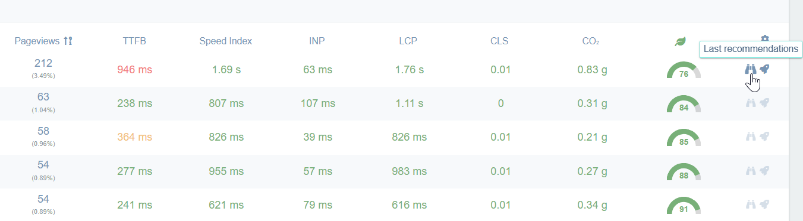

Centreon Experience Monitoring provides detailed audits of how to improve the performance of your site.

To access audit pages, click the **Last recommendations** icon in the tables on the **URLs** tab (that includes the detailed page for a specific URL when you click this URL in the treemap on the **Summary & Live** tab).

