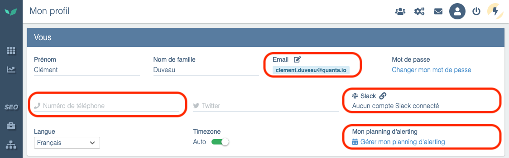
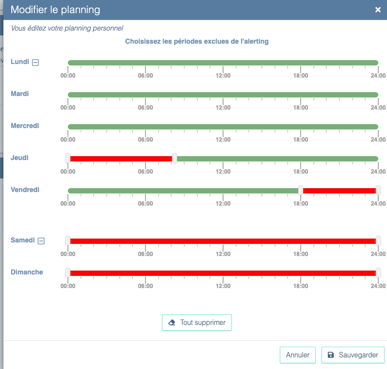

# Receive and configure alerts

Alerts are available **by email with all licenses**.

Some licenses allow receiving alerts **by SMS, Slack, or webhooks** (Microsoft Teams, Google Chat, Mattermost...). To subscribe to this option, contact your sales representative or support:

[Contact Quanta support](../getting-started/contact-support.md)

# Configure communication channels

Notifications are **personal**. For a user to receive emails, SMS, or Slack messages, simply configure the information on their profile page.



Profile page

To send a notification to a Teams channel, Google Chat, or other messaging software, you can use webhooks in the alerts.

<aside>
💡 If you want to send notifications to a team email address, you can create a user that uses that team email. See the dedicated page:

[Manage your users and their rights](./manage-users-and-rights.md)

</aside>

# Access the alerting and reporting settings screen

You can access the configuration screen by clicking the three dots above a user journey, then *Alerting*.


You can also access the configuration screen by clicking *Configuration* then *Alerting*.


Access to alerting from Configuration

# Set up alerts

## Alert schedule

Users can define periods during which they do not receive alerts.



Example schedule

Additionally, each alert can be enabled/disabled for specific time ranges so it doesn't notify subscribed people regardless of their personal schedule.

## Configure an alert

Select how you want to be alerted (SMS/Email/Slack). Here are some example messages you may receive:

### Email


Example email alert

### SMS


Example SMS alert

### Webhook

In addition to email or SMS alerts, Quanta allows users to receive alerts via a **webhook**, giving greater flexibility for integrating with other tools and systems. When an incident is detected on a monitored web application, Quanta can send an **HTTP POST** request to a URL specified by the user. This URL can be protected by htaccess, and the user can also define **custom headers** if needed.
You can configure this URL by clicking the word “Webhook” for a newly created or existing alert, then clicking the “**+**” icon (**Create a webhook**):


Then simply enter the URL of your choice and any htaccess credentials (if the API is protected by htaccess):


The body of the POST request that will be sent in case of an alert contains a **JSON payload** with detailed information about the alert, allowing automated processing of the data. Here is an example of the format sent:

```json
{
  "start_clock": 1739292540,
  "journey_id": 3682,
  "journey_name": "1. Mon scénario",
  "interaction_id": 19640,
  "interaction_name": "Accueil",
  "interaction_number": 0,
  "incident_id": 5898982,
  "incident_kind": "expectation_failed",
  "traits": {
    "pending_expectations": [
      {
        "kind": "text",
        "details": "vous êtes ici"
      }
    ],
    "details": "50s",
    "current_url": "https://perdu.com/"
  },
  "url": "https://app.quanta.io/app/sites/1390/uj/3682?from=1739292480&to=1739292660",
  "settings_url": "https://app.quanta.io/app/settings/sites/1390/alerting?section=uj&ids=4947",
  "alert_status": "error",
  "site_name": "perdu.com",
  "site_id": 1390,
  "detected_at_clock": 1739292540
}
```

Explanation of the data sent:

- **`start_clock`**: Unix timestamp indicating the start of the incident.
- **`journey_id`** and **`journey_name`**: ID and name of the user journey.
- **`interaction_id`**, **`interaction_name`**, **`interaction_number`**: Information about the specific step in the journey that triggered the alert (e.g., the ID of the homepage).
- **`incident_id`** and **`incident_kind`**: Unique incident identifier and the type of problem detected (e.g., "expectation_failed" if an element was not found on the page).
- **`traits`**:
  - **`pending_expectations`**: List of checks that failed (e.g., a text test).
  - **`details`**: Additional information about the incident (e.g., a 50s wait).
  - **`current_url`**: The URL open in the browser at the time of the incident.
- **`url`**: Direct link to the incident in the Quanta interface.
- **`settings_url`**: Link to the alert settings for the concerned site.
- **`alert_status`**: Alert status (e.g., "error" for a critical error).
- **`site_name`** and **`site_id`**: Name and ID of the affected site.
- **`detected_at_clock`**: Unix timestamp of when the incident was detected.

When the alert ends (when the site is back to normal), Quanta will send a new webhook call of type “Recovery” indicating the issue has been resolved.
The POST body sent when an **alert is resolved** also contains a **JSON payload** with detailed information, like this:

```json
{
  "start_clock": 1739292540,
  "end_clock": 1739293920,
  "duration": 1380,
  "journey_id": 3682,
  "journey_name": "1. Mon scénario",
  "url": "https://app.quanta.io/app/sites/1390/uj/3682?from=1739292540&to=1739293920",
  "settings_url": "https://app.quanta.io/app/settings/sites/1390/alerting?section=uj&ids=4947",
  "alert_status": "recovery",
  "site_name": "perdu.com",
  "site_id": 1390,
  "detected_at_clock": 1739294100
}
```

Explanation of the data sent:

- **`start_clock`**: Unix timestamp indicating when the incident began.
- **`end_clock`**: Unix timestamp indicating when the incident ended (the moment the situation returned to normal).
- **`duration`**: Total duration of the incident in seconds (e.g., **1380s** which is **23 minutes**).
- **`journey_id`** and **`journey_name`**: ID and name of the user journey affected by the incident.
- **`url`**: Direct link to the incident in the Quanta interface to review the event timeline.
- **`settings_url`**: Link to the alert settings for the concerned site.
- **`alert_status`**: Alert status, here `"recovery"` to indicate the incident is over.
- **`site_name`** and **`site_id`**: Name and ID of the affected site.
- **`detected_at_clock`**: Unix timestamp of the recovery detection, i.e., when Quanta observed the problem was resolved.

With this feature, technical teams can **automate alert handling** by integrating alerts into their internal systems (Slack, monitoring tools, custom scripts, etc.) or external services (Zapier, PagerDuty, etc.).

# Configure alert thresholds

Once your alert is created, you can configure different thresholds:

- The alert threshold
- The resolution threshold

You will receive notifications based on these.

Depending on the type of alert, you can control different thresholds:

- **Scenario status alert:** select after how many errors (inaccessible pages, missing string, timeout, dynamic selector not found) you want to be notified. By default the alert threshold is 3 failures within a 5-minute period, and your scenario is considered "repaired" when we have no errors over a 5-minute period.
- **Scenario time alert:** select your tolerance limit for increases in scenario time. By default, if the total time of your scenario exceeds the previous day's time by 15% at least 15 times out of 25 probe runs, you will be notified.

# Frequently asked questions

## What types of errors will trigger an alert?

You will receive an alert for anomalies such as: error codes, site unavailable, excessively long load times (over 20 sec), etc.

Each error is represented by red bars in QUANTA. To know exactly what happened, check the alert message you received — it explains the reason for the incident.

## Are there quotas on alerts?

There are no quotas for emails, webhooks, and Slack notifications, but there are quotas for SMS. The SMS quota is set per site and is replenished monthly.

To see your SMS credit, go to *Configuration*, then the *Site* tab. You will find your quota in the *Alerts & Reports* section.


n utilisateur reçoive les emails, les SMS ou Slack, il suffit de configurer dans sa page profil les informations.


Page profil

Pour envoyer une notification dans un canal Teams, Google Chat, ou d’autres logiciels de messagerie, vous pourrez utiliser les webhooks dans les alertes.

<aside>
💡 Si vous souhaitez envoyer des notifications à un email d’équipe, vous pouvez créer un utilisateur utilisant cet email d’équipe. Référez-vous à la page dédiée:

[Gérez vos utilisateurs et leurs droits](./manage-users-and-rights.md)

</aside>

# Accéder à l’écran de configuration des alertes et rapports

Vous pouvez accéder à l’écran de configuration en cliquant sur les trois petits points au-dessus d’un parcours utilisateur, puis sur *Alerting*.


Vous pouvez aussi accéder à l’écran de configuration soit en cliquant sur *Configuration* puis *Alerting*.


Accès à l’alerting depuis la configuration

# Mettre en place les alertes

## Planning d’alerting

Les utilisateurs peuvent définir les périodes pendant lesquelles ils ne reçoivent pas d’alertes.


Exemple de planning

Egalement, chaque alerte peut être activée/désactivée sur des plages horaires pour ne pas notifier les personnes abonnées à cette alerte, quelque soit leur propre planning.

## Configurer une alerte

Sélectionnez la façon dont vous souhaitez être alerté (SMS/Email/Slack). Voici quelques exemples de messages que vous pourrez recevoir :

### Email


Exemple d’alerte par email

### SMS


Exemple d’alerte par SMS

### Webhook

En complément des alertes par e-mail ou SMS, Quanta permet aux utilisateurs de recevoir leurs alertes via un **webhook**, offrant ainsi une plus grande flexibilité pour l'intégration avec d'autres outils et systèmes. Lorsqu'un incident est détecté sur une application web surveillée, Quanta peut envoyer une requête **HTTP POST** à une URL spécifiée par l'utilisateur. Cette URL peut être protégée par un accès **htaccess**, et l'utilisateur peut également définir des **headers spécifiques** si nécessaire.
La configuration de cette URL est disponible en cliquant sur le mot “Webhook” d’une alerte nouvellement créée ou pré-existante, puis en cliquant sur l’icone “**+**” (**Créer un webhook**) :


Ensuite il suffit de rentrer l’URL de votre choix et les éventuels paramètres de connexion htaccess (si l’API est sécurisée par un Htaccess) :


Le corps de la requête POST qui sera envoyée en cas d’alerte contient un **payload JSON** avec des informations détaillées sur l'alerte, permettant une exploitation automatisée des données. Voici un exemple du format envoyé :

```json
{
  "start_clock": 1739292540,
  "journey_id": 3682,
  "journey_name": "1. Mon scénario",
  "interaction_id": 19640,
  "interaction_name": "Accueil",
  "interaction_number": 0,
  "incident_id": 5898982,
  "incident_kind": "expectation_failed",
  "traits": {
    "pending_expectations": [
      {
        "kind": "text",
        "details": "vous êtes ici"
      }
    ],
    "details": "50s",
    "current_url": "https://perdu.com/"
  },
  "url": "https://app.quanta.io/app/sites/1390/uj/3682?from=1739292480&to=1739292660",
  "settings_url": "https://app.quanta.io/app/settings/sites/1390/alerting?section=uj&ids=4947",
  "alert_status": "error",
  "site_name": "perdu.com",
  "site_id": 1390,
  "detected_at_clock": 1739292540
}
```

Explication des données envoyées :

- **`start_clock`** : Timestamp Unix indiquant le début de l'incident.
- **`journey_id`** et **`journey_name`** : ID et nom du parcours utilisateur.
- **`interaction_id`**, **`interaction_name`**, **`interaction_number`** : Informations sur l'étape spécifique du parcours ayant déclenché l'alerte (ex: l’ID de la page d'accueil).
- **`incident_id`** et **`incident_kind`** : Identifiant unique de l'incident et type de problème détecté (ex: "expectation_failed" si un élément n’a pas été trouvé dans la page).
- **`traits`** :
    - **`pending_expectations`** : Liste des vérifications qui ont échoué (ex: un test de texte).
    - **`details`** : Informations complémentaires sur l'incident (ex: temps d'attente de 50s).
    - **`current_url`** : URL en cours dans le navigateur au moment de l'incident.
- **`url`** : Lien direct vers l'incident dans l'interface Quanta.
- **`settings_url`** : Lien vers la configuration des alertes associées au site concerné.
- **`alert_status`** : Statut de l'alerte (ex: "error" pour une erreur critique).
- **`site_name`** et **`site_id`** : Nom et ID du site concerné.
- **`detected_at_clock`** : Timestamp Unix de la détection de l'incident.

Une fois l’alerte terminée (quand le site est de nouveau opérationnel), Quanta enverra un nouvel appel webhook de “Recovery” indiquant que le problème est résolu.
Le corps de la requête POST qui sera envoyée en cas de **résolution d’alerte** contient également un **payload JSON** avec des informations détaillées, comme ceci :

```json
{
  "start_clock": 1739292540,
  "end_clock": 1739293920,
  "duration": 1380,
  "journey_id": 3682,
  "journey_name": "1. Mon scénario",
  "url": "https://app.quanta.io/app/sites/1390/uj/3682?from=1739292540&to=1739293920",
  "settings_url": "https://app.quanta.io/app/settings/sites/1390/alerting?section=uj&ids=4947",
  "alert_status": "recovery",
  "site_name": "perdu.com",
  "site_id": 1390,
  "detected_at_clock": 1739294100
}
```

Explication des données envoyées :

- **`start_clock`** : Timestamp Unix indiquant le début de l'incident.
- **`end_clock`** : Timestamp Unix indiquant la fin de l'incident (moment où la situation est revenue à la normale).
- **`duration`** : Durée totale de l'incident en secondes (ex: ici **1380s** soit **23 minutes**).
- **`journey_id`** et **`journey_name`** : ID et nom du parcours utilisateur concerné par l’incident.
- **`url`** : Lien direct vers l'incident dans l'interface Quanta, permettant de consulter l’évolution de la situation.
- **`settings_url`** : Lien vers la configuration des alertes associées au site concerné.
- **`alert_status`** : Statut de l’alerte, ici `"recovery"` pour indiquer que l'incident est terminé.
- **`site_name`** et **`site_id`** : Nom et ID du site concerné par l'incident.
- **`detected_at_clock`** : Timestamp Unix de la détection de la récupération, soit le moment où Quanta a constaté la résolution du problème.

Grâce à cette fonctionnalité, les équipes techniques peuvent **automatiser le traitement des alertes** en les intégrant dans leurs systèmes internes (Slack, outils de monitoring, scripts personnalisés, etc.) ou externes (Zapier, Pagerduty, etc.).

# Paramétrer les seuils d'alerte

Une fois votre alerte créée, vous avez la possibilité de configurer différents seuils:

- Le seuil d'alerte
- Le seuil de résolution

Pour lesquels vous recevrez une notification.

En fonction de votre type d'alerte, vous allez pouvoir contrôler différents seuils:

- **Alerte sur le statut du** **scénario:** sélectionnez au bout de combien d'erreurs (pages non accessible, chaîne de caractère manquante, timeout, sélecteur dynamique introuvable) vous souhaitez être averti. Par défaut le seuil d'alerte est à 3 échecs sur une période de 5 minutes et votre scénario est considéré comme "réparé" lorsque sur une période de 5 minutes nous n'avons eu aucune erreur.
- **Alerte sur le temps du scénario:** sélectionnez votre limite de tolérance sur l'augmentation du temps du scénario, par défaut, si le temps total de votre scénario dépasse de 15 % le temps de la veille au moins 15 fois sur 25 passages de sonde, vous serez averti.

# **Questions fréquentes**

## Suite à quel type d’erreur serai-je alerté ?

Vous recevrez une alerte pour les anomalies de type : Code d’erreur, Site indisponible, Temps de chargement trop longs (+ de 20 sec), etc.

Chaque erreur est représentée par des barres rouges dans QUANTA. Pour savoir exactement ce qui s’est passé, nous vous invitons à regarder le message d’alerte que vous avez reçu et dans lequel la raison de l’incident est explicitée.

## Y-a-t’il des quotas dans les alertes ?

Il n’y a pas de quotas pour les emails, les webhooks et les notifications Slack mais il y en a pour les SMS. Le quota de SMS est fixé par site et recrédité tous les mois.

Pour voir votre crédit de SMS, aller dans *Configuration*, puis dans l’onglet *Site*. Vous trouverez votre quota dans la partie *Alertes & Rapports*


