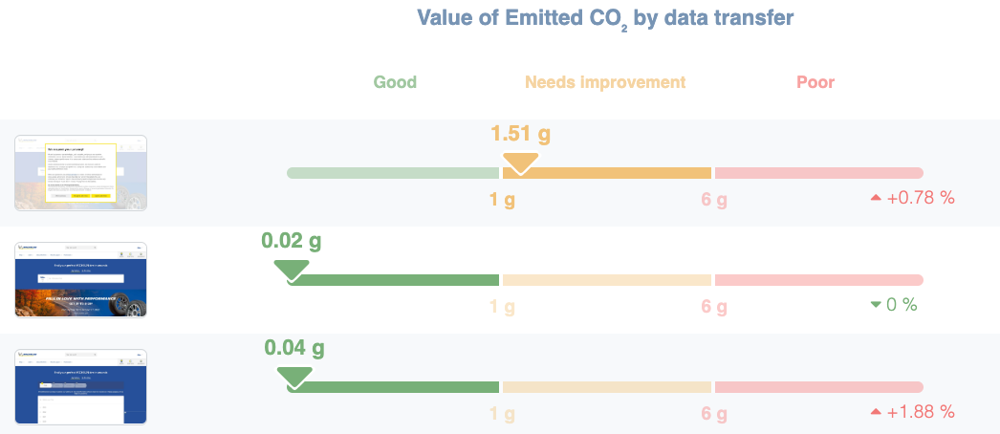
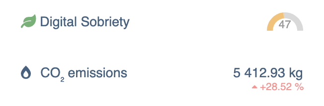

---
id: carbon-footprint-evaluation-and-digital-sobriety
title: Carbon footprint evaluation and digital sobriety approach in DEM
--- 

# Carbon footprint evaluation and digital sobriety approach in DEM

Measuring the environmental footprint of digital activity for a website requires many factors and ongoing updates to calculation methods: the field is relatively new and the state of the art evolves rapidly.

Although the domain is changing fast, DEM already aims to provide actionable measures that follow the principles of the [GHG Protocol](https://www.greenly.earth/blog-fr/ghg-protocol-quest-ce-que-cest-comment-ca-marche) (Relevance, Completeness, Consistency, Transparency, and Accuracy). These criteria are important to allow companies that wish to include their website impact in their corporate carbon accounting.

To respect these principles and provide carbon impact estimates as close to reality as possible, DEM relies on several market-recognized algorithms:

- The Digital Sobriety Score for eco-design scoring, represented as a per-page score out of 100
    
    
    
    Eco-design score measurement in DEM for a given user journey
    
- The [Sustainable Web Design](https://sustainablewebdesign.org/calculating-digital-emissions/) method to estimate CO2e emissions for downloading a page over the network
    
    
    
    Carbon impact measurement (in CO2e) performed via synthetic requests for a given user journey
    
- The open-source Boavizta impact database for manufacturing and end-of-life impact calculations for servers (measurement to be published in DEM in Q2 2023).

Depending on the feature — whether it's measuring the carbon impact of a specific user journey, weighting per-page carbon impact by page traffic, or highlighting pages with the biggest eco-design optimization potential — DEM will use one or another of these methods, always transparently.

  

Global site measurement (eco-design score and carbon footprint) calculated based on **real traffic** in DEM's Real User Monitoring module

Beyond using established methods, DEM contributes to refining calculation methods through regular exchanges with industry professionals, notably:

- the ecosystem of [Planet’Tech Care](https://planet-techcare.green/) signatories (of which DEM is an active member)
- the cross-company working group [Boavizta](https://www.boavizta.org/)
- the association [La Fresque du Numérique](https://www.fresquedunumerique.org/)

The goal of these collaborations is to advance the state of the art in digital impact measurement and cross-validate results with other professionals to ensure coherence (see GHG Protocol criteria: Relevance and Accuracy).

For more on digital decarbonization and measurement tools, see the interview with Laurent Eskenazi (co-founder of Boavizta) and Guillaume Thibaux (co-founder of DEM) on BSmart TV:

[https://www.youtube.com/watch?v=UELsTjTDMag](https://www.youtube.com/watch?v=UELsTjTDMag)

## Calculation dimensions

To measure a website's total carbon impact, two major dimensions must be considered:

1. The three types of "Scopes":
    - direct emissions produced by the company (Scope 1);
    - indirect emissions from energy consumption (Scope 2);
    - other indirect emissions (Scope 3);
2. The portion of the digital equipment chain considered:
    - Datacenter (including servers hosting the site);
    - Network (routers, firewalls, 4G antennas, submarine fiber, etc.);
    - End-user devices (computer, tablet, or phone);

As shown in the two-dimensional table below, DEM can measure emissions related to site "usage" across the entire chain (datacenter, network, and end-user devices). This measurement generally represents the largest portion of greenhouse gas emissions, and eco-design measures typically have the greatest impact on this metric when implemented.

Here is the current functional scope of DEM:

|  | Scope 1 | Scope 2 | Scope 3 |  |
| --- | --- | --- | --- | --- |
|  | Direct emissions from usage | Indirect emissions during usage | Upstream and downstream emissions |  |
| Datacenter | YES | YES | YES (details to be published using [Boavizta.org](http://Boavizta.org) data in Q4 2023) |  |
| Network | YES | YES | YES |  |
| End-user devices | YES | YES | n/a |  |

For more details about the algorithms used for each scope, contact the support team at [support@quanta.io](mailto:support@quanta.io).
