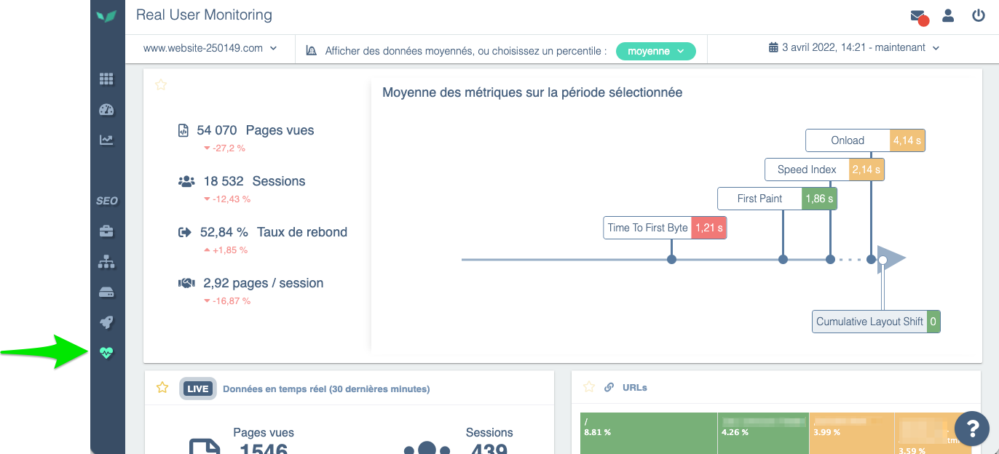
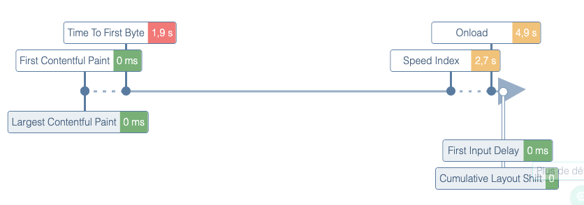

# Real User Monitoring (RUM)

Called “RUM”🍹 among insiders, Real User Monitoring consists of observing and analyzing the experience perceived by real users, directly from their browsers, regardless which one they use.

It's important to note that:

- this feature requires adding an **external tag** to the page, which is designed to be loaded **asynchronously** and to be **extremely lightweight** so it doesn't slow the user's browsing on the site.
- the type of data sent by the browser via the DEM tag and the way DEM stores these elements in its database ensure **the DEM tag is excluded from the scope of GDPR**. Indeed, the figures sent through the tag are purely technical and **not personally identifiable**. The DEM dashboard allows observing site behavior for different browser types (Chrome, Mobile Safari, EDGE, ...) but without any possibility to identify a unique user.

Once this tag is in place, DEM can record the experience perceived by all users **with or without sampling**, which provides a very precise view of key performance metrics (e.g., TTFB, Speed Index, full page load time, etc.).

The **key benefits** provided by RUM are:

- an **objective** view of performance because it is measured **by the users themselves**. Example: if the site is mostly visited by users on Safari and the site's code runs particularly poorly on that browser, it will be immediately visible that a problem **on that specific browser** impacts a large portion of the site's traffic.

- an **exhaustive** view of performance for **all pages** visited by users. This is a major difference compared to [Synthetic Monitoring](./synthetic-monitoring.md), which measures certain reference pages or journeys. Conversely, the RUM data collector will record performance metrics (TTFB, Speed Index, etc.) **every time a click is made** on the site. The result is the construction of a cross-cutting, real-time view of the most visited pages with their respective performance scores:

> Next: how to [Install Real User Monitoring](../installation/real-user-monitoring-installation.md).
