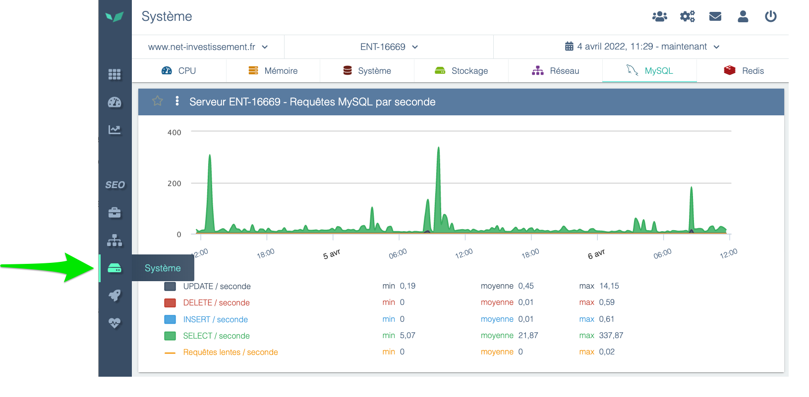
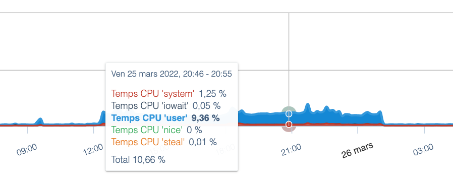
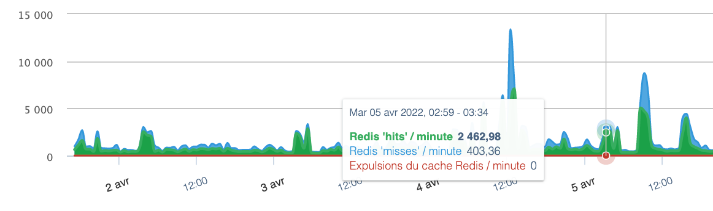

# System View

The **System data** section provides metrics from the infrastructure hosting your web application, helping you analyze system & middleware's health. You will find it by opening the main menu and clicking **System**.

Prerequisites:

- a DEM license of type **OPS**, **Full**, or **Enterprise**.
- a hosting platform that allows installing Linux packages — this excludes fully managed SaaS platforms like Salesforce or Shopify. For these kind of hosting solutions, the System section would not be as relevant as you don't have control on the underlying platform as it's the SaaS provider responsibility to keep their application running smoothly.
- DEM system agents installed. They are distributed as Linux packages and require a few minutes of work from a system administrator to install.

The **key benefits** provided by the System view are:

- an accurate, historical measurement of **server load** — the activity generated by the website on the platform (CPU and memory usage percentage). This indicator is essential to monitor to ensure the site's capacity is not at risk.
    

    
- measurements of **system indicators**, such as disk space status, network bandwidth, or any other resource whose limits can lead to a potential server outage.
- application-specific measurements for services installed on the architecture that are required for the application to function: Apache, Nginx, MySQL, Redis, Memcached. For these applications, DEM provides **specific metrics** (e.g., number of requests received by Redis, percentage of requests served from cache vs. not, etc.).
    

    
Targeted primarily at a technical audience, the System view is especially useful to anticipate and understand potential hosting platform issues, and to verify that the platform is optimally configured to ensure your web application runs smoothly. When combined with other DEM measurements (page response times, site traffic, etc.), these system insights are very helpful for **correlating** platform problems with impacts on site experience.
