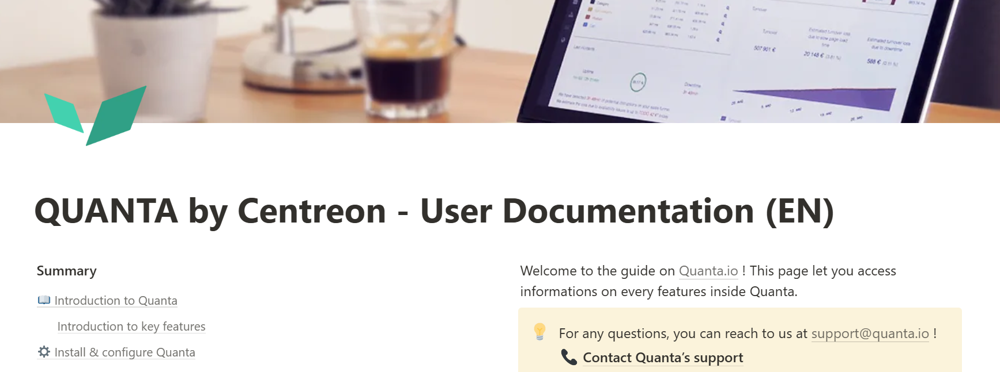

[Quanta by Centreon](https://www.quanta.io/fr/) est notre solution de Digital Experience Monitoring (DEM). La documentation sera bientôt disponible dans cet espace, mais pour l'instant, veuillez [accéder à la documentation du produit sur le site Quanta](https://quantaio.notion.site/QUANTA-by-Centreon-Documentation-Utilisateur-aab10d5221484f5785dc842868e62d8a).

## La solution Quanta

Quanta est une solution analytics conçue spécialement pour permettre à tous les acteurs de collaborer efficacement autour d'un même objectif: utiliser la web performance pour optimiser les **revenus en ligne**.

Quanta offre une application web à travers laquelle vous pouvez suivre le temps de chargement de vos pages web et de votre tunnel d'achat et d'identifier facilement les insuffisances sur toute votre infrastructure logicielle et matérielle à travers des **graphiques simples et dynamiques**, **des journaux d'audit complets, des détections automatiques des anomalies, des alertes personnalisables et la visualisation en temps réel**.

Quanta offre: un bilan approfondi de votre code, une analyse des chemins critiques, des perspectives expertes sur votre infrastructure, une liste des « quick wins » à mettre en place dans l’immédiat.
