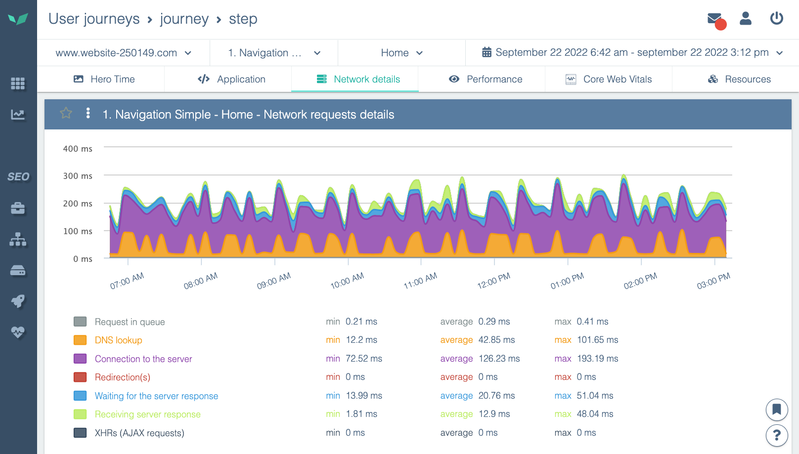

# Using Charts

## **Zooming on graphs**

DEM graphs are interactive. Easily zoom in on the period you are interested in by using the "click and drag" action from left to right on the graph (and the opposite to zoom out).

## Isolate and hide statistics in a chart

A chart can be composed of several cumulative statistics. For example, here you can see the details of network times for loading a page:

To make things clearer, you can:

- hide a statistic (do not display it)
- isolate a statistic (hide all others)

To do this, click on the statistic you want to isolate or hide in the legend, or on the chart.

Choose what you want to do with this statistic. In this example, if you isolate the statistic, you will see:

See the next article to go further:

[Speed up your site: application or server configuration?](../performance-analysis/speed-up-website-with-applications-or-server-configuration.md)
