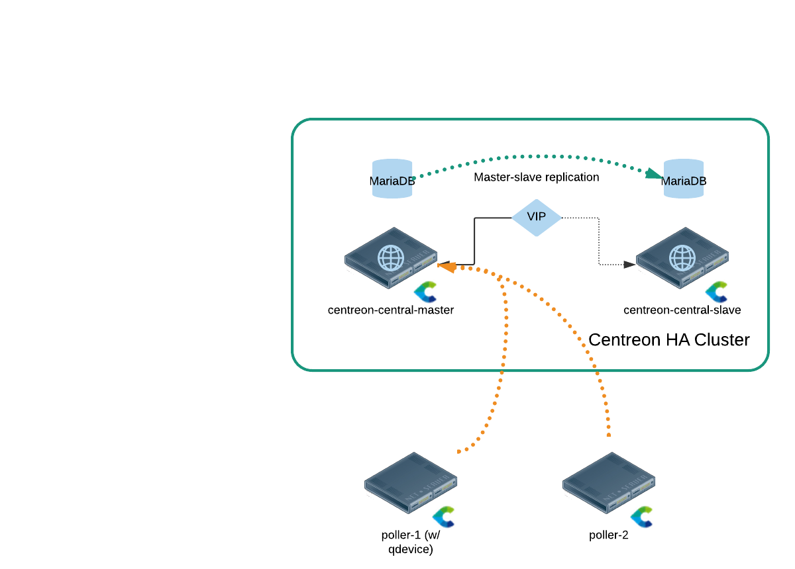
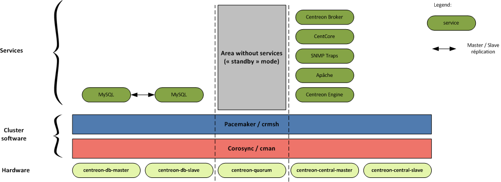
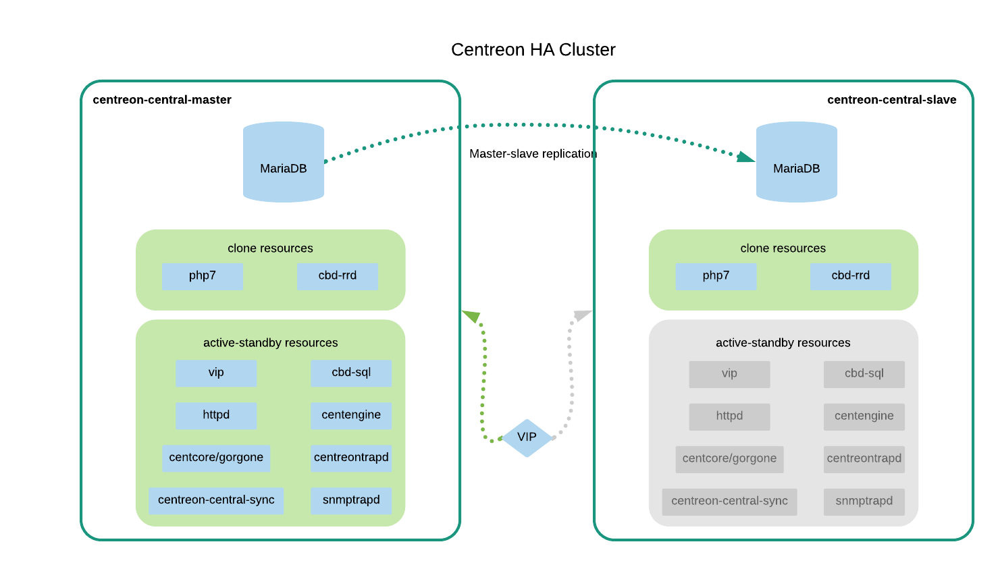

> **Warning:** For Commercial Edition customers, please get in touch with your Centreon Sales representative or Technical Account Manager before implementing this. Extensions needs a specific license files to smoothly work on both nodes.  

## 2-nodes cluster

### Presentation

The architecture of the high availability platform is composed by these 4 roles:

* `centreon-central-master`: Centreon web GUI, active in nominal mode
* `centreon-central-slave`: Centreon web GUI, passive in nominal mode
* `quorum-device`: third server allowing to reach a majority of votes to elect a `master`
* `poller`: server hosting a distant poller (the `quorum-device` role can be held by a poller

**Note:** One will notice that at least 3 servers are needed whereas the title mentions only two nodes. There is no mistake here, there are indeed 2 central nodes, and the monitoring role **must** rely on external pollers, not on central servers.

### Cluster services description

There are three types of services:

* `centreon` and `centreon_storage` MariaDB databases
* Centreon RRD Broker and PHP7, that can run on both nodes at the same time
* Centreon Engine, Centreon Central Broker, Apache, Centcore/Gorgone, *etc.* processes, that must run on one node only

MariaDB data is hosted by both `centreon-central-master` and `centreon-central-slave` servers. Depending on the state of the resources of the cluster, one has the "master" role (regardless of the server's name) the second is named "slave" and synchronizes asynchronously (MariaDB process) the databases from the "master" server.

Services are running on either the `centreon-central-master` server or on the `centreon-central-slave` server depending on the state of the resource group.

The server with the `quorum-device` role does not host any particular service. It aims to obtain an absolute majority in a vote of the cluster master.

### Centreon main components

#### Monitoring poller components

A monitoring poller provides:

* a monitoring scheduler Centreon Engine (`centengine`)
* an event handler Centreon Broker Module (`cbmod`) that allows `centengine` to connect to the active central server to transfer the collected data

**Note:** `cbmod` is configured to connect to the Centreon VIP.

#### Centreon main server components

A Centreon central server provides:

* a monitoring scheduler Centreon Engine (`centengine`) 
* an event handler (`cbmod`) that connects locally to transfer the collected data
* a centralized events management process (`cbd_central-broker`) that:

    * inserts into the database the information collected
    * transfers in local performance data in order to generate graphs

* a performance data management process (`cbd-central-rrd`) to create/update the performance graphs (RRD files)
* a web Centreon interface (Apache/PHP7)

**Note:** The Centreon RRD broker process is active on both Centreon central servers in order to avoid having to synchronize the directories hosting the RRD files (via DRBD for example). It is powered by a dual-output from `cbd_central_broker` process directed to both `centreon-central-master`'s and `central-centreon-slave`'s RRD broker processes.

#### Database components

Centreon database components are:

* `centreon`: monitoring configuration database
* `centreon_storage`: monitoring information (live and history) database

The databases hosted by `centreon-central-master` and `centreon-central-slave` are synchronized using MariaDB replication process.

#### Overall schema

### Description of the cluster resources

The cluster services are divided into two functional groups.

#### MariaDB functional group

The `ms_mysql` functional group is a "multi-state" resource. This resource can be in master mode on one node and in slave mode on another node. The `ms_mysql-master` meta-resource is assigned to the replication master.

#### Centreon functional group

The `centreon` functional group gathers all Centreon resources to manage them. 

#### Resources type description

All these resources are described in the table below.

| Name                    | Type                 | Description                                          |
| ----------------------- | -------------------- | ---------------------------------------------------- |
| `ms_mysql`              | multi-state resource | Handles `mysql` process and the data replication     |
| `ms_mysql-master`       | location             | Set MariaDB Master server rule preference            |
| `php7`                  | clone service        | FastCGI Process Manager service (`rh-php73-php-fpm`) |
| `cbd_rrd`               | clone service        | Broker RRD service (`cbd`)                           |
| `centreon`              | group                | Centreon "primitive services" group                  |
| `vip`                   | primitive service    | VIP address for centreon                             |
| `http`                  | primitive service    | Apache service (`httpd24-httpd`)                     |
| `gorgone`               | primitive service    | Gorgone service (`gorgoned`)                         |
| `centreon_central_sync` | primitive service    | Files synchronization service                        |
| `cbd_central_broker`    | primitive service    | Central Broker service (`cbd-sql`)                   |
| `centengine`            | primitive service    | Centreon-Engine service (`centengine`)               |
| `centreontrapd`         | primitive service    | SNMP Traps management service (`centreontrapd`)      |
| `snmptrapd`             | primitive service    | SNMP Traps listening service (`snmptrapd`)           |

**Note:** The resources of the `centreon` group are started one after the other in the list order.

### Recommendations

#### Number of nodes

Centreon recommends using at least 3 servers for highly available Centreon platform. While it is possible to split database and central roles, for now we only suggest deploying two standalone "central & DB" servers.

#### Role of the Centreon central server

In the case of a failover architecture the **Centreon central cluster must not be used as a poller**. In other words, it mustn't monitor resources. Its monitoring ability should only be used to monitor its pollers. If this recommendation is not followed, the `centengine` service would take too long to restart and **it may cause the functional `centreon` group to failover**.

#### VIP usage

Centreon recommends using VIP address to access the Web User Interface and the database as well.

### Constraints

The failover architecture implies various constraints:

* Synchronization (via `rsync`) of:

  * Media files
  * Configuration files for: `centengine`, `cbd_central_broker`, `cbd_rrd`
  * Centreon-MBI reports hosted on the Web server

* MariaDB files `ibdata*` and `ib_logfile*` must be in the "datadir" directory or in a subdirectory (scripts `centreondb-smooth-backup.sh` and `mysql-sync-bigdb.sh` aren't compatible with this operation);
* MariaDB files `log-bin*` and `relay-log*` can be located in a directory (or a subdirectory) different from "datadir". They can also be on a different logical volume (`lvm`) than "datadir". However, the logical volume must be located in the volume group where "datadir" is stored.

