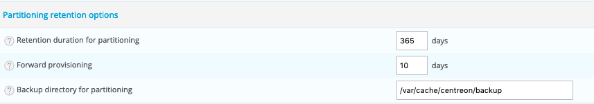
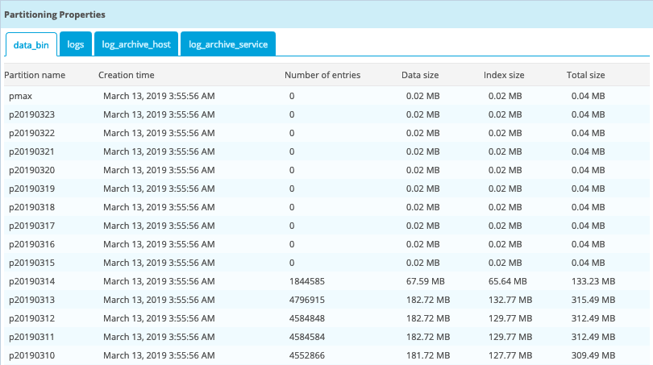
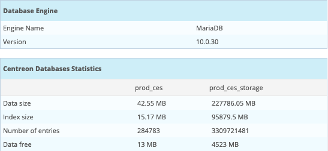

## Overview

Some tables in the 'centreon\_storage' database are partitioned to:

- Optimize the execution time of sevral queries,
- Optimize the purge of data,
- Minimize the reconstruction of the tables in error during a crash of the
DBMS.

One partition per day is created for the following tables:

- **data\_bin**: performance data
- **logs**: event logs from the supervision engine collection.
- **log\_archive\_host**: availability data of hosts.
- **log\_archive\_service**: availability data of services.

> There are some limitations:
>
> - Maximum number of partitions (for a MariaDB table) is 1024
> - Foreign keys are not supported

More details about MariaDB partitioning
*[here](https://mariadb.com/kb/en/library/partitioning-overview/)*.

## Prerequisites

The following packages are required:

- php-mysql
- Pear-DB
- MariaDB (\>= 10.1)

MariaDB **open\_files\_limit** parameter must be set to 32000 in \[server\]
section:

```text
[server]
open_files_limit = 32000
```

> If you install Centreon via the dedicated ISO, this parameter is already
> configured. If you do it on your RedHat or CentOS Linux version, you will be
> able to do it manually. Don't forget to restart mariadb processes if you change
> this value in my.cnf.

If you use systemd, you need to create the
**/etc/systemd/system/mariadb.service.d/mariadb.conf** file:

```text
[Service]
LimitNOFILE=32000
```

Then reload systemd and MariaDB:

```shell
systemctl daemon-reload
systemctl restart mariadb
```

## Configuration

The data retention time is programmed in the `Administration > Parameters >
Options` menu:



The setting is as follows:

- **Retention duration for partitioning**: retention time for partitioned
tables, by default **365 days**.
- **Forward provisioning**: number of partitions created in advance, by
default **10 days**.
- **Backup directory for partitioning**: partition backup directory, by
default **/var/cache/centreon/backup**.

## Operation

Partitioning uses XML files in the **/usr/share/centreon/config/partition.d/**
directory to create the necessary partitions.

Every day, a script launched by a cron realizes the creation of missing tables
or those in advance:

```text
0 4 * * * centreon /opt/rh/rh-php73/root/bin/php /usr/share/centreon/cron/centreon-partitioning.php >> /var/log/centreon/centreon-partitioning.log 2>&1
```

Sample partitioning **partitioning-data\_bin.xml** file:

```xml
<?xml version="1.0" encoding="UTF-8"?>
<centreon-partitioning>
    <table name="data_bin" schema="centreon_storage">
        <activate>1</activate>
        <column>ctime</column>
        <type>date</type>
        <createstmt>
CREATE TABLE IF NOT EXISTS `data_bin` (
    `id_metric` int(11) DEFAULT NULL,
    `ctime` int(11) DEFAULT NULL,
    `value` float DEFAULT NULL,
    `status` enum('0','1','2','3','4') DEFAULT NULL,
    KEY `index_metric` (`id_metric`)
) ENGINE=InnoDB DEFAULT CHARSET=utf8;
        </createstmt>
    </table>
</centreon-partitioning>
```

## Migrating unpartitioned tables

The command line does the following procedure:

- Rename existing table (‘xxx’ will be ‘xxx\_old’)
- Create an empty partitioned table
- Migrate data in partitioned table (with ‘SELECT INSERT’ statement)

You need to make some checks before:

- Enough space on MariaDB Server (at least twice the size of the table.
Indexes and Data)
- No data in futures (time is used for the partitioning)
- Enough memory on database server

> The ‘SELECT INSERT’ statement will lock the table and maybe your production in
> some points (per example table migration of ‘logs’).

The migration of the table is done by using the **-m** option and specifying the
name of the table to migrate:

```shell
/opt/rh/rh-php73/root/bin/php /usr/share/centreon/bin/centreon-partitioning.php -m data_bin
```

If the table migration is ok, the old table can be deleted with the following
commands:

```sql
DROP TABLE centreon_storage.data_bin_old;
```

## Monitoring of partitioning operation

The **Centreon Database** Plugin Pack allows you to control that the number of
partitions created in advance is sufficient. It is recommended to install and
deploy this Plugin Pack.

It is also possible to view the partitioned tables and the consumption
associated with each partition via the `Administration > Platform Status >
Databases` menu:



More general information on the state of health of the databases is also
present:


