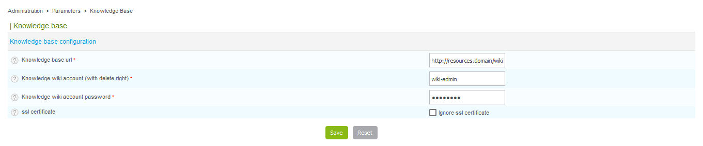

## Introduction

In Centreon Open Source suite since 2.8.0 version, **Knowledge Base** allow you
to easily associate a wiki with Centreon Web.

It creates links between hosts and services and specific procedure on Wiki.

To make things more flexible, procedures can be associated with templates.

**Knowledge Base** is the solution to easily link a Wiki to Centreon.

## Prerequisites

**Centreon Knowledge Base** requires **MediaWiki** to be installed (version =
1.31) on your system. Mediawiki is provided with RPM packages on Centreon
repository.

## Configure the access to the wiki

Before starting with **Knowledge Base**, you need to configure it to access the
wiki database.

For this go to `Administration > Parameters > Knowledge Base` and complete
the form

## User guide

### Definition

A procedure is basically a technical documentation allowing operators to know
what to do when an alert is raised in Centreon.

Procedures can be of different natures:

  - Describe actions to solve a problem,
  - Escalate the issue to another team,
  - Open a support ticket,
  - Warn users that a specific service is down.

A procedure can be defined for an host or a service.

### Displayed procedure: template and overload

To avoid too much workload on the procedure deployment, the functionality allows
administrator to setup a single procedure for hosts/services.

So a procedure can be specified for a given host/service but can be specified as
well for a host/service template.

If a procedure is defined at template level, all children of the template will
have the procedure attached as well unless overloaded by a specific one. The
mechanism is identical to template system in Centreon with inheritance.

**Knowledge Base** function is designed to avoid adding or updating
manually several times the same procedure in knowledge base.

When a user clicks on a host procedure:

  - if a specific procedure is defined for this host, its wiki page is displayed
  - if no specific procedure is defined bu the host template has a procedure,
    the host template wiki page is displayed
  - if host template has no procedure defined, parents template will be checked
    for a defined procedure
  - finally if no procedure is defined in the template tree, a message will warn
    that there is no procedure defined for this host

It's the same for services.

### Create / Update / Delete a procedure

Navigate in Centreon front-end to `Configuration > Knowledge Base` sub-menus
to:

  - List Hosts / Services / Host Templates / Service Templates and attached
    procedures
  - Create / View / Edit / View history for a Host / Services / Host Templates /
    Service Templates
  - List Hosts / Services / Host Templates / Service Templates without procedure
    defined

### Link from monitoring front end

The technical procedure is available in Centreon front-end through a link icon:

By clicking on link icon, the user is redirected to the corresponding procedure.

If the link icon is on the left of a host name, the wiki page containing the
procedure for the host will be displayed.

If the link icon is on the right of a service name, the wiki page containing the
procedure for the service will be displayed.

### Synchronization

There's a cron job that updates hosts, services and hosts/services templates
configuration.

For example, if you create a page in the wiki using the usual pattern (ex:
`Host:Centreon-Server` or `Service:Centreon-Server Disk-/`), the cron will add
the link to the page in the **URL** field of object's extended information.

### Best practice for deployment

To deploy procedures in the best way, we strongly advice you to use the multi
level inheritance system.

The best practice is to define procedures at template level as much as you can.

Here is an example of an host template configuration tree:

  - Linux \> Generic-hosts
  - Windows \> Generic-hosts
  - RedHat \> Linux
  - Debian \> Linux
  - Active-Directory \> Windows
  - LDAP \> Linux

To setup procedures for the *RedHat* host template, just proceed as indicated in
*[Link from monitoring front end](link-from-monitoring-front-end)*.

In the template tree we see that the **RedHat** template inherits from two other
templates: **Linux** and **Generic-hosts**. In this example all hosts using the
*RedHat* host template will have the new procedure defined attached.

We could setup a procedure at a higher level in the template tree, it will
impact more hosts.

For example if we define a procedure for **Linux** host template, all hosts
using **RedHat**, **Debian** and **LDAP** host templates will have the procedure
attached by inheritance. Because **Linux** is the parent template.

Behavior is the same for service templates.

> To delete a procedure link for specific host / service / template, edit the
> object and empty the **URL** field in **Extended Information** tab.
>
> If the object inherits from any template of a procedure, the empty value will
> overload and delete the procedure link.
