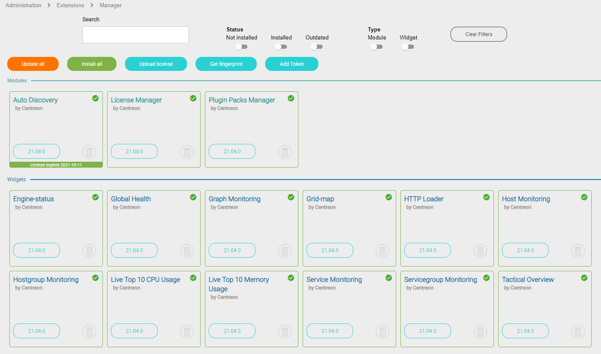
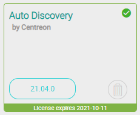
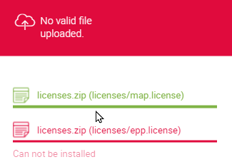

## Types of licenses

According to your [Centreon edition](https://www.centreon.com/en/editions/), your license can be:
- offline : uses one or several license files
- online (subscription-based): uses a token.


## Viewing license-based modules

Go to **Administration > Extensions > Manager**. All modules currently installed on your platform have a green border and a green tick mark in their top right corner. Modules that require a license have a colored banner at the bottom (red if you have no valid license, green if you have one).



The following modules need to be installed separately and require a valid license.

- [Plugin Packs](https://docs.centreon.com/current/en/monitoring/pluginpacks.html#installation)
- [Autodiscovery](https://docs.centreon.com/current/en/monitoring/discovery/installation.html)
- [Anomaly detection](https://docs.centreon.com/current/en/monitoring/anomaly-detection.html)
- [BAM](https://docs.centreon.com/current/en/service-mapping/install.html)
- [MAP](https://docs.centreon.com/current/en/graph-views/install.html)
- [MBI](https://docs.centreon.com/current/en/reporting/introduction.html)

## Adding a license

### Offline licenses

1. To request your license:

    1. Go to **Administration > Extensions > Manager**.

    2. Click on **Get fingerprint**.

    3. Paste the fingerprint in an email to our support team requesting the license.

2. Once you have received your license, in the **Administration > Extensions > Manager** page, click on **Upload license**.

5. Browse to the file and then click **OK**. The license is applied and the corresponding modules display their validity date:
    
    

6. If you have several licenses (e.g. for BAM, MBI...), repeat the steps above until you have uploaded all license files.

### Online licenses

To use an online license, your Centreon platform must be connected to the internet.

1. Make sure you have your license token (provided by our support team).

2. Go to **Administration > Extensions > Manager**.

3. Click on **Add Token**. A popup window appears.

4. Paste your token in the popup window, then click on **Add**.

    - If your token contains one license, a tick mark is displayed next to the **Add** button.

    - If your token contains several licenses, choose the license you want and then click on **Choose**. 

    Press **Esc** to close the popup window. The license is applied and the corresponding modules display their validity date:
    
        

        The **Add token** button changes to become a **View license** button.

## Free IT-100 license

See chapter [Set up your free IT-100 solution](https://docs.centreon.com/current/en/getting-started/IT100.html).

## Troubleshooting

### No valid file uploaded



Check the contents of the following directory:

```
ll /etc/centreon/licenses.d
```

If the directory already contains licences with rights that are not apache/apache, delete them or change their rights so that they can be overwritten by the new licenses:

```
chown apache:apache /etc/centreon/license.d/*
chmod 644 /etc/centreon/license.d/*
```

### Your EPP license is not valid

* Check that the fingerprint of the central server (on page **Administration > Extensions > Gestionnaire**) matches the fingerprint in the license.

    ```
    less /etc/centreon/license.d/epp.license
    ```

* Check that you do not have more hosts than your license allows:

    ```
    #mysql centreon
    SELECT COUNT(*) FROM host WHERE host_register='1';
    ```