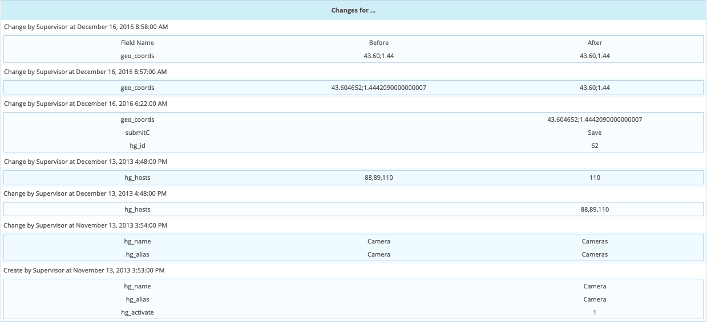
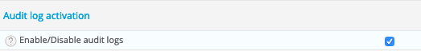

## Principle

By default, Centreon retains all user actions concerning changes to
configuration in a log. To access this data, go into the menu `Administration > Logs`.

The grey search bar can be used to filter the information presented via filters:

- **Object** used to filter on object name (host, service, contact, SNMP trap
definition, group, etc.)
- **User** used to filter by change author
- **Object Type** used to filter by object type

## Practice

E.g.: To see all the actions effective by the user: **admin**, enter “admin” in
the **User** field and click on **Search**.

The table below defines the columns in the results table:

<table>
<colgroup>
<col style="width: 17%" />
<col style="width: 82%" />
</colgroup>
<thead>
<tr class="header">
<th>Column Name</th>
<th>Description</th>
</tr>
</thead>
<tbody>
<tr class="odd">
<td>Time</td>
<td>Indicates the date of the event</td>
</tr>
<tr class="even">
<td>Modification type</td>
<td>
Contains the type of action effective. There are several types of action possible:

<ul>
<li>Added: Indicates that the object has been added</li>
<li>Changed: Indicates that the object has been changed</li>
<li>Deleted: Indicates that the object has been deleted</li>
<li>Massive Change: Indicates a massive change of configuration on objects.</li>
<li>Enabled: Indicates that the object has been enabled</li>
<li>Disabled: Indicates that the object has been disabled</li>
</ul></td>
</tr>
<tr class="odd">
<td>Type</td>
<td>Indicates object type</td>
</tr>
<tr class="even">
<td>Object</td>
<td>Indicates object name</td>
</tr>
<tr class="odd">
<td>Author</td>
<td>Indicates the user having effective this change</td>
</tr>
</tbody>
</table>

By clicking on the name of an object, you can view the history of the changes
effective on it.

The table below defines the columns of the changes table:

<table>
<colgroup>
<col style="width: 27%" />
<col style="width: 72%" />
</colgroup>
<thead>
<tr class="header">
<th>Column Name</th>
<th>Description</th>
</tr>
</thead>
<tbody>
<tr class="odd">
<td>Date</td>
<td>Date of the change</td>
</tr>
<tr class="even">
<td>Contact Name</td>
<td>Name of the person having effective the change</td>
</tr>
<tr class="odd">
<td>Type</td>
<td>Modification type</td>
</tr>
<tr class="even">
<td></td>
<td>
The last column describes the change itself :

<ul>
<li>Field name: Describes the field that has been changed</li>
<li>Before: Indicates the previous value</li>
<li>After: Indicates the new value</li>
</ul></td>
</tr>
</tbody>
</table>

## Configuration

To enable user audit logs, go to `Administration > Parameters > Options` and
check the **Enable/Disable audit logs** option:

