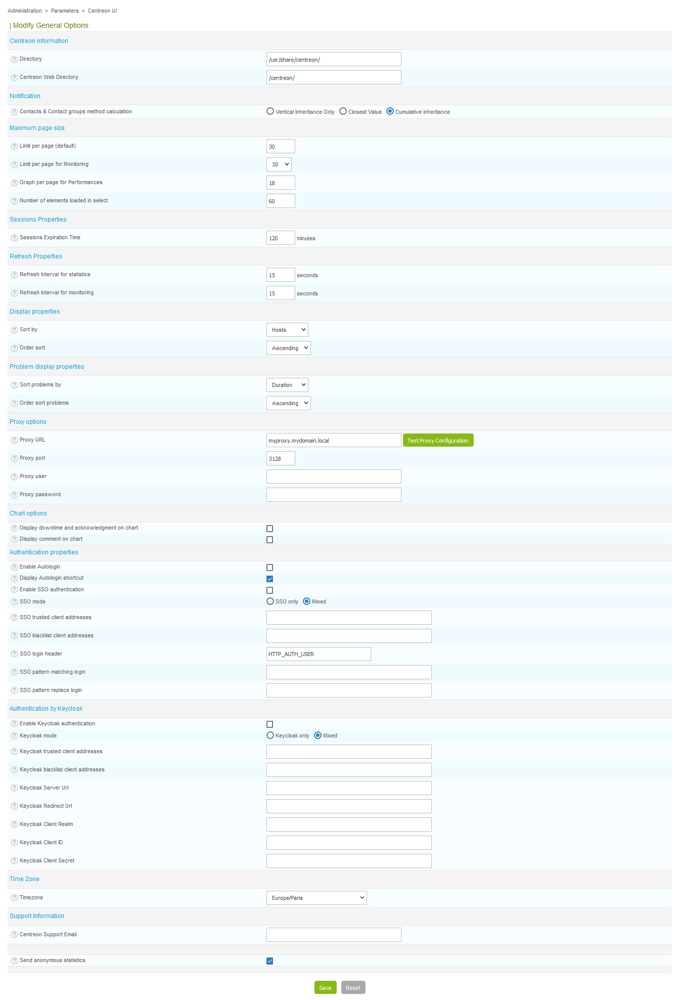
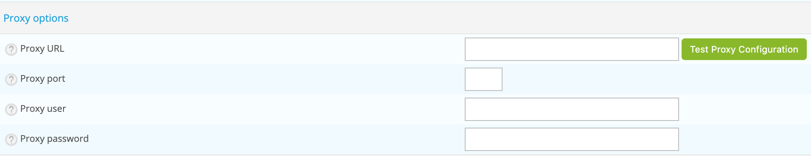
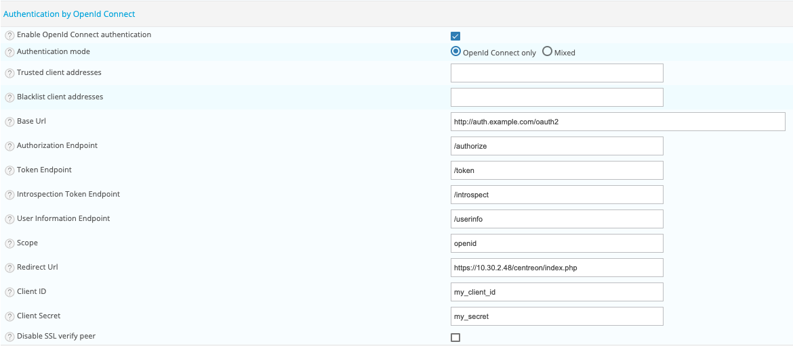

This part covers the configuration of the general options of the Centreon web
interface.

Go to `Administration > Parameters > Centreon UI`.

## General options

- **Directory** indicates the directory where Centreon is installed
- **Centreon Web Directory** field indicates the web directory on which
Centreon is installed
- **Contacts & Contact groups method calculation** allows to define how
notification inheritance for hosts and services will be calculated.
- **Limit per page (default)** field defines the number of objects displayed
per **Configuration** page
- **Limit per page for Monitoring** field defines the number of objects
displayed per page in the **Monitoring** menu
- **Graph per page for Performances** field defines the maximum number of
displayed charts on **Performance** page
- **Number of elements loaded in select** field defines the maximum number in
select box
- **Sessions Expiration Time** field, expressed in minutes, indicates the
maximum session duration
- **Refresh Interval for statistics** field, expressed in seconds, indicates
the refreshment interval for the statistics page
- **Refresh Interval for monitoring** field, expressed in seconds, indicates
the refreshment interval for the objects on the monitoring page
- **Sort problems by** field is used to choose how to sort the incidents in
the **Monitoring** menu
- **Order sort problems** field indicates the display order for incidents, by
rising or falling order of gravity
- **Display downtime and acknowledgment on chart** allows to display downtime
and acknowledgment on chart
- **Display comment on chart** allows to display comment from service on chart
- **Timezone** field indicates timezone of your monitoring server.
- **Centreon Support Email** field indicates the e-mail address of the
**Customer’s service support centre** for the Centreon platform. This e-mail
address will be displayed at the bottom of the page on the link **Centreon
Support**
- **Send anonymous statistics** box defines wether or not the platform will
send anonymous information for the **Centreon Customer Experience Improvement**

## Proxy configuration

The proxy configuration is mandatory to use Centreon IT Edition.

Define needed information:

- **Proxy URL**
- **Proxy port**
- **Proxy user**
- **Proxy password**

Once you defined settings, test your configuration by clicking on the **Test
Proxy Configuration** button.

To validate the configuration, click on the **Test Proxy Configuration** button. If the message **Connection Successful**
appears, your configuration is valid, otherwise modify your parameters.

## Autologin

- **Enable Autologin** box authorizes the users to log into the web interface
via the autologin mechanism
- **Display Autologin shortcut** box serves to display the connection
short-cut at the top right

## SSO

- **Enable SSO authentication** allows to enable or disable SSO authentication.
- **SSO mode** field indicates if the authentication should take place only by
SSO or using local authentication as well (Mixed). The mixed mode requires
trusted client addresses.
- **SSO trusted client addresses** field indicates which are the IP/DNS of the
trusted clients (corresponding to the reverse proxy) for SSO. The trusted
clients are separated by comas.
- **SSO blacklist client addresses** field indicates which are the IP/DNS
rejected.
- **SSO login header** field indicates the variables of the header that will
be used as a login / pseudo (i.e HTTP\_AUTH\_USER).
- **SSO pattern matching login** field indicates the pattern to search for in
the username.
- **SSO pattern replace login** field indicates the replace string.

> SSO feature is only to be enabled in a secured and dedicated environment for
> SSO. Direct access to Centreon UI from users have to be disabled.

## OpenId Connect

Centreon is compatible with OAuth 2.0 / OpenId Connect authentication.

Usage of Identity Providers (IdP) is available, such as Keycloak, LemonLDAP::NG or other IdP which are compatible with
are compatible with the Authorization Code Flow.

- **Enable OpenId Connect authentication** allows to enable or disable OpenId Connect authentication.
- **Authentication mode** field indicates if the authentication should take place only by OpenId Connect or using local
  authentication as well (Mixed).
- **Trusted client addresses** field indicates which are the IP/DNS of the trusted clients (corresponding to the
  reverse proxy). The trusted clients are separated by comas.
- **Blacklist client addresses** field indicates which are the IP/DNS rejected.
- **Base Url** field defines the IdP base URL for OpenId Connect endpoints (mandatory).
- **Authorization Endpoint** field defines the authorization endpoint, for example `/authorize` (mandatory).
- **Token Endpoint** field defines the token endpoint, for example `/token`(mandatory).
- **Introspection Token Endpoint** field defines the introspection token endpoint, for example `/introspect` (mandatory).
- **User Information Endpoint** field defines the user information endpoint, for example `/userinfo`.
- **End Session Endpoint** field defines the logout endpoint, for example `/logout`.
- **Scope** field defines the scope of the IdP, for example `openid`. Separate scope by space.
- **Redirect Url** field defines the redirect URL after login to access to your Centreon server, for example
  `http://192.168.0.1/centreon/index.php`.
- **Client ID** field defines the Client ID.
- **Client Secret** field defines the Client secret.
- **Disable SSL verify peer** field allows to disable SSL peer validation, should only used for test.

> Depending on the identity provider, it is necessary to enter several scopes, this is indicated in the provider's
> configuration documentation.

> For authentication to be functional, the response to the introspection token call must return a `preferred_username`
> variable containing the user's login which will be compared with the users defined in Centreon. If it's not the case,
> you will have to configure your provider to send extra claims to an additional scope. In this case, it will be
> necessary to configure the user information endpoint and add the additional scope to the scope definition.

> If you want to automatically import user after connection, you can configure an LDAP server and enable auto import.