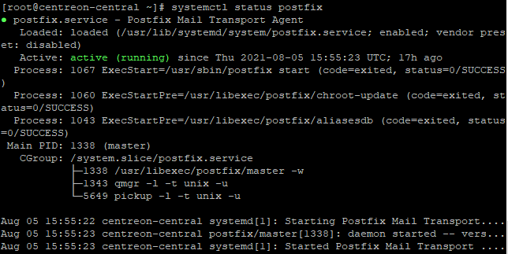

For your Centreon to be able to send notification emails, you need to configure a local smtp server. If your operating system is RHEL, CentOS or Oracle Linux, Postfix is already installed. 

This page gives you an example of a possible configuration. Refer to the [official Postfix documentation](http://www.postfix.org/BASIC_CONFIGURATION_README.html) for more information.

Notifications commands are executed by the poller that monitors the resource: you need to configure the mail relay on all pollers.

We recommend that you use a dedicated email account to send notifications.

## Step 1: Configuring Postfix

1. In your server's terminal, enter the following command:

    ```
    yum -y install cyrus-sasl-plain
    ```

2. Restart Postfix: 

    ```
    systemctl restart postfix
    ```

3. Configure Postfix to run at startup:

    ```
    systemctl enable postfix
    ```

4. Edit the following file:

    ```
    vi /etc/postfix/main.cf
    ```

5. Add the following information:

    ```
    myhostname = hostname
    relayhost = [smtp.isp.com]:port
    smtp_use_tls = yes
    smtp_sasl_auth_enable = yes
    smtp_sasl_password_maps = hash:/etc/postfix/sasl_passwd
    smtp_tls_CAfile = /etc/ssl/certs/ca-bundle.crt
    smtp_sasl_security_options = noanonymous
    smtp_sasl_tls_security_options = noanonymous
    ```
    
    - **myhostname** is the hostname of the Centreon server.
    - **relayhost** is the email server for the account that will send notifications.

    In the following example, Centreon will use a Gmail account to send notifications:

    ```
    myhostname = centreon-central
    relayhost = [smtp.gmail.com]:587
    smtp_use_tls = yes
    smtp_sasl_auth_enable = yes
    smtp_sasl_password_maps = hash:/etc/postfix/sasl_passwd
    smtp_tls_CAfile = /etc/ssl/certs/ca-bundle.crt
    smtp_sasl_security_options = noanonymous
    smtp_sasl_tls_security_options = noanonymous
    ```

## Step 2: Configuring the credentials of the account that will send emails

1. Create a `/etc/postfix/sasl_passwd` file:

    ```
    touch /etc/postfix/sasl_passwd
    ```

2. Add the following line (replace `username:password` by the credentials of the account that will send the notification emails):

    ```
    [smtp.isp.com]:port username:password
    ```

    Example:

    ```
    [smtp.gmail.com]:587 username@gmail.com:XXXXXXXX
    ```

3. Save the file.

3. In the terminal, enter the following command: 

    ```
    postmap /etc/postfix/sasl_passwd
    ```

4. For security reasons, change the permissions on the file:

    ```
    chown root:postfix /etc/postfix/sasl_passwd*
    chmod 640 /etc/postfix/sasl_passwd*
    ```

3. Reload Postfix so that chenges are taken into account:

    ```
    systemctl reload postfix
    ```

## Testing and troubleshooting

- To send a test email, enter the following command:

    ```
    echo "Test" | mail -s "Test" user@isp.com
    ```

    Replace `user@isp.com` by a real email address: the recipient should receive the test email.

- If the user hasn't received the message, check the following log file:

    ```
    tail -f /var/log/maillog
    ```

- To check that your Postfix service is running, enter:

    ```
    systemctl status postfix
    ```

    The results should look like this:

    

## Gmail configuration

If you want to send emails through a Gmail account, you will need to turn on the **Allow less secure apps** option on this account. See [Less secure apps & your Google Account](https://support.google.com/accounts/answer/6010255).
