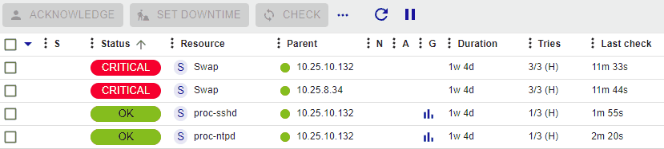
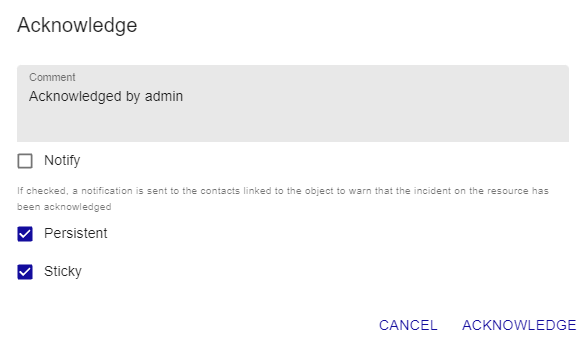

### Principle

When a host or a service presents an incident and this incident is
confirmed, the notification process is triggered, it can generate a
notification sent to a contact. If the problem persists and depending on
the configuration produced (resend a notification at regular time
intervals, escalation of notification, etc.) it is possible that other
alerts be send.

The acknowledgment of an incident can be used to stop the notification
process (sending of notifications) until the host or the service
recovers its nominal status.

Example of use:

A service is charged with checking the health of the hard disks in a
disc array. A hard disk goes down on a disk array, a notification is
sent. The monitoring operator acknowledges the service specifying that a
team is in the process of dealing with the problem. Notifications are no
longer sent. The service will return to its nominal state after a change
of disk.

> The acknowledgment of an incident signifies the taking into account of
> the problem by a user of the monitoring (and not the correction of
> the incident which can only be effective when the check returns to its
> nominal state).

### Practice

To acknowledge an incident, there are several solutions:

<!--DOCUSAURUS_CODE_TABS-->

<!--From the Resources Status page-->

1. Go to **Monitoring > Resources Status**.
2. Use one of the following methods:
    - Select the object(s) that you want to acknowledge, then click the **Acknowledge** button above the list of resources.
    - Hover over the resource you want to acknowledge, then click the **Acknowledge** button that appears on the left.

        

    The following window appears:

    

    -   The **Comment** field is generally used to provide the reason of the
    acknowledgment. It is mandatory.
    
    -   If the **Notify** box is checked, a notification is sent to the
    contacts linked to the object to warn that the incident on the
    resource has been acknowledged (in the situation the contact
    possesses the activity acknowledgment notification filter).

    -   If the **Persistent** box is checked, the acknowledgment will be
    maintained even if the monitoring engine is restarted. Otherwise, the
    acknowledgment disappears and the notification process is
    reactivated.

    -   If the **Sticky** box is checked, the acknowledgment will be
    maintained in case of a change of Not-OK status (E.g.: DOWN to
    UNREACHABLE or WARNING to CRITICAL). Otherwise, the acknowledgment
    disappears and the notification process is reactivated.

<!--From real time monitoring-->

1.  Go to **Monitoring > Status Details > Hosts** (or **Services**).
2.  Select the object(s) that you want to acknowledge.
3.  In the menu: **More actions** click on **Hosts: Acknowledge** or on
    **Services: Acknowledge**.

    The following window appears:

-   If the **Sticky** box is checked, the acknowledgment will be
    maintained in case of a change of Not-OK status (E.g.: DOWN to
    UNREACHABLE or WARNING to CRITICAL). Otherwise, the acknowledgment
    disappears and the notification process is reactivated.
-   If the **Notify** box is checked, a notification is sent to the
    contacts linked to the object to warn that the incident on the
    resource has been acknowledged (in the situation the contact
    possesses the activity acknowledgment notification filter).
-   If the **Persistent** box is checked, the acknowledgment will be
    maintained in the case of a restart of the scheduler. Otherwise, the
    acknowledgment disappears and the notification process is
    reactivated.
-   The **Comment** field is generally used to provide the reason of the
    acknowledgment, it is mandatory
-   If the **Acknowledge services attached to hosts** box is checked,
    all the services linked to the host will be acknowledged (option
    visible only if we acknowledge a host).
-   If the **Force active checks** box is checked, a command will be
    sent to the scheduler to recheck the resource as soon as possible.

<!--From the detailed sheet of an object-->

From of the detail page of an object, click on the icon |enabled| associated
with the **Acknowledged** field in the **Options** frame.

The following window appears:

-   If the **Sticky** box is checked, the acknowledgment will be
    maintained in case of a change of Not-OK status (E.g.: DOWN to
    UNREACHABLE or WARNING to CRITICAL). Otherwise, the acknowledgment
    disappears and the notification process is reactivated.
-   If the **Notify** box is checked, a notification is sent to the
    contacts linked to the object to warn that the incident on the
    resource has been acknowledged (in the situation the contact
    possesses the activity acknowledgment notification filter).
-   If the **Persistent** box is checked, the acknowledgment will be
    maintained in the case of a restart of the scheduler. Otherwise, the
    acknowledgment disappears and the notification process is
    reactivated.
-   The **Comment** field is generally used to provide the reason of the
    acknowledgment, it is mandatory
-   If the **Acknowledge services attached to hosts** box is checked,
    all the services linked to the host will be acknowledged (option
    visible only if we acknowledge a host).
-   If the **Force active checks** box is checked, a command will be
    sent to the scheduler to recheck the resource as soon as possible.

<!--END_DOCUSAURUS_CODE_TABS-->

### Disacknowledging resources

To delete the acknowledgment of an incident on an object:

<!--DOCUSAURUS_CODE_TABS-->

<!--From the Resources Status page-->

1. Go to **Monitoring > Resources Status**.
2. Select the objects you want to disacknowledge.
3. On the **More actions** menu, click **Disacknowledge**.

<!--From real time monitoring-->

1.  Go to **Monitoring > Status Details > Hosts** (or **Services**).
2.  Select the objects you want to disacknowledge.
3.  In the **More actions** menu, click on **Hosts: Disacknowledge** or
    on **Services: Disacknowledge**

<!--END_DOCUSAURUS_CODE_TABS-->