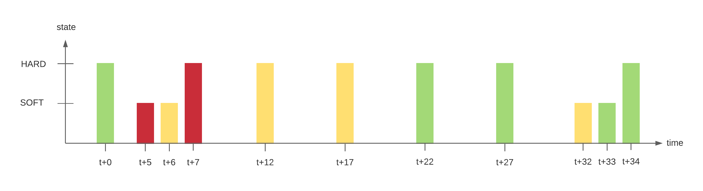

## Resources status

Statuses are indicators for the hosts or the services. Each status has a precise meaning for the resource.
Each status is determined following the monitoring of the resource according to user-defined thresholds.

### Host status

The table below summarizes all the possible statuses for a host.

| Status                                         | Description                         |
|------------------------------------------------|-------------------------------------|
| UP          | The host is available and reachable |
| DOWN        | The host is unavailable             |
| UNREACHABLE | The host is unreachable             |

### Service status

The table below summarizes all the possible statuses for a service.

| Status                                     | Description                                                               |
|--------------------------------------------|---------------------------------------------------------------------------|
| OK      | The service presents no problem                                           |
| WARNING | The service has reached the warning threshold                             |
| DOWN    | The service has reached the critical threshold                            |
| UNKNOWN | The status of the service cannot be checked (e.g.: SNMP agent down, etc.) |

### Advanced statuses

In addition to the standard statuses, new statuses can be used to add additional information:

* The PENDING status is a status displayed for a service or a host freshly
  configured but which has not yet been checked by the scheduler.
* The UNREACHABLE status is a status indicating that the host (parental
  relationship) is situated downstream of a host with a DOWN status.
* The FLAPPING status is a status indicating that the status change percentage of the resource is very high. This
  percentage is obtained from calculations performed by the network monitoring engine.
* The ACKNOWLEDGED status is a status indicating that the incident of the service or
  of the host has been taken into account by a user.
* The DOWNTIME status is a status indicating that the incident of the service or of
  the host occurred during a downtime period.

## Status confirmation

A resource can have two states:

* SOFT: Signifies that an incident has just been detected and that it has to be confirmed.
* HARD: Signifies that the status of the incident is confirmed. Once the status is confirmed, the notification process
  is engaged (sending of a mail, SMS, etc.).

### Explanation

An incident (Not-OK status) is confirmed as soon as the number of validation attempts has reached its end. The
configuration of a resource (host or service) requires a regular check interval, a number of attempts to confirm a
Not-OK status and an irregular check interval. As soon as the first incident is detected, the state is "SOFT" until its
confirmation into "HARD", triggering the notification process.

Example:

A service has the following check settings:

* Max check attempts: 3
* Normal check interval: 5 minutes
* Retry check interval: 1 minute

Let us imagine the following scenario:

| Time | Check attempt | Status   | State | State change | Note                                                                                                                                                                                                          |
|------|---------------|----------|-------|--------------|---------------------------------------------------------------------------------------------------------------------------------------------------------------------------------------------------------------|
| t+0  | 1/3           | OK       | HARD  | No           | Initial state of the service                                                                                                                                                                                  |
| t+5  | 1/3           | CRITICAL | SOFT  | Yes          | First detection of a non-OK state. Event handlers execute.                                                                                                                                                    |
| t+6  | 2/3           | WARNING  | SOFT  | Yes          | Service continues to be in a non-OK state. Event handlers execute.                                                                                                                                            |
| t+7  | 3/3           | CRITICAL | HARD  | Yes          | Max check attempts has been reached, so service goes into a HARD state. Event handlers execute and a problem notification is sent out. Check # is reset to 1 immediately after this happens.                  |
| t+12 | 3/3           | WARNING  | HARD  | Yes          | Service changes to a HARD WARNING state. Event handlers execute and a problem notification is sent out.                                                                                                       |
| t+17 | 3/3           | WARNING  | HARD  | No           | Service stabilizes in a HARD problem state. Depending on what the notification interval for the service is, another notification might be sent out.                                                           |
| t+22 | 1/3           | OK       | HARD  | Yes          | Service experiences a HARD recovery. Event handlers execute and a recovery notification is sent out.                                                                                                          |
| t+27 | 1/3           | OK       | HARD  | No           | Service is still OK.                                                                                                                                                                                          |
| t+32 | 1/3           | UNKNOWN  | SOFT  | Yes          | Service is detected as changing to a SOFT non-OK state. Event handlers execute.                                                                                                                               |
| t+33 | 2/3           | OK       | SOFT  | Yes          | Service experiences a SOFT recovery. Event handlers execute, but notification are not sent, as this wasn't a "real" problem. State type is set HARD and check # is reset to 1 immediately after this happens. |
| t+34 | 1/3           | OK       | HARD  | No           | Service stabilizes in an OK state.                                                                                                                                                                            |