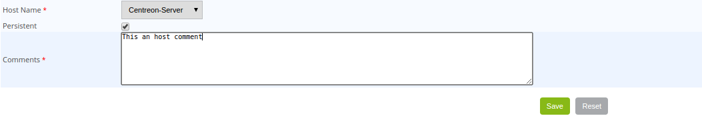

## Adding a comment

### Principle

Centreon allows us to add comments on an object. This comment is visible by
anyone having access to the resource (host or service). A comment has the
following properties:

-   Hostname
-   Servicename if the comment is associated with a service
-   Date of entry of the comment
-   Author of the comment
-   The contents of the comment
-   The validity of the comment against a restart of the scheduler

### Practice

There are two solutions to add a comment:

<!--DOCUSAURUS_CODE_TABS-->
<!--From the detailed sheet of an object-->

1.  Access to the details page of the object
2.  In the category **Host/Service Commands**, click on **Add a comment
    for this host/this service**

<!--From the Comment menu-->

1.  Go into the **Monitoring > Downtimes > Comments** menu
2.  Click on **Add a Service Comment** or **Add a Host Comment**

<!--END_DOCUSAURUS_CODE_TABS-->

The following window appears:

-   The **Host Name** field defines the host concerned by the comment.
-   If you have chosen to add a comment to a service, the **Service**
    field can be used to select the service concerned by the comment.
-   If the **Persistent** box is checked, the comment will be maintained
    in the event of a restart of the scheduler.
-   The **Comments** field contains the comment itself.

## Management of checks

### Principle

It is possible to temporarily enable or disable check on a host or a service.

> Changes to settings checks do not affect the configuration of the
> object in the database. These changes are made on the supervision in
> real time, they are canceled if the scheduler is restarted.

### Practice

<!--DOCUSAURUS_CODE_TABS-->
<!--From the detailed sheet of an object-->

1.  Access the details page of the object
2.  In the category: **Options** go to the line: **Active checks** to
    check the state of the checks.

To:

-   Enable the check, click on 
-   Disable the check, click on 

<!--From real time monitoring-->

1.  Go into the **Monitoring > Status Details > Hosts** (or **Services**)
    menu
2.  Select the object(s) on which you want to enable or disable the
    check
3.  In the menu: **More actions…** click on:

-   **Hosts : Disable Check** or **Services: Disable Check** to stop the
    check on a host or a service
-   **Hosts: Enable Check** or **Services: Enable Check** to enable the
    check of a host or of a service

<!--END_DOCUSAURUS_CODE_TABS-->

## Management of notifications

### Principle

It is possible to temporarily enable or disable the notification of a
host or a service.

> Changes the notifications settings do not affect the configuration of
> the object in the database. These changes are made on the real time
> monitoring, they are canceled if the scheduler is restarted.

### Practice

There are two ways of managing the notifications:

<!--DOCUSAURUS_CODE_TABS-->
<!--From the detailed sheet of an object-->

1.  Access the details page of the object
2.  In the category: **Options** go to the line: **Service
    Notifications**

To:

-   Enable the notification, click on 
-   Disable the notification, click on 

<!--From real time monitoring-->

1.  Go into the **Monitoring > Status Details > Hosts** (or **Services**)
    menu
2.  Select the host(s) / service(s) you want enable or disable the
    notification
3.  In the menu: **More actions…** click on:

-   **Hosts: Disable Notification** or **Services: Disable
    Notification** to stop the notification of a host or of a service
-   **Hosts: Enable Notification** or **Services: Enable Notification**
    to enable the notification of a host or a service

<!--END_DOCUSAURUS_CODE_TABS-->

## Reprogramming checks

### Principle

By default, the checks (checks on a service) are executed at regular
intervals following the configuration defined by the user. It is
possible to interact on the check scheduling pile to change the
programming of the checks.

There are two types of programming:

-   Normal programming: the service check is given priority in the
    scheduler queue (asap).
-   Forced programming: the service check is given priority in the
    scheduler queue (asap) even if the time of the execution request is
    outside the check period or if the service is not of the active
    type.

### Practice

There are two ways of forcing the check of a service:

<!--DOCUSAURUS_CODE_TABS-->
<!--From the detailed sheet of an object-->

1.  Access the detail page of the object
2.  In the category **Host Commands** (or **Service Commands**), click
    on **Re-schedule the next check for this host / service** or
    **Re-schedule the next check for this host / service (forced)**

<!--From real time monitoring-->

1.  Go into the menu: **Monitoring > Status Details > Hosts** (or
    `Services`)
2.  Select the objects to for which you want to force the check
3.  In the menu: **More actions…** click on **Schedule immediate check**
    or **Schedule immediate check (Forced)**

<!--END_DOCUSAURUS_CODE_TABS-->