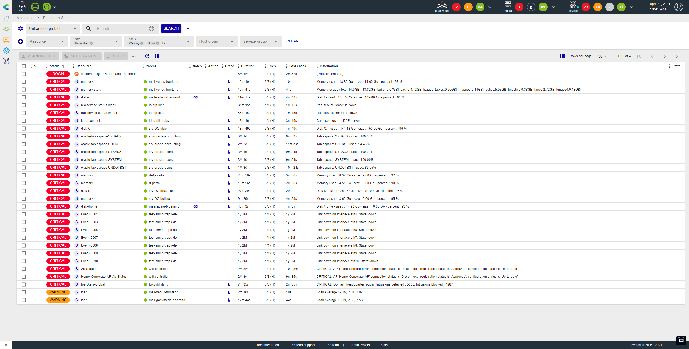
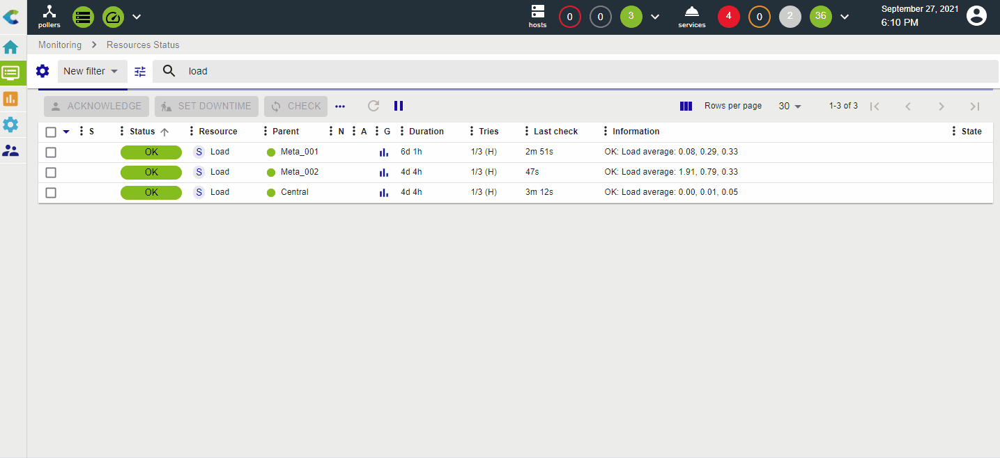
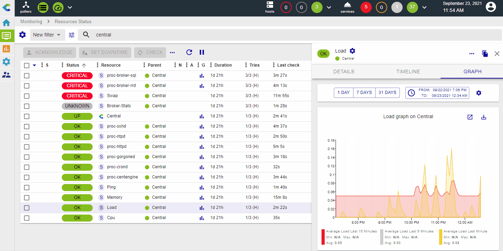

The **Monitoring > Resources Status** page is your main view to track
resources events & statuses, analyze & quickly handle them.

This view mixes hosts & services to have a unified interface and way to manage
events.

## Events list

The event list is a condensed and efficient view of all alerts and of the status of all resources
monitored by Centreon.

You can add or remove columns, and sort by the column of your choice.

## Take actions on events

### Acknowledge an event

When one or more alerts are visible, you may need to [acknowledge](manage-alerts.html#acknowledging-a-problem) them to tell
your team that the problem is handled. You can do that in two ways:

-   By directly acknowledging the line: an **Acknowledge** button
    appears on mouseover
-   By selecting multiple lines and clicking on the **Acknowledge**
    button above the table.

 Only "non-ok" resources can be acknowledged and you cannot acknowledge a resource that has already been acknowledged.

When a resource is acknowledged:
- The alert is not visible anymore in the
**Unhandled problems** filter
- [Notifications](notif-configuration.html) for this resource are stopped
- The color of the line for acknowledged resources is changed
to yellow.

The acknowledgement can also be cancelled, in which case the event will be included again in the list 
of **Unhandled Problems** and its notifications will resume: in the **More actions** menu, select **Disacknowledge**.

### Set a planned downtime

When a maintenance is planned on one or multiple resources, you can set a
[planned downtime](manage-alerts.html#add-a-downtime) for them in Centreon in two ways:

-   By directly setting a planned downtime on the line:
    a **Set Downtime** button appears on mouseover
-   By selecting multiple lines and clicking on the **Set Downtime** button
    above the table.

When a resource is in planned downtime, the alert is not visible anymore in the
**Unhandled problems** filter and notifications for this resource are stopped. The
color of lines for resources with a planned downtime is changed to light purple.

### Refresh a status

In many situations, you need to quickly re-check one or multiple services
to refresh their status. This can be achieved in two ways:

-   By directly clicking on the **Check** button on the line when the
    mouse is over
-   By selecting multiple lines and clicking on the **Check** button,
    above the table.

### Submit a status

In some cases, especially with so-called "passive" services, it can be useful
to submit a result, i.e. a status, an output and metrics, in order to
reset the event.
This can be achieved using the **Submit Status** action, available when a single passive service is selected.

## Filter

### Pre-defined filters

When you open the **Resource status** page, the default filter is **Unhandled
problems**. This filter quickly shows all problems/alerts that are not yet
handled so you can focus on choosing the most relevant alerts to take
care of. You can choose two other filters that are **Resources problems**
and **All**.

The following rules apply:

-   **Unhandled problems**: resource status is **Warning** or **Critical** or
    **Unknown** or **Down** AND the resource is not acknowledged nor in planned
    downtime
-   **Resource problems**: resource status is **Warning** or **Critical** or **Unknown**
    or **Down** (whether or not the resource has been acknowleged/a downtime has been set)
-   **All**: All resources.

### Search bar

You can filter the list of resources by their name. Regular expressions are supported.
By default, the search bar will look for your expression to match with:

-   Host name
-   Host alias
-   Address or FQDN
-   Service description
-   Information

It's possible to force searching on specific fields by using the following
labels:

-   h.name: only search in the host name field
-   h.alias: only search in host alias field
-   h.address: only search in the host address field
-   s.description: only search in the service description field
-   information: only search in the information field

### Advanced criteria

If pre-defined filters and the search bar are not enough, it's possible
to expand the filter bar to access the following additional criteria:

-   Resource type: host, service or meta-service
-   Status: **OK**, **Warning**, **Critical**, **Unknown**, **Pending**, **Up**, **Down**, **Unreachable**
-   State: Is the problem already acknowledged, in a planned downtime or simply unhandled
-   Host group
-   Service group
-   Monitoring server: resources monitored by a specific server (or poller)

### Display/hide criteria

You can hide or display the search criteria you want: use the **Select criteria** button to the left:

### Save your filter

You may create some "complex" filters that set you in a specific
context, using multiple criteria and even complex regular expressions.
In that case, you may want to save this filter and re-use it later.

Use the **gear icon** next to **Filter** to:

-   Save your current search as a new filter
-   Save the current filter so that it is updated using the criteria currently
    applied
-   Edit filters so that you can rename, re-order or delete them

As soon as a filter is saved, it can be reused in the Filter dropdown list,
categorized under **My Filter**.

By clicking on the **Edit filters** menu, you can manage your existing filters (rename, re-order and delete):

## Detail panel

When you click on a line, a detail panel opens on the right side to display the main information
concerning the resource. This panel can be resized.

Depending on the type of resource, the detail panel displays different information.

### Host panel

The host panel contains the following elements:

- **Details** tab: Detailed information about the host's current status,
- **Services** tab: A listing of its attached services and their current status (as well as their graphs if the corresponding mode is selected),
- **Timeline** tab: The timeline of events that occurred for this host,
-   Shortcuts to the configuration, logs and report for this host.

If an acknowledgement or downtime is set on the host, it will be displayed in
the panel and the header will be colored accordingly.

### Service panel

The service panel contains the following elements:

- **Details** tab: Detailed information about its current status,
- **Timeline** tab: The timeline of events that occured for this service,
- **Graph** tab: A graph with one curve per metric collected by this service,
- Shortcuts to the configurations, logs and reports for this service and its
    related host.

If an acknowledgement or downtime is set on the service, it will be displayed in
the panel and the header will be colored accordingly.

#### Graph

The graph tab enables you to visually display how the metrics evolve for the selected resource. 

Hovering over the metric curves will display under the graph's title the precise time and also display within the legend the different values for that same point in time.

When the pointer is not hovering over curves, the legend displays Min, Max and Average values for each metric.

Use the legend to display or hide metrics:
- Click on a legend item to display only the corresponding metric.
- To display all metrics again, click again on the legend of the displayed metric.

You can also toggle the selection of individual metrics by Ctrl+Clicking (or Cmd+Clicking for Mac users) on the corresponding tile within the legend:

Graphs display metric evolution over a given period of time. This can be defined in the following ways:
- A selection of preconfigured periods is available in the graph header: Last Day, Last 7 Days, Last 31 Days
- Datetime pickers are available for Start and End points in time. Anytime the displayed period changes, this element is updated accordingly
- Using the side [<] and [>] buttons that appear upon hovering the graph's border, you can translate in time by half your current timespan (respectively backward and forward in time)
- Selecting a period of time within the graph will zoom in on this period

The **Display events** toggle (available under the **gear** button) allows you to display some timeline events (downtime, acknowledgement, comment) directly on the graph, via annotations:

It is possible to add a comment directly on the graph, by left clicking anywhere at the time you want to add it, and select **Add a comment** on the tooltip that appears:

To delete a comment, go to **Monitoring > Downtimes > Comments**.

By clicking on the **Export to PNG** button, you can export a snapshot of the graph, which also includes the timeline events, if the switch is toggled. Note that only the selected metrics will be exported:

