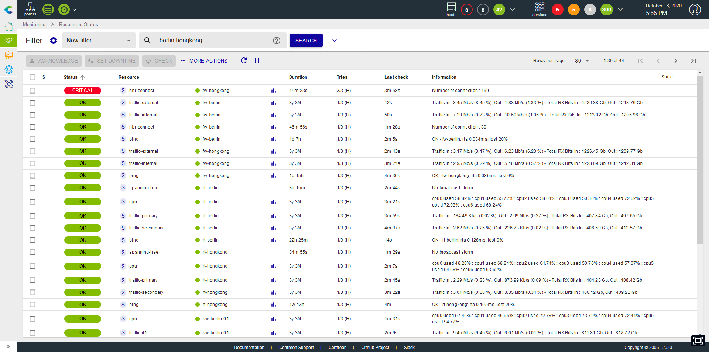

The `Resources Status` page is your main view to track resources events &
statuses, analyze & quickly handle them.

This view mixes hosts & services to have a unified interface and way to manage
events.

> To be updated

<iframe width="640" height="480" src="https://www.youtube.com/embed/FVjuIbBDuYU" frameborder="0" allowfullscreen></iframe>

## Events list

The event list is a condensed & efficient view of all alerts or resource status
monitored by Centreon.

It's possible to sort by the column of your choice.

## Take actions on events

### Acknowledge an event

When one or more alerts are visible, you may need to acknowledge them to tell
your team that the problem is handled, you can do that in two ways:

-   By directly acknowledging on the line, a "Acknowledgement" button
    apper on mouse over
-   By selecting multiple lines and clicking on the "Acknowledgement"
    button, above the table

You can also disacknowledge previously acknowledged events by choosing the
"Disacknowledge" action in the "More actions" menu.

> Only "non-ok" resources can be ackwnoledged

When a resource is acknowledged, the alert is not visible anymore in the
"Unhandled problems" filter and notifications for this resource are stopped.

### Set a planned downtime

When a maintenance is planned on one or multiple resources, you can set this
planned downtime in Centreon in two ways:

-   By directly setting a planned downtime on the line when the mouse is
    over
-   By selecting multiple lines and clicking on the "Downtime" button,
    above the table

When a resource is in planned downtime, the alert is not visible anymore in the
"Unhandled problems" filter and notifications for this resource are stopped.

### Refresh a status

In many situations, you need to quickly re-check one or multiple service
to refresh their status. You can set this planned downtime in Centreon
in two ways:

-   By directly clicking on the "Check" button on the line when the
    mouse is over
-   By selecting multiple lines and clicking on the "Check" button,
    above the table

## Filter

### Pre-defined filters

When you open the Events view, the default filter is "Unhandled
problems". This filter quickly show all problems/alerts that are not yet
handled so you can focus on choosing the most relevant alerts to take
care of. You can choose two other filters that are "Resources problems"
and "All".

The following rules apply:

-   Unhandled problems: resource status is Warning or Critical or
    Unknown or Down AND the resource is not acknowledged nor in planned
    downtime
-   Resource problems: resource status is Warning or Critical or Unknown
    or Down
-   All: All resources

### Search bar

It's possible to filter out the events by name of resources. You can use
the power of regular expression mechanism to finely search for resources
(host or services)

By default, the search bar with look for your expression to match with

-   Host name
-   Host alias
-   Address or FQDN
-   Service description

It's possible to force search on a defined fields by using the following
labels:

-   h.name: only search in host.name field
-   h.alias: only search in host alias field
-   h.address: only search in host address field
-   s.description: only search in service description field

### By advanced criteria

If pre-defined filter and the search bar are not enough, it's possible
to expand the filter bar to access the following additionnal criteria:

-   Resource types (host or service)
-   Statuses (Ok,Warning, Critical, Unknown, Pending, Up, Down)
-   States: Is the problem already acknowledged, in a planned downtime
    or simply unhandled
-   Host groups
-   Service groups

### Save your filter

You may create some "complex" filters that set you in a specific
context, using multiple criterias and even complex regular expressions.
In that case, you may want to save this filter and re-use it later.

This is possible using the **icon** next to Filter. You'll be able to:

-   Save your current search as a new filter
-   Save the current filter so that it's updated using your current
    applied criterias
-   Edit filters so that you can rename, re-order or delete them

As soon as a filter is saved, it's re-usable in the Filter dropdown list,
categorized under "My Filter".

## Detail panel

When you click on a line, a detail panel opens to display main information
concerning the resource.

Regarding the type of resource, the detail panel displays different information.

### Host panel

The host panel contains several informative tabs:

-   Detailed information about its current status,
-   A listing of its attached services and their current status,
-   The timeline of events that occured for this host,
-   Shortcuts to the configuration, logs and report.

If an acknowledgement or downtime is set on the host, it will be displayed in
the panel and the header will be accordingly colored.

### Service panel

The service panel contains several informative tabs:

-   Detailed information about its current status,
-   The timeline of events that occured for this service,
-   A graph with one curve per metric collected by this service,
-   Shortcuts to the configurations, logs and reports for this service and its
    related host.

If an acknowledgement or downtime is set on the service, it will be displayed in
the panel and the header will be accordingly colored.
