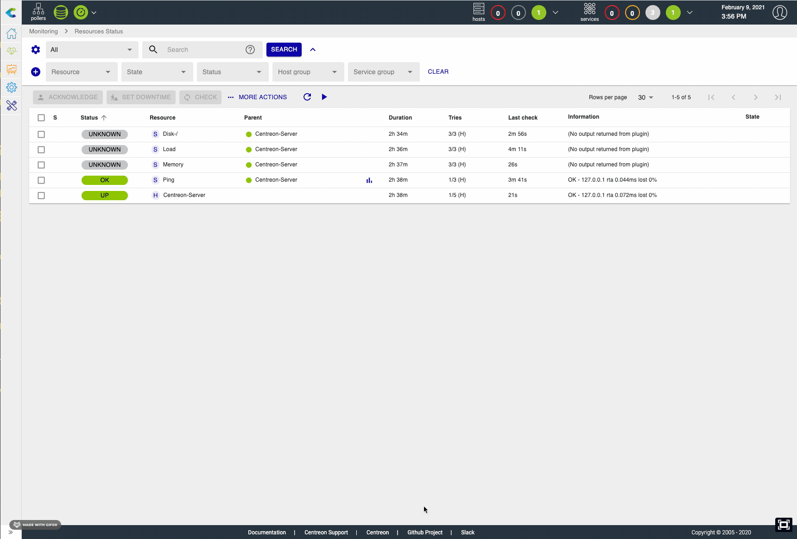
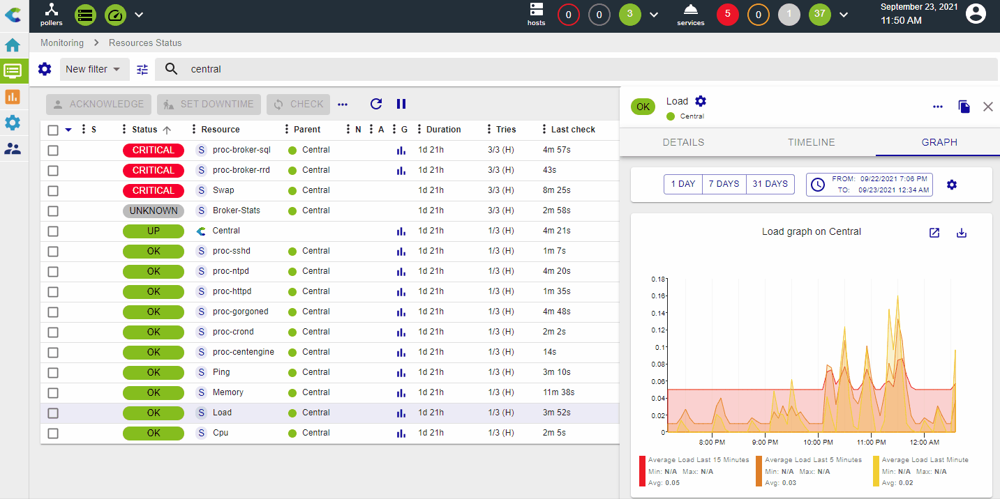
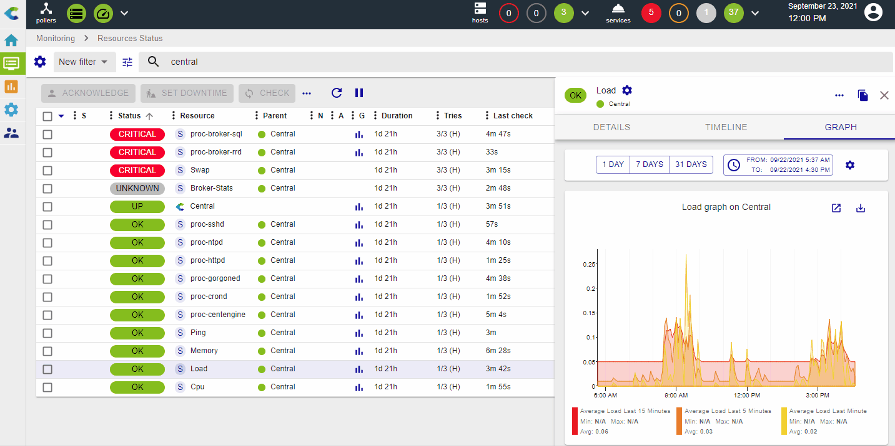
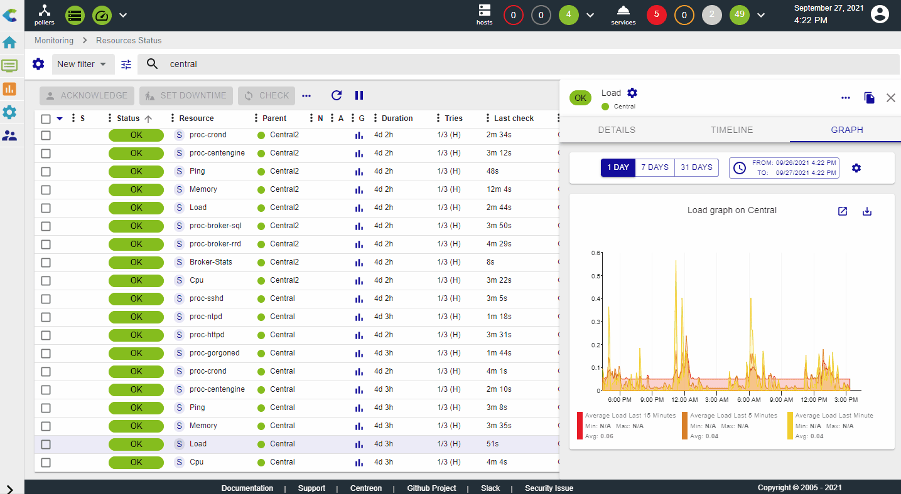

The `Monitoring > Resources Status` page is your main view to track
resources events & statuses, analyze & quickly handle them.

This view mixes hosts & services to have a unified interface and way to manage
events.

## Events list

The event list is a condensed and efficient view of all alerts or resource status
monitored by Centreon.

It's possible to sort by the column of your choice.

## Take actions on events

### Acknowledge an event

When one or more alerts are visible, you may need to acknowledge them to tell
your team that the problem is handled, you can do that in two ways:

-   By directly acknowledging the line, an "Acknowledgement" button
    appears on mouseover
-   By selecting multiple lines and clicking on the "Acknowledgement"
    button, above the table

You can also disacknowledge previously acknowledged events by choosing the
"Disacknowledge" action in the "More actions" menu.

> Only "non-ok" resources can be acknowledged
> You cannot acknowledge a resource already acknowledged

When a resource is acknowledged, the alert is not visible anymore in the
"Unhandled problems" filter and notifications for this resource are stopped.
The color of the line for acknowledged resources is changed
to yellow.

The acknowledgement can also be deleted to put the event back to the unhandled
events and resume the notifications.

### Set a planned downtime

When a maintenance is planned on one or multiple resources, you can set a
planned downtime for them in Centreon in two ways:

-   By directly setting a planned downtime on the line when the mouse is
    over it
-   By selecting multiple lines and clicking on the "Downtime" button,
    above the table

When a resource is in planned downtime, the alert is not visible anymore in the
"Unhandled problems" filter and notifications for this resource are stopped. The
color of lines for resources with a planned downtime is changed to light purple.

### Refresh a status

In many situations, you need to quickly re-check one or multiple service
to refresh their status. You can set this planned downtime in Centreon
in two ways:

-   By directly clicking on the "Check" button on the line when the
    mouse is over
-   By selecting multiple lines and clicking on the "Check" button,
    above the table

### Submit a status

In some cases, especially with so-called "passive" services, it can be useful
to submit a result, i.e. a status, an output and metrics, in order to
reset the event.

## Filter

### Pre-defined filters

When you open the Resource status page, the default filter is "Unhandled
problems". This filter quickly shows all problems/alerts that are not yet
handled so you can focus on choosing the most relevant alerts to take
care of. You can choose two other filters that are "Resources problems"
and "All".

The following rules apply:

-   Unhandled problems: resource status is Warning or Critical or
    Unknown or Down AND the resource is not acknowledged nor in planned
    downtime
-   Resource problems: resource status is Warning or Critical or Unknown
    or Down
-   All: All resources

### Search bar

It's possible to filter out the events by name of resources. You can use
the power of regular expression mechanism to finely search for resources
(host or services)

By default, the search bar with look for your expression to match with:

-   Host name
-   Host alias
-   Address or FQDN
-   Service description
-   Information

It's possible to force search on a defined fields by using the following
labels:

-   h.name: only search in the host name field
-   h.alias: only search in host alias field
-   h.address: only search in the host address field
-   s.description: only search in the service description field
-   information: only search in the information field

### By advanced criteria

If pre-defined filter and the search bar are not enough, it's possible
to expand the filter bar to access the following additionnal criteria:

-   Resource types (host or service)
-   Statuses (Ok,Warning, Critical, Unknown, Pending, Up, Down)
-   States: Is the problem already acknowledged, in a planned downtime
    or simply unhandled
-   Host groups
-   Service groups

### Hide / show criterias

It's also possible to manage the display of criterias (in order to display only the pertinent ones), by clicking on the "Select criterias" on the left hand-side:

### Save your filter

You may create some "complex" filters that set you in a specific
context, using multiple criterias and even complex regular expressions.
In that case, you may want to save this filter and re-use it later.

This is possible using the **gear icon** next to Filter. You'll be able to:

-   Save your current search as a new filter
-   Save the current filter so that it's updated using your current
    applied criterias
-   Edit filters so that you can rename, re-order or delete them

As soon as a filter is saved, it's re-usable in the Filter dropdown list,
categorized under "My Filter".

By clicking on the "Edit filters" menu, you can manage your existing filters (rename, re-order and delete):

## Detail panel

When you click on a line, a detail panel opens to display main information
concerning the resource.

Regarding the type of resource, the detail panel displays different information.

### Host panel

The host panel contains several informative tabs:

-   Detailed information about its current status,
-   A listing of its attached services and their current status (as well as their graphs if the corresponding mode is selected),
-   The timeline of events that occurred for this host,
-   Shortcuts to the configuration, logs and report.

If an acknowledgement or downtime is set on the host, it will be displayed in
the panel and the header will be accordingly colored.

### Service panel

The service panel contains several informative tabs:

-   Detailed information about its current status,
-   The timeline of events that occured for this service,
-   A graph with one curve per metric collected by this service,
-   Shortcuts to the configurations, logs and reports for this service and its
    related host.

If an acknowledgement or downtime is set on the service, it will be displayed in
the panel and the header will be accordingly colored.

#### Graph

The graph tab enables you to visually display how the metrics evolves for the selected resource. Hovering the metric curves will display a tooltip containing the different values for the corresponding point in time.

It's possible to select or deselect metrics for display using the legend. By clicking on a legend item, it will unselect all metrics other than this one. Clicking on a metric being the only one selected will select all of them:

You can also toggle the selection of individual metrics by Ctrl+Clicking (or Cmd+Clicking for Mac users) on the corresponding legend:

The "Display events" switch allows you to display some timeline events (Downtime, Acknowledgement, Comment) directly on the graph, via annotations:

It's possible to add a comment directly on the graph, by left clicking anywhere at the time you want to add it, and select "Add a comment" on the tooltip that appears:

By clicking on the "Export to PNG" button, you can export a snapshot of the graph, which also includes the timeline events, if the switch is toggled. Note that only the selected metrics will be exported:

