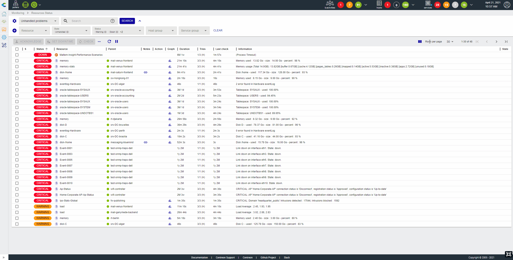
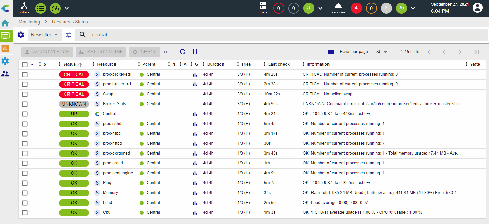

The **Monitoring > Resources Status** page is your main view to track
resources events & statuses, analyze & quickly handle them.

This view mixes hosts & services to have a unified interface and way to manage
events.

## Events list

The event list is a condensed and efficient view of all alerts and of the status of all resources
monitored by Centreon.

You can add or remove columns, and sort by the column of your choice.

## Take actions on events

### Acknowledge an event

When one or more alerts are visible, you may need to [acknowledge](manage-alerts.html#acknowledging-a-problem) them to tell
your team that the problem is handled. You can do that in two ways:

-   By directly acknowledging the line: an **Acknowledge** button
    appears on mouseover
-   By selecting multiple lines and clicking on the **Acknowledge**
    button above the table. You can use the **Shift** key to select several adjacent lines.

 Only "non-ok" resources can be acknowledged and you cannot acknowledge a resource that has already been acknowledged.

When a resource is acknowledged:
- The alert is not visible anymore in the
**Unhandled problems** filter
- [Notifications](notif-configuration.html) for this resource are stopped
- The color of the line for acknowledged resources is changed
to yellow.

The acknowledgement can also be cancelled, in which case the event will be included again in the list 
of **Unhandled Problems** and its notifications will resume: in the **More actions** menu, select **Disacknowledge**.

### Set a planned downtime

When a maintenance is planned on one or multiple resources, you can set a
[planned downtime](manage-alerts.html#add-a-downtime) for them in Centreon in two ways:

-   By directly setting a planned downtime on the line:
    a **Set Downtime** button appears on mouseover
-   By selecting multiple lines and clicking on the **Set Downtime** button
    above the table.

When a resource is in planned downtime, the alert is not visible anymore in the
**Unhandled problems** filter and notifications for this resource are stopped. The
color of lines for resources with a planned downtime is changed to light purple.

### Refresh a status

In many situations, you need to quickly re-check one or multiple services
to refresh their status. This can be achieved in two ways:

-   By directly clicking on the **Check** button on the line when the
    mouse is over
-   By selecting multiple lines and clicking on the **Check** button,
    above the table.

### Submit a status

In some cases, especially with so-called "passive" services, it can be useful
to submit a result, i.e. a status, an output and metrics, in order to
reset the event.
This can be achieved using the **Submit Status** action, available when a single passive service is selected.

## Filtering events

The various filters are added using an AND criterion: results will match all criteria.

### Pre-defined filters

When you open the **Resource status** page, the default filter is **Unhandled
problems**. This filter quickly shows all problems/alerts that are not yet
handled so you can focus on choosing the most relevant alerts to take
care of. You can choose two other filters that are **Resources problems**
and **All**.

The following rules apply:

-   **Unhandled problems**: resource status is **Warning** or **Critical** or
    **Unknown** or **Down** AND the resource is not acknowledged nor in planned
    downtime
-   **Resource problems**: resource status is **Warning** or **Critical** or **Unknown**
    or **Down** (whether or not the resource has been acknowleged/a downtime has been set)
-   **All**: All resources.

### Search criteria

You can filter the list of resources according to a number of predefined criteria.

1. Click the **Search options** icon :

    A pop-in window appears, that lists the following criteria:

    - **Resource**: display only hosts, services or metaservices
    - **State**: whether the problem is already acknowledged, in a planned downtime or simply unhandled
    - **Status**: **OK**, **Up**, **Warning**, **Down**, **Critical**, **Unreachable**, **Unknown**, **Pending**
    - **Host group**
    - **Service group**
    - **Monitoring server**: resources monitored by a specific server (or poller)

    

2. Click on a search criterion: a list of all possible values is displayed.

3. Select the values you want. The search bar displays the text for the filter you have applied, and a figure on the left of the criterion shows how many values are selected.

    

    You can click the 'x' on the right of a criterion to deselect all values.

4. Click **Search**, or click outside the pop-up. The list of resources is filtered.

### Search bar

If you type text into the search bar, by default the search is performed on the following fields:

-   Name of the host
-   Alias of the host
-   Address or FQDN of the host
-   Description of the service

For instance, if you type "rta", all resources containing "rta" in one of the above fields will be displayed (e.g. a metaservice called **Ping-RTA-Average**).

However, you can do a much more specific search using the [Centreon Query Language](#cql-criteria). This language allows you to search only 
in one or several fields.

#### CQL criteria

- **alias**: search for hosts according to their alias
- **fqdn**: search for hosts according to their IP address or FQDN
- **host_group**: search for hosts that belong to a host group
- **h.name**: search for resources according to the name of the host displayed in column **Resource** for the hosts, and **Parent** for the services
- **h.alias**: search for resources according to the alias of a host, or to the alias of a service's parent
- **h.address**: search for resources according to the FQDN/the IP address of the host or of a service's parent
- **information**: search only in column **Information**
- **monitoring_server**: search for all the resources that the selected poller is monitoring
- **name**: search for hosts only on the name of the host, as displayed in column **Resource**
- **parent_name**: search for services, according to their parent's name
- **parent_alias**: search for services, according to their parent's alias
- **state**: search for resources in a non-OK or non-UP state, according to whether they are unhandled, acknowledged or in downtime
- **status**: search for resources according to their [status](concepts.html)
- **service_group**: search for services that belong to a service group
- **s.description**: search only in the description of the service (i.e. its name in column **Resource**)
- **type**: display only hosts, services or metaservices

#### Using the search bar

The search bar shows all applied criteria, as text. Autocomplete helps you enter search terms easily: 

1. Start typing the criterion you want. For intance, type "h": the search bar suggests all criteria starting with "h" (**host_group**, **h.name**, **h.alias**, **h.address**). Select the criterion you want using the **Up** and **Down** arrows, then press **Tab** or **Enter** to confirm the selection. A colon is used between a criterion and its possible values (e.g. **host:Linux**).

2. According to the type of criterion, autocomplete can suggest possible values for this criterion (e.g. for criterion **Type**, the possible values are **Host**, **Service** and **Metaservice**). Select the value you want using the **Up** and **Down** arrows, then press **Tab** or **Enter** to confirm the selection. It is possible to set several values for a criterion. The values should be separated by commas. The search will retrieve all values, using an OR criterion, e.g. **type:service,metaservice** will retrieve all services and metaservices.

    

3. Use spaces between search criteria. Criteria are added using an AND criterion: results will match all criteria. You can use regular expressions.
4. Once you have entered all your search criteria, type a space character or press **Esc** to exit autocomplete, then press **Enter**.

Example :
    **s.description:ping h.name:linux**: the list displays all services whose name contain "ping", for all hosts whose name contain "linux".

### Save your filter

You may create some "complex" filters that set you in a specific
context, using multiple criteria and even complex regular expressions.
In that case, you may want to save this filter and re-use it later.

Use the **gear icon** next to **Filter** to:

-   Save your current search as a new filter
-   Save the current filter so that it is updated using the criteria currently
    applied
-   Edit filters so that you can rename, re-order or delete them

As soon as a filter is saved, it can be reused in the Filter dropdown list,
categorized under **My Filter**.

By clicking on the **Edit filters** menu, you can manage your existing filters (rename, re-order and delete):

## Detail panel

When you click on a line, a detail panel opens on the right side to display the main information
concerning the resource. This panel can be resized.

Depending on the type of resource, the detail panel displays different information.

### Host panel

The host panel contains the following elements:

- **Details** tab: Detailed information about the host's current status. You can drag and drop tiles to rearrange them.
- **Services** tab: A listing of its attached services and their current status (as well as their graphs if the corresponding mode is selected)
- **Timeline** tab: The timeline of events that occurred for this host
- **Graph** tab: graphs for the services for this host
-   Shortcuts to the configuration, logs and report for this host.

If an acknowledgement or downtime is set on the host, it will be displayed in
the panel and the header will be colored accordingly.

### Service panel

The service panel contains the following elements:

- **Details** tab: Detailed information about its current status. You can drag and drop tiles to rearrange them.
- **Timeline** tab: The timeline of events that occured for this service
- **Graph** tab: A graph with one curve per metric collected by this service
- Shortcuts to the configurations, logs and reports for this service and its
    related host.
- Below the name of the service, the name of its parent host. Click it to open the host panel for the parent host.  

If an acknowledgement or downtime is set on the service, it will be displayed in
the panel and the header will be colored accordingly.

### Timeline tab

The **Timeline** tab shows an antichronological list of events that occurred for this service or host. Use the **Event** list to display only the types of event you want.

### Graph tab

The graph tab enables you to visually display how the metrics evolve for the selected resource. 

Hovering over the metric curves will display under the graph's title the precise time and also display within the legend the different values for that same point in time.

When the pointer is not hovering over curves, the legend displays Min, Max and Average values for each metric.

Use the legend to display or hide metrics:
- Click on a legend item to display only the corresponding metric.
- To display all metrics again, click again on the legend of the displayed metric.

You can also toggle the selection of individual metrics by Ctrl+Clicking (or Cmd+Clicking for Mac users) on the corresponding tile within the legend:

Graphs display metric evolution over a given period of time. This can be defined in the following ways:
- A selection of preconfigured periods is available in the graph header: Last Day, Last 7 Days, Last 31 Days
- Datetime pickers are available for Start and End points in time. Anytime the displayed period changes, this element is updated accordingly
- Using the side [<] and [>] buttons that appear upon hovering the graph's border, you can translate in time by half your current timespan (respectively backward and forward in time)
- Selecting a period of time within the graph will zoom in on this period

The **Display events** toggle (available under the **gear** button) allows you to display some timeline events (downtime, acknowledgement, comment) directly on the graph, via annotations:

It is possible to add a comment directly on the graph, by left clicking anywhere at the time you want to add it, and select **Add a comment** on the tooltip that appears:

To delete a comment, go to **Monitoring > Downtimes > Comments**.

By clicking on the **Export to PNG** button, you can export a snapshot of the graph, which also includes the timeline events, if the switch is toggled. Note that only the selected metrics will be exported:

To see a bigger version of the graph, click on **Go to performance page** in the top right corner of the graph.

The graph opens on page **Monitoring > Performances > Graphs**, allowing you to filter the graph more precisely.

