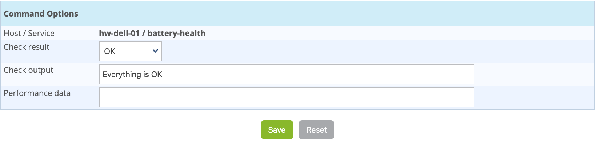

### Principle

For passively checked services, it is possible send a result manually to the
scheduler so that it is taken into account.

### Practice

To submit a result, access the details page of the object. In the category
**Service Commands** click on **Submit result for this service**

The following window appears:

-   The **Host Name** and **Service** fields define the host and the
    service the result will be submitted
-   The **Check result** field defines the status of the service
-   The **Check output** field defines the message to be displayed for
    the service
-   The **Performance data** field can be used to define performance
    data for the generation of graphs
