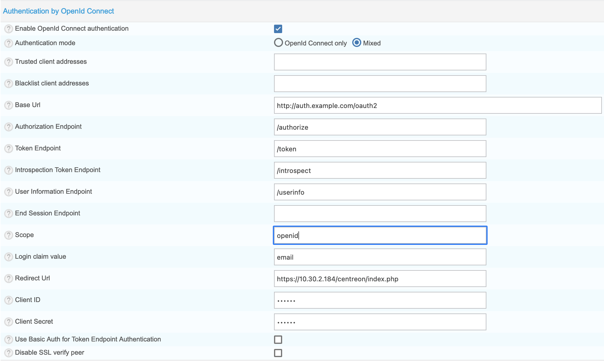

Centreon is compatible with OAuth 2.0/OpenId Connect authentication.

Usage of Identity Providers (IdP) is available, such as Keycloak, LemonLDAP::NG or other IdP which are compatible with
the Authorization Code Flow.

Authentication via OpenId Connect is configured on page **Administration > Parameters > Centreon UI**, section **Authentication by OpenId Connect**.

- **Enable OpenId Connect authentication** allows to enable or disable OpenId Connect authentication.
- **Authentication mode** field indicates if the authentication should take place only by OpenId Connect or using local
  authentication as well (Mixed).
- **Trusted client addresses** field indicates which are the IP/DNS of the trusted clients (corresponding to the
  reverse proxy). The trusted clients are separated by comas.
- **Blacklist client addresses** field indicates which are the IP/DNS rejected.
- **Base Url** field defines the IdP base URL for OpenId Connect endpoints (mandatory).
- **Authorization Endpoint** field defines the authorization endpoint, for example `/authorize` (mandatory).
- **Token Endpoint** field defines the token endpoint, for example `/token`(mandatory).
- **Introspection Token Endpoint** field defines the introspection token endpoint, for example `/introspect` (mandatory).
- **User Information Endpoint** field defines the user information endpoint, for example `/userinfo`.
- **End Session Endpoint** field defines the logout endpoint, for example `/logout`.
- **Scope** field defines the scope of the IdP, for example `openid`. Separate scope by space.
- **Redirect Url** field defines the redirect URL after login to access to your Centreon server, for example
  `http://192.168.0.1/centreon/index.php`.
- **Client ID** field defines the Client ID.
- **Client Secret** field defines the Client secret.
- **Disable SSL verify peer** field allows to disable SSL peer validation, should only used for test.

> Depending on the identity provider, it is necessary to enter several scopes. This is indicated in the provider's
> configuration documentation.

> For authentication to be functional, the response to the introspection token call must return a `preferred_username`
> variable containing the user's login which will be compared with the users defined in Centreon. If it's not the case,
> you will have to configure your provider to send extra claims to an additional scope. In this case, it will be
> necessary to configure the user information endpoint and add the additional scope to the scope definition.

> If you want to automatically import user after connection, you can configure an LDAP server and enable auto import.
